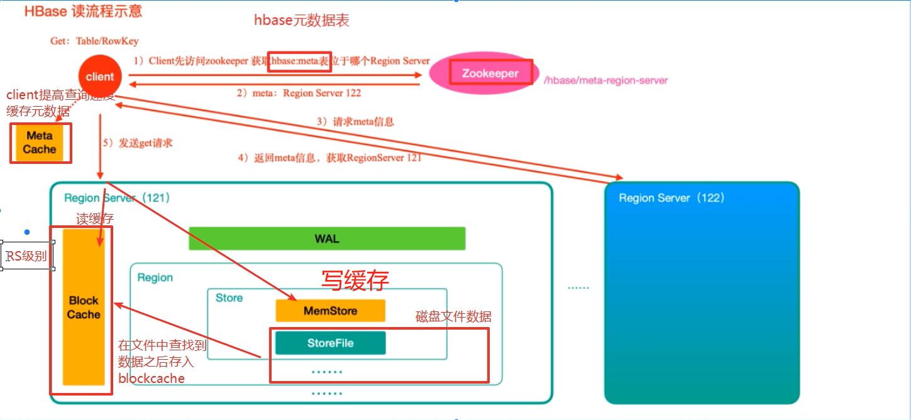

# HBase
- [dataflair](https://data-flair.training/blogs/hbase-tutorial/)
- columnar, non-relational, distributed database

# Data Model
- range partition (How does it handle hot keys)
- column store, columns are groupped by **column family**, and rows are groupped by region, each region(s) maps to a **single region server**, and rows are **sorted by alphabetical order**, thus this schema follows the **range partitioning shceme**
- **Write/Update** does not immediately remove the physical data, but rather will be a new record inserted into the table marking data modification/deletion. Write/Update will be eventually **merged/compacted** so only most recent updates are reflected on the disk file(**StoreFile** in HBase)
  > **Underlying storage data structure for HBase can be viewed as *Distributed LSM Tree***, as each Update/Delete/Write operation is an append only log into a im memory sorted data structure then into a on-disk segment file (`StoreFile` in HBase), and background process will continuously merge/compact the segment files

# Read/Write flow

## Read Flow

- \*HMaster is not part of the read request, read request only goes through **ZK** for metadata and **region servers**(region server for the metadata and region server for the actual data)

## Write Flow
- Write first goes into the WAL in the region server, then write to the **MemStore** write buffer, note at this point is not necessary to wait for data to be persisted/flushed onto disk since both WAL and MemStore has the data, **so at the point MemStore finishes copying the data from client, the region server acnowledges the client for finishing the write reqeust**
- Disk representation of data written in HBase table is **StoreFile**, since write/update/delete will not immediately removes the record, which inevitbly will increase the size of `StoreFile`, so **merging StoreFile is necessary**.

## Read/Write Performance
- Read is ok if the querying record is in the read cache(each region server has a read cache). Else it incurrs some cost on reading data from disk(`StoreFile`)
- Client Write request does not involve waiting record to be persisted onto disk(`SequenceFile`) with the usage of WAL and write buffer(`MemStore`). **Thus Write has better performance than Read**

## Flush and Block(阻塞) Mechanism in HBase
- upon some threshhold met(HBase daemon periodically check this condition), HBase will flush contents in write buffer(`MemStore`) onto disk
- However, if a herding request of write occurs, and the size of overall write buffer in the cluster(in all region server) hits some threshhold(`0.95`), HBase will trigger **block** and client can no longer write to HBase during the block

## Compaction
### minor compact 小合并
- 在将Store中多个HFile(`StoreFile`)合并为一个HFile
  > 这个过程中，**删除和更新的数据仅仅只是做了标记，并没有物理移除，这种合并的触发频率很高**。
### major compact 大合并
- 合并Store中所有的HFile(`StoreFile`)为一个HFile
  > 这个过程**有删除标记的数据会被真正移除，同时超过单元格maxVersion的版本记录也会被删除**。合并频率比较低，默认7天执行一次，并且**性能消耗非常大**，建议生产关闭(设置为0)，在应用空闲时间手动触发。一般可以是手动控制进行合并，防止出现在业务高峰期。

# Partitin Scheme
- Partition Scheme in HBase is called `Region` in HBase, and HBase adopts range partitioning with dynamic repartitioning scheme(This scheme in HBase is called `Split`)
- We can, implement the Hash Partition on top of the partition scheme in HBase, since all primary keys are sorted in alphebetical order, we can, compute the hash of the primary key and use the hash as the primary key input to the Hbase
# Coprocessor
- The coprocessor framework provides mechanisms for **running your custom code directly on the RegionServers managing your data.**
- The whole story of HBase Coprocessor is built around **data locality**, where processing code runs directly on the same machine of where the table physically resides(a specific region server)
- Type of Coprocessors in HBase: **Observer Coprocessor**, **Endpoint Coprocessor**

## Observer coprocessor
- this is similar to a hook/callback/Trigger in MySQL, where a data change will incur an invokation of custome code
## Endpoint coprocessor
- allows to run custome code directly on `RegionServer` where storage data resides, instead running on the client
- common use case for Endpoint coprocessor is aggregation, where local aggregates are computed then global aggregation
  - we can implement same idea of local aggregation in Endpoint coprocessor using `Phoenix` framework