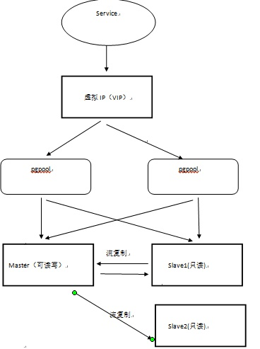

# PostgreSQL

## [High Availability](https://www.postgresql.org/docs/9.5/high-availability.html)

> [Another one, both are official doc](https://wiki.postgresql.org/wiki/Replication,_Clustering,_and_Connection_Pooling)
>
> [Google Managed Postgres Cluster - Master Slave](https://cloud.google.com/architecture/architectures-high-availability-postgresql-clusters-compute-engine)

> 

# PostgreSQL vs MySQL

- +PostgreSQL has richer support for datatypes (can even make index on JSON, array. support [geographical data](http://postgis.net/))

  - PG+ [PostgREST](https://github.com/PostgREST/postgrest) to generate the backend REST API

- +PG has richer query patterns (support OVER window syntax)

- +Better Locking mechanisms(optimistic locking and MVCC support) and transaction support with isolation level "repeatable read/snapshot isolation"

  > MySQL 的事务隔离级别 repeatable read 并不能阻止常见的并发更新, 得加锁才可以, 但悲观锁会影响性能, 手动实现乐观锁又复杂. 而 Pg 的列里有隐藏的乐观锁 version 字段, 默认的 repeatable read 级别就能保证并发更新的正确性, 并且又有乐观锁的性能.

- +Better support for COPY operation due to WAL implementation 

  > 于WEB应用来说，复制的特性很重要，mysql到现在也是异步复制，pgsql可以做到同步，异步，半同步复制。还有mysql的同步是基于binlog复制，类似oracle golden gate,是基于stream的复制，做到同步很困难，这种方式更加适合异地复制，pgsql的复制基于wal，可以做到同步复制。同时，pgsql还提供stream复制。

- 

# RDBMS vs NoSQL

- RDBMS models relations. However it became hard to support high current write request for a complicated set of tables having some relation constraint
- RDBMS usually provide strong consistency guarantee, however, this guarantee will trade a lot of performance where there are high concurrent read/write requests
- NoSQL models things differently (document, key-value, graph).
- NoSQL scales horizontally easily in trade of weaker consistency guarantee. Adding more instances usually scales the performance of the cluster linearly with techniques like partitioning to distribute load.