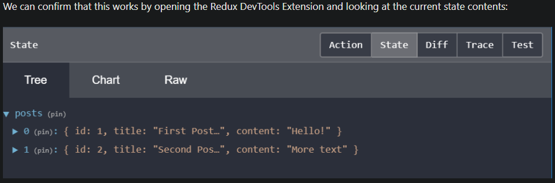

# Fundamentals

## [JSX](https://reactjs.org/docs/introducing-jsx.html)

- a JSX expression is like html expressions inside JS file `const element = <h1>Hello, world!</h1>;`
- JSX expression will be converted into JS object after compilation

## Rendering

- Render through **React DOM**. Unlike browser DOM elements, React elements are plain objects, and are cheap to create. React DOM takes care of updating the DOM to match the React elements.

- `ReactDOM.render(element, document.getElementById('nodeId'));` to render an element with DOM node id = `nodeId`, you may have as many isolated root DOM nodes as you like

- React elements are **immutable**. Once you create an element, you can’t change its children or attributes. An element is like a single frame in a movie: it represents the UI at a certain point in time. 

  >  update the UI is to create a new element, and pass it to `ReactDOM.render()`.

- 

## [Component](https://reactjs.org/docs/components-and-props.html)

> [API reference](https://reactjs.org/docs/react-component.html)

- Components let you split the UI into independent, reusable pieces, and think about each piece in **isolation**

- Component can be defined using Function or Class, make sure it starts with capital letter

  > Below both are equivalent:
  >
  > ```javascript
  > function Welcome(props) { //as long as the method defined a 'prop' param
  >       return <h1>Hello, {props.name}</h1>;
  > }
  > ```
  >
  > 
  >
  > ```javascript
  > class Welcome extends React.Component {
  >       render() {
  >         return <h1>Hello, {this.props.name}</h1>;
  >       }
  > }
  > ```
  >
  > **Usage**: When React sees an element representing a user-defined component, it passes JSX attributes and children to this component as a single object. We call this object “props”.
  >
  > ```javascript
  > function Welcome(props) {
  >       return <h1>Hello, {props.name}</h1>;
  > }
  > 
  > const element = <Welcome name="Sara" />; //props.name = 'Sara'
  > ReactDOM.render(
  >       element,
  >       document.getElementById('root')
  > );
  > ```
  >
  >  
  >
  > **Component can compose of other components:**
  >
  > ```javascript
  > function Welcome(props) {
  >   return <h1>Hello, {props.name}</h1>;
  > }
  > 
  > function App() {
  >   return (
  >     <div>
  >       <Welcome name="Sara" />
  >       <Welcome name="Cahal" />
  >       <Welcome name="Edite" />
  >     </div>
  >   );
  > }
  > 
  > ReactDOM.render(
  >   <App />,
  >   document.getElementById('root')
  > );

- a good Component design should be one that contains other reusable components, rather than having a lot of nesting JSX

- note again React elements are immutable, and so is `props` that passes to the Component, **Whether you declare a component as a function or a class, it must never modify its own props.**

- **component vs element in React**: Component can be think of as a factory of elements, Component defines the architype of element

## State and Lifecycle

> [API reference](https://reactjs.org/docs/react-component.html)

- state: **MUST be used with class defined component**, rather than function defined component. (If want to use function defined component, use **React Hook**)

  - customized object that can be added with business logic attributes

  - update using `this.state.setState`

    - React may **batch multiple `setState() `calls into a single update for performance**. Because `this.props` and `this.state` may be updated asynchronously, you should not rely on their values for calculating the next state. (note, **props is READ ONLY!**)

    - To allow update is based on the previous state, use `setState(Function(state, props) => resolvedStateObj)): void`

      > ```javascript
      > 
      > this.setState(function(state, props) {
      >     return {
      >      	counter: state.counter + props.increment
      >     };
      > });
      > 
      > this.setState(function(state) {
      >     return {
      >          counter: state.counter + 1
      >     };
      > });
      > ```
      >
      > 

- lifecycle: adding callbacks to manage the lifecycle event

  - `componentDidMount(): CallbackFunction`: executes the callback function after the element described by the component is 'mounted' (loaded)
  - `componentWillUnmount(): Function`: executes the callback when the component is unmounted

## Handling Event

> If want to use Event Handling with function defined component, use **React Hook**
>
> **Caution:**
> when defining event handling with class defined component, make sure to bind the function inside the constructor of the component!
>
> ```javascript
> class Toggle extends React.Component {
>     constructor(props) {
>          super(props);
>          this.state = {isToggleOn: true};
> 
>          // This binding is necessary to make `this` work in the callback
>          this.handleClick = this.handleClick.bind(this);
>     }
> 
>     handleClick() {
>          this.setState(prevState => ({
>            isToggleOn: !prevState.isToggleOn
>          }));
>     }
> 
>     render() {
>      return (
>        <button onClick={this.handleClick}>
>          {this.state.isToggleOn ? 'ON' : 'OFF'}
>        </button>
>      );
>     }
> }
> 
> ReactDOM.render(
> 	<Toggle />,
> 	document.getElementById('root')
> );
> ```
>
> You have to be careful about the meaning of `this` in JSX callbacks. In JavaScript, class methods are not [bound](https://developer.mozilla.org/en/docs/Web/JavaScript/Reference/Global_objects/Function/bind) by default. If you forget to bind `this.handleClick` and pass it to `onClick`, `this` will be `undefined` when the function is actually called.
>
> This is not React-specific behavior; it is a part of [how functions work in JavaScript](https://www.smashingmagazine.com/2014/01/understanding-javascript-function-prototype-bind/). Generally, if you refer to a method without `()` after it, such as `onClick={this.handleClick}`, you should bind that method.
>
> If calling `bind` annoys you, there are two ways you can get around this. If you are using the experimental [public class fields syntax](https://babeljs.io/docs/plugins/transform-class-properties/), you can use class fields to correctly bind callbacks.

- events must be camel case, so i.e. `onClieck`

## Conditional Rendering

- note when `setState()` is invoked, a new element will be rendered by its component, carrying the new state.
- in-line conditional rendering:

> `&&`: `boolean && expression` always evaluates to expression if `boolean` is true
>
> Also note inside JSX we can nest `{exp}` that `exp` can be anything that evaluates to a JSX
>
> ```javascript
> function Mailbox(props) {
>     const unreadMessages = props.unreadMessages;
>     return (
>         <div>
>         	<h1>Hello!</h1>
>         	{unreadMessages.length > 0 && 
>          	<h2> You have {unreadMessages.length} unread messages. /h2>}
>         </div>
>     );
> }
> 
> const messages = ['React', 'Re: React', 'Re:Re: React'];
>     ReactDOM.render(
>     <Mailbox unreadMessages={messages} />,
>     document.getElementById('root')
> );
> ```
>
> 
>
> `if-else`:
>
> ```javascript
> render() {
> 	const isLoggedIn = this.state.isLoggedIn;
>     return (
>         <div>
>         	The user is <b>{isLoggedIn ? 'currently' : 'not'}</b> logged in.
>         </div>
>     );
> }
> ```

- hide rendering:

> return `null` in `render()` to hide the element created by the component
>
> ```javascript
> function WarningBanner(props) {
>       if (!props.warn) {
>         return null;
>       }
> 
>       return (
>         <div className="warning">
>           Warning!
>         </div>
>       );
> }
> ```
>
> 

## Lists and Keys

- Keys help React identify which items(usually `ListItem` in a `<li></li>`, or `<ul></ul>`) have changed, are added, or are removed. Keys should be given to the elements inside the array to give the elements a stable identity. The best way to pick a key is to use a string that uniquely identifies a list item among its siblings.

- list items usually is associated with keys (usually generated with `map()`)

  > ```javascript
  > function ListItem(props) {
  >       // Correct! There is no need to specify the key here:
  >       return <li>{props.value}</li>;
  > }
  > 
  > function NumberList(props) {
  >       const numbers = props.numbers;
  >       const listItems = numbers.map((number) =>
  >         // Correct! Key should be specified inside the array.
  >         <ListItem key={number.toString()} value={number} />
  >       );
  >       return (
  >         <ul>
  >           {listItems}
  >         </ul>
  >       );
  > }
  > 
  > const numbers = [1, 2, 3, 4, 5];
  > ReactDOM.render(
  >       <NumberList numbers={numbers} />,
  >       document.getElementById('root')
  > );
  > ```
  >
  > 

## Forms

- Controlled Component

  > In HTML, form elements such as `<input>`, `<textarea>`, and `<select>` typically maintain their own state and update it based on user input. In React, mutable state is typically kept in the state property of components, and only updated with [`setState()`](https://reactjs.org/docs/react-component.html#setstate).
  >
  > 
  >
  > We can combine the two by making the React state be the “single source of truth”. Then the React component that renders a form **also controls what happens in that form on subsequent user input**(by registering event, or mutate state to render new elements). An input form element whose value is controlled by React in this way is called a “controlled component”.

## Lifting State Up

>  Both Celsius and Fahrenheit `TemperatureInput` Component shares a root `Calculator` Component. Children components simply calls the parent's `setState()` to share the same state (since state change happens at the parent Component)
>
> ```javascript
> class Calculator extends React.Component {
>   constructor(props) {
>     super(props);
>     this.handleCelsiusChange = this.handleCelsiusChange.bind(this);
>     this.handleFahrenheitChange = this.handleFahrenheitChange.bind(this);
>     this.state = {temperature: '', scale: 'c'};
>   }
> 
>   handleCelsiusChange(temperature) {
>     this.setState({scale: 'c', temperature});
>   }
> 
>   handleFahrenheitChange(temperature) {
>     this.setState({scale: 'f', temperature});
>   }
> 
>   render() {
>     const scale = this.state.scale;
>     const temperature = this.state.temperature;
>     const celsius = scale === 'f' ? tryConvert(temperature, toCelsius) : temperature;
>     const fahrenheit = scale === 'c' ? tryConvert(temperature, toFahrenheit) : temperature;
> 
>     return (
>       <div>
>         <TemperatureInput
>           scale="c"
>           temperature={celsius}
>           onTemperatureChange={this.handleCelsiusChange} />
>         <TemperatureInput
>           scale="f"
>           temperature={fahrenheit}
>           onTemperatureChange={this.handleFahrenheitChange} />
>         <BoilingVerdict
>           celsius={parseFloat(celsius)} />
>       </div>
>     );
>   }
> }
> 
> class TemperatureInput extends React.Component {
>   constructor(props) {
>     super(props);
>     this.handleChange = this.handleChange.bind(this);
>   }
> 
>   handleChange(e) {
>     this.props.onTemperatureChange(e.target.value);
>   }
> 
>   render() {
>     const temperature = this.props.temperature;
>     const scale = this.props.scale;
>     return (
>       <fieldset>
>         <legend>Enter temperature in {scaleNames[scale]}:</legend>
>         <input value={temperature}
>                onChange={this.handleChange} />
>       </fieldset>
>     );
>   }
> }
> ```


## [Composition](https://reactjs.org/docs/composition-vs-inheritance.html)

- composition and specialization work by including other component in current component

  > ```javascript
  > function FancyBorder(props) {
  >       return (
  >            <div className={'FancyBorder FancyBorder-' + props.color}>
  >                {props.children}
  >            </div>
  >       );
  > }
  > 
  > function WelcomeDialog() {
  >       return (
  >            <FancyBorder color="blue">
  >                <h1 className="Dialog-title">
  >                    Welcome
  >                </h1>
  >                <p className="Dialog-message">
  >                    Thank you for visiting our spacecraft!
  >                </p>
  >            </FancyBorder>
  >       );
  > }
  > ```


## [Thinking in React](https://reactjs.org/docs/thinking-in-react.html)

- props or state?

  > Prop: 
  >
  > To build a **static version** of your app that renders your data model, you’ll want to build components that reuse other components and pass data using **props**. **props** are a way of passing data from parent to child. If you’re familiar with the concept of *state*, **don’t use state at all** to build this static version. State is reserved only for interactivity, that is, data that changes over time. Since this is a static version of the app, you don’t need it.
  >
  >  
  >
  > The component at the top of the hierarchy will take your data model as a prop. If you make a change to your underlying data model and call `ReactDOM.render()` again, the UI will be updated. You can see how your UI is updated and where to make changes. React’s **one-way data flow** (also called *one-way binding*) keeps everything modular and fast.
  >
  > > **building static(stateless) view with react** means root component passes immutable data through prop to child components, child component statically display the data. When there is a change in the data model at root level, root will call `ReactDOM.render()` again, all children component will also get `render()` and reflect the change of data
  >
  > 

- Procedure of development:

  > 0. draw a UI on a paper
  >
  > 1. Break UI into a Component Hierarchy (single responsibility principle)
  >
  > 2. Build static version (any views that are "static")
  >
  > 3. Identify minimal State
  >
  >    > Ask three questions about each piece of data:
  >    >
  >    > 1. Is it passed in from a parent via props? If so, it probably isn’t state.
  >    > 2. Does it remain unchanged over time? If so, it probably isn’t state.
  >    > 3. Can you **compute it based on any other state or props in your component**? If so, it isn’t state.
  >
  > 4. Identify owner of the state (**usually the common ancestor of components that use the same state**)
  >
  >    > For each piece of state in your application:
  >    >
  >    > - Identify every component that renders something based on that state.
  >    > - Find a common owner component (a single component above all the components that need the state in the hierarchy).
  >    > - Either the common owner or another component higher up in the hierarchy should own the state.
  >    > - If you can’t find a component where it makes sense to own the state, create a new component solely for holding the state and add it somewhere in the hierarchy above the common owner component.
  >
  > 5. Implement Inverse Data Flow: Usually, data flows from parent component down the hierarchy, but sometimes child component need to modify parent state to reflect changes. Pass parent component's state change handler to child through `props`


https://reactjs.org/docs/accessibility.html

# [Context](https://reactjs.org/docs/context.html)

- How to avoid passing some attribute all the way down the nesting component tree? 

  - Method 1: Component Composition
  - Method 2: React Context. sometimes the same data needs to be accessible by many components in the tree, and at different nesting levels. Context lets you “broadcast” such data, and changes to it, to all components below. 

- API:

  - creates context object with the defaultValue

    > ```javascript
    > const MyContext = React.createContext(defaultValue);
    > ```
    >
    > 

  - modify the context value. Every Context object comes with a Provider React component that allows consuming components to subscribe to context changes. All consumers that are descendants of a Provider will re-render whenever the Provider’s `value` prop changes. 

    > ```javascript
    > <MyContext.Provider value={/* some value */}>
    > ```
    >
    > 

  - consuming context: `this.context` for class component, "function child" for function component


# [Hooks](https://reactjs.org/docs/hooks-reference.html)

> Why hooks? 
>
> - Use all react features without a class(no more class component, which is potentially nesting hell, hard to track as it gets cumbersome)
> - Reuse stateful logic between components, states, event handlers, context, become much less amount of code required and cleaner code structure
>
>  
>
> Hooks includes: 
>
> 1. state hooks `useState()`
> 2. effect hooks `useEffect()`
> 3. context hooks `useContext`
> 4. reducer hooks `useReducer`
>
>  
>
> **What is important to know?**
>
> - `useEffect(f, [stateVar1, stateVar2, ...])`: improve performance so upon a re-render, React will not render the new effect if new effect is the same as old effect. To accomplish this in class Component, we do a diff. To accomplish this in function component with `useEffect()` Hook, we pass `[stateVar1, stateVar2, ...]` as second parameter so React will first compare state variables between old and new effect. If they are the same, no clean-up then re-render will be performed on that particular effect
> - Two component that call the same Custom hook DOES NOT  share the same state. States they manage are independent, to share state across two component, make an higher order function component that includes the two with higher order component be the owner of the shared state. **Custom Hooks are a mechanism to reuse stateful logic**
> - pass parameters to Custom Hooks, we can even pass a state variable to the hook. (see in custom hooks)

## `useState(defaultValue)`

obtain a getter as well as a setter for a React state, state is defaulted to `defaultValue`


## `useContext(myContext)`

obtain as well as subscribe for value of React Context `MyContext`, assuming `MyContext` is defined already


## `useEffect()`

`useEffect(f, [stateVar1, stateVar2]): cleanUpFunction`: 

- register a function `f` that gets called after component is mounted / updated. 

  > So why is effect good? we can use state variables defined in the same scope (same function defined component)
  >
  >  
  >
  > Below, we can use the state variable `count` inside our `useEffect()` hook. A few more things worth nothing here:
  >
  > - Upon user click the `Click Me` button, the state variable `count` will get changed, thus leading to a new `re-render()` call that generate a new element
  > - since we have an effect hook, that is associated with `count` state variable, upon change of `count`, `document.title` will get updated as well
  > - thus an new element with updated count as well as a new title will now get rendered
  >
  > ```javascript
  > function Example() {
  >   const [count, setCount] = useState(0);
  > 
  >   useEffect(() => {
  >     document.title = `You clicked ${count} times`;
  >   });
  >     
  >   return (
  >     <div>
  >       <p>You clicked {count} times</p>
  >       <button onClick={() => setCount(count + 1)}>
  >         Click me
  >       </button>
  >     </div>
  >    );
  > }
  > ```
  >
  > 

- `f` can optionally return a function, representing the remove/clean up effect. It cleans up the previous effects before applying the next effects. **So whenever React is about to re-render our component due to an update, React will first perform clean up functions to clean up previous effect**. 

  - If you want to run an effect and clean it up only once (on mount and unmount), you can **pass an empty array (`[]`) as a second argument**. This tells React that your effect doesn’t depend on *any* values from props or state, so it never needs to re-run. This isn’t handled as a special case — it follows directly from how the dependencies array always works.

  > friend online status example, if a friend go offline in which he was online, the UI will display friend is offline. Unless we include this logic in `componentDidUpdate` in class component.
  >
  >  
  >
  > Only have the logic in `componentWillUnmount` is NOT enough, since unmount only happen once. However, with `useEffect`, React will perform clean up function every time a new effect is about to override the old effect
  >
  > ```javascript
  > function FriendStatus(props) {
  >   // ...
  >   useEffect(() => {
  >     // ...
  >     ChatAPI.subscribeToFriendStatus(props.friend.id, handleStatusChange);
  >     return () => {
  >       ChatAPI.unsubscribeFromFriendStatus(props.friend.id, handleStatusChange);
  >     };
  >   });
  >   
  >   return /*Friend Status Component JSX*/
  > }
  > ```
  >
  >  
  >
  > In class defined component, we write something like this:
  >
  > ```javascript
  >   componentDidMount() {
  >     ChatAPI.subscribeToFriendStatus(
  >       this.props.friend.id,
  >       this.handleStatusChange
  >     );
  >   }
  > 
  >   componentDidUpdate(prevProps) {
  >     // Unsubscribe from the previous friend.id
  >     ChatAPI.unsubscribeFromFriendStatus(
  >       prevProps.friend.id,
  >       this.handleStatusChange
  >     );
  >     // Subscribe to the next friend.id
  >     ChatAPI.subscribeToFriendStatus(
  >       this.props.friend.id,
  >       this.handleStatusChange
  >     );
  >   }
  > 
  >   componentWillUnmount() {
  >     ChatAPI.unsubscribeFromFriendStatus(
  >       this.props.friend.id,
  >       this.handleStatusChange
  >     );
  >   }
  > ```
  >
  >  
  >
  >  
  >
  > **Going further to Improve performance**
  >
  > In some cases, **cleaning up or applying the effect after every render might create a performance problem**. In class components, we can solve this by writing an extra comparison with `prevProps` or `prevState` inside `componentDidUpdate`:
  >
  > ```javascript
  > componentDidUpdate(prevProps, prevState) {
  >   if (prevState.count !== this.state.count) {
  >     document.title = `You clicked ${this.state.count} times`;
  >   }
  > }
  > ```
  >
  >  
  >
  > with React Hook, pass an array as an optional second argument to `useEffect`:
  >
  > ```javascript
  > useEffect(() => {
  >   document.title = `You clicked ${count} times`;
  > }, [count]); // Only re-run the effect if count changes
  > ```
  >
  > In the example above, we pass `[count]` as the second argument. What does this mean? If the `count` is `5`, and then our component re-renders with `count` still equal to `5`, React will compare `[5]` from the previous render and `[5]` from the next render. Because all items in the array are the same (`5 === 5`), React would skip the effect. That’s our optimization.
  >
  > When we render with `count` updated to `6`, React will compare the items in the `[5]` array from the previous render to items in the `[6]` array from the next render. This time, React will re-apply the effect because `5 !== 6`. If there are multiple items in the array, React will re-run the effect even if just one of them is different
  >
  >  
  >
  >  This also works for effects that have a cleanup phase:
  >
  > ```javascript
  > useEffect(() => {
  >   function handleStatusChange(status) {
  >     setIsOnline(status.isOnline);
  >   }
  > 
  >   ChatAPI.subscribeToFriendStatus(props.friend.id, handleStatusChange);
  >   return () => {
  >     ChatAPI.unsubscribeFromFriendStatus(props.friend.id, handleStatusChange);
  >   };
  > }, [props.friend.id]); // Only re-subscribe if props.friend.id changes
  > ```
  
- One `useEffect()` should be think of 1 type of business logic that relates to a side effect(can be change of display, or call some backend API ...). We can have multiple `useEffect()` within the same function defined component. This introduces **separation of concerns**

## custom Hooks

- the idea is to extract hooks that are used by many component into another function, to improve the reusability. So components that want to use a hook, they simply can call this function and obtain the hook with already-defined custom `useEffect()` 

- we can go further, we can register functions related to this state variable using `useEffect()`. Encapsulating all the logic relating to this state variable inside a function. This significantly reduces the nesting and results in a cleaner code structure

- the custom hook function can take arguments for business logic as well, which is flexible

- for a hook of a state `myState`, custom hook should be defined with a function name = `useMyState()`

  > Below defines a custom hook for state variable `FriendStatus`
  >
  > ```javascript
  > import React, { useState, useEffect } from 'react';
  > 
  > function useFriendStatus(friendID) {
  >   const [isOnline, setIsOnline] = useState(null);
  > 
  >   function handleStatusChange(status) {
  >     setIsOnline(status.isOnline);
  >   }
  > 
  >   useEffect(() => {
  >     ChatAPI.subscribeToFriendStatus(friendID, handleStatusChange);
  >     return () => {
  >       ChatAPI.unsubscribeFromFriendStatus(friendID, handleStatusChange);
  >     };
  >   });
  > 
  >   return isOnline;
  > }
  > ```
  >
  > Now, we can have two components that both use the architype of `FriendStatus`
  >
  >   ```javascript
  >   function FriendStatus(props) {
  >     const isOnline = useFriendStatus(props.friend.id);
  >   
  >     if (isOnline === null) {
  >       return 'Loading...';
  >     }
  >     return isOnline ? 'Online' : 'Offline';
  >   }
  >   ```
  >
  > ```javascript
  > function FriendListItem(props) {
  >   const isOnline = useFriendStatus(props.friend.id);
  > 
  >   return (
  >     <li style={{ color: isOnline ? 'green' : 'black' }}>
  >       {props.friend.name}
  >     </li>
  >   );
  > }
  > ```
  >
  > 
  >
  > The state of each component is **completely independent**. Hooks are a way to reuse *stateful logic*, not state itself. In fact, each *call* to a Hook has a completely isolated state — so you can even use the same custom Hook twice in one component.
  >
  >   
  >
  > how to share the same state variable between two function defined component?
  >
  > - set a higher order function component that is the owner of the state variable. This approach is similar to how we derive the owner of two class defined component

- pass state variables between hooks

  > Below is a Chat Recipient Selector, for each recipient selected, we want to be able to see if the recipient is online or not. Two states here are
  >
  > 1. the online status of the selected recipient
  > 2. selected recipient ID
  >
  > ```javascript
  > const friendList = [
  >   { id: 1, name: 'Phoebe' },
  >   { id: 2, name: 'Rachel' },
  >   { id: 3, name: 'Ross' },
  > ];
  > 
  > function ChatRecipientPicker() {
  >   const [recipientID, setRecipientID] = useState(1);
  >   const isRecipientOnline = useFriendStatus(recipientID);
  > 
  >   return (
  >     <>
  >       <Circle color={isRecipientOnline ? 'green' : 'red'} />
  >       <select
  >         value={recipientID}
  >         onChange={e => setRecipientID(Number(e.target.value))}
  >       >
  >         {friendList.map(friend => (
  >           <option key={friend.id} value={friend.id}>
  >             {friend.name}
  >           </option>
  >         ))}
  >       </select>
  >     </>
  >   );
  > }
  > 
  > function useFriendStatus(friendID) {
  >   const [isOnline, setIsOnline] = useState(null);
  > 
  >   useEffect(() => {
  >     function handleStatusChange(status) {
  >       setIsOnline(status.isOnline);
  >     }
  > 
  >     ChatAPI.subscribeToFriendStatus(friendID, handleStatusChange);
  >     return () => {
  >       ChatAPI.unsubscribeFromFriendStatus(friendID, handleStatusChange);
  >     };
  >   });
  > 
  >   return isOnline;
  > }
  > ```
  >
  > 

  

## `useReducer()`

- A component might grow too complicated needing to manage a lot of states and logics of change of states. We can co-locate all the change of all states into a "reducer". By calling a reducer with state string, we can specify which state we want to go, and all changes of states are implemented and encapsulated inside the reducer

## Fetching data with React Hook

- https://www.robinwieruch.de/react-hooks-fetch-data
- 

# Redux

- Redux extracts the shared state from the components, and put it into a centralized location outside the component tree. With this, our React component tree becomes a big "view", and any component can access the state or trigger actions, no matter where they are in the tree

- **Redux expects that all state updates are done immutably**

  > We can do this by hand using JavaScript's array / object spread operators, as well as array methods that return new copies of the array instead of mutating the original array:
  >
  > ```javascript
  > const obj = {
  >     a: { // To safely update obj.a.c, we have to copy each piece
  >      c: 3,
  >      d: 10
  >     },
  >     b: 2
  > }
  > 
  > const obj2 = {
  >     ...obj, // copy obj, here only b is copied, since a will get modified
  >     // overwrite a
  >     a: {       // copy obj.a
  >      ...obj.a, // copy a.d, a.c will get modified
  >      c: 42	  // overwrite c
  >     }
  > }
  > /* result:
  > obj2 = {
  >     a: {
  >         d: 10,
  >         c: 42
  >     },
  >     b:2
  > }
  > */
  > 
  > 
  > const arr = ['a', 'b']
  > // Create a new copy of arr, with "c" appended to the end
  > const arr2 = arr.concat('c')
  > 
  > // or, we can make a copy of the original array:
  > const arr3 = arr.slice()
  > // and mutate the copy:
  > arr3.push('c')
  > ```

## Important Note

- "[Do I always have to put all my app's state into the Redux store?](https://redux.js.org/tutorials/essentials/part-2-app-structure#component-state-and-forms)": The answer is **NO. Global state that is needed across the app should go in the Redux store. State that's only needed in one place should be kept in component state.**

  > If there is a state that no other component will ever need it, we keep that state local. Global states should only be states that are used across the component tree
  >
  >  
  >
  > **In a React + Redux app, your global state should go in the Redux store, and your local state should stay in React components.**
  
- It's important to note that **the component will re-render any time the value returned from `useSelector` changes to a new reference**. Components should always try to select the smallest possible amount of data they need from the store, which will help ensure that it only renders when it actually needs to.

- 

## [Redux Concept](https://redux.js.org/tutorials/essentials/part-1-overview-concepts#terminology)

### Action

- An **action** is a plain JavaScript object that has a `type` field. **You can think of an action as an event that describes something that happened in the application**.

- The `type` field should be a string that gives this action a descriptive name, like `"todos/todoAdded"`

- An action object can have other fields with additional information about what happened. By convention, we put that information in a field called `payload`.

  > An action object looks like:
  >
  > ```javascript
  > const addTodoAction = {
  >   type: 'todos/todoAdded',
  >   payload: 'Buy milk'
  > }
  > ```
  >
  > 

- An **action creator** is a function that creates and returns an action object. We typically use these so we don't have to write the action object by hand every time:

  > ```javascript
  > const addTodo = text => {
  >     return {
  >      type: 'todos/todoAdded',
  >      payload: text
  >     }
  > }
  > ```

  - We can generate action creators using `mySlice.actions`

    > By default, the action creators generated by `createSlice` expect you to pass in one argument, and that value will be put into the action object as `action.payload`.
    >
    > 
    >
    > Occasionally, we want to have some custom logic inside our action creation functions. To inject custom logic into the auto generated action creator function by `mySlice.actions`, we add a prepare function into the corresponding reducer
    >
    > 
    >
    > In following example, we have a `posts` state managed by the redux store, and one of the action/reducer pattern for `posts` is we want to be able to add a post. So a boil plate for the slice definition will look like this:
    >
    > ```javascript
    > initialState = {
    >     value: [] //this can be acces by calling state.posts.value
    > }
    > 
    > const postsSlice = createSlice({
    >     name: 'posts',	//we can now access state.posts from the redux store
    >     initialState,
    >     reducers: {
    >      postAdded: {
    >        reducer(state, action) {
    >          state.push(action.payload) //push the new post into existing posts
    >        }
    >      }
    >      // other reducers here
    >     }
    > })
    > ```
    >
    > However, each post should be associated with an unique post id, and we should not be generating any random value inside the reducer, thus the task of generating unique Id giving a post must go into action creation function(we can, do that before calling the action creation function, but that adds coding complexity if multiple component are using the `postsSlice`, all of them need to write the logic of creating such unique id before calling the action creation function `postAdd`)
    >
    > 
    >
    > the way we do it is using "prepare callback" function when we define a reducer. The "prepare callback" function can take multiple arguments, generate random values like unique IDs, and run whatever other synchronous logic is needed to decide what values go into the action object. It should then return an object with the `payload` field inside. (The return object may also contain a `meta` field, which can be used to add extra descriptive values to the action, and an `error` field, which should be a Boolean indicating whether this action represents some kind of an error.)
    >
    > Inside of the `reducers` field in `createSlice`, we can define one of the fields as an object that looks like `{reducer, prepare}`:
    >
    > ```javascript
    > const postsSlice = createSlice({
    > name: 'posts',
    > initialState,
    > reducers: {
    >  postAdded: {
    >    reducer(state, action) {
    >      state.push(action.payload)
    >    },
    >    prepare(title, content) {
    >      return {
    >        payload: {
    >          id: nanoid(),
    >          title,
    >          content
    >        }
    >      }
    >    }
    >  }
    >  // other reducers here
    > }
    > })
    > ```
    >
    > 
    >
    > and here is how we use it: (note now our generated `postAdded()` action creation function takes two argument due to the prepare callback, `(title, content)`)
    >
    > ```javascript
    > const onSavePostClicked = () => {
    > if (title && content) {
    >  dispatch(postAdded(title, content))
    >  setTitle('')
    >  setContent('')
    > }
    > }
    > ```
    >
    > 

### Reducer

- A **reducer** is a function that receives the current `state` and an `action` object, decides how to update the state if necessary, and returns the new state: `(state, action) => newState`. **You can think of a reducer as an event listener which handles events based on the received action (event) type.**
- Reducers must follow some rules:
  - They should only calculate the new state value based on the `state` and `action` arguments
  - They are not allowed to modify the existing `state`. Instead, they must make *immutable updates*, by copying the existing `state` and making changes to the copied values.
  - They must **not do any asynchronous logic**, calculate random values, or cause other "side effects"(i.e. **`Date.now()`, `Math.random()`**). (For asynchronous logic, use redux thunk)

### Store

- The current Redux application state lives in an object called the **store** .

- The store is created by passing in a reducer, and has a method called `getState` that returns the current state value:

  > ```javascript
  > import { configureStore } from '@reduxjs/toolkit'
  > 
  > const store = configureStore({ reducer: counterReducer })
  > 
  > console.log(store.getState())
  > // {value: 0}
  > ```
  >
  > 

#### Dispatch

- The Redux store has a method called `dispatch`. **The only way to update the state is to call `store.dispatch()` and pass in an action object**. The store will run its reducer function and save the new state value inside, and we can call `getState()` to retrieve the updated value:

  > ```javascript
  > store.dispatch({ type: 'counter/increment' })
  > 
  > console.log(store.getState())
  > // {value: 1}
  > ```
  >
  > 

- **You can think of dispatching actions as "triggering an event"** in the application. Something happened, and we want the store to know about it. Reducers act like event listeners, and when they hear an action they are interested in, they update the state in response.

- We typically call action creators to dispatch the right action:

  - and action creator functions can usually be generated by `mySlice.actions`
  
  > ```javascript
  > const increment = () => {
  >       return {
  >         type: 'counter/increment'
  >       }
  > }
  > 
  > store.dispatch(increment())
  > 
  > console.log(store.getState())
  > // {value: 2}
  > ```

### Selector

- **Selectors** are functions that know how to extract specific pieces of information from a store state value. As an application grows bigger, this can help avoid repeating logic as different parts of the app need to read the same data:

  > Below is a selector that selects the `value` field from the state read from store
  >
  > ```javascript
  > const selectCounterValue = state => state.value
  > 
  > const currentValue = selectCounterValue(store.getState())
  > console.log(currentValue)
  > // 2
  > ```
  >
  > 

### [Redux Slices](https://redux.js.org/tutorials/essentials/part-2-app-structure#redux-slice)

- **A "slice" is a collection of Redux reducer logic and actions for a single feature in your app**, typically defined together in a single file. The name comes from splitting up the root Redux state object into multiple "slices" of state.

  > Sample slice:
  >
  > - 3 reducers, 3 actions
  >
  > ```javascript
  > import { createSlice } from '@reduxjs/toolkit'
  > 
  > export const counterSlice = createSlice({
  >   name: 'counter',
  >   initialState: {
  >     value: 0
  >   },
  >   reducers: {
  >     increment: state => {
  >       // Redux Toolkit allows us to write "mutating" logic in reducers. It
  >       // doesn't actually mutate the state because it uses the immer library,
  >       // which detects changes to a "draft state" and produces a brand new
  >       // immutable state based off those changes
  >       state.value += 1
  >     },
  >     decrement: state => {
  >       state.value -= 1
  >     },
  >     incrementByAmount: (state, action) => {
  >       state.value += action.payload
  >     }
  >   }
  > })
  > 
  > // Redux generates the action creator functions for us
  > export const { increment, decrement, incrementByAmount } = counterSlice.actions
  > 
  > export default counterSlice.reducer
  > ```
  >
  >  
  >
  > Now we also need to configure the store to use the slice. Suppose we have a slice for managing state of user posts  `posts`
  >
  > ```javascript
  > import { createSlice } from '@reduxjs/toolkit'
  > 
  > const initialState = [
  >   { id: '1', title: 'First Post!', content: 'Hello!' },
  >   { id: '2', title: 'Second Post', content: 'More text' }
  > ]
  > 
  > const postsSlice = createSlice({
  >   name: 'posts',
  >   initialState,
  >   reducers: {
  >     postAdded(state, action) { //a reducer that addes the new post into existing posts
  >       state.push(action.payload) //note it's ONLY safe to mutate state inside slice definition
  >     }
  >   }
  > })
  > 
  > //export the generated action creator function
  > export const { postAdded } = postsSlice.actions
  > //By default, the action creators generated by createSlice expect you to pass in one argument, and that value will be put into the action object as action.payload.
  > 
  > //export the reducer function
  > export default postsSlice.reducer
  > ```
  >
  >  
  >
  > `store.js`
  >
  > ```javascript
  > import { configureStore } from '@reduxjs/toolkit'
  > 
  > import postsReducer from '../features/posts/postsSlice'
  > 
  > export default configureStore({
  >   reducer: {
  >     posts: postsReducer
  >   }
  > })
  > ```
  >
  > This tells Redux that we want our top-level state object to have a field named `posts` inside, and all the data for `state.posts` will be updated by the `postsReducer` function when actions are dispatched.
  >
  > 
  >
  > 
  >
  >  Usage of above:
  >
  > now suppose we have a component `AddPostForm.js`, component is a form and when user click submit it will add the new post into existing `posts` stored in the Redux store
  >
  > ```javascript
  > import React, { useState } from 'react'
  > import { useDispatch } from 'react-redux'
  > import { nanoid } from '@reduxjs/toolkit'
  > 
  > import { postAdded } from './postsSlice'
  > 
  > export const AddPostForm = () => {
  >   const [title, setTitle] = useState('')
  >   const [content, setContent] = useState('')
  > 
  >   const dispatch = useDispatch()
  > 
  >   const onTitleChanged = e => setTitle(e.target.value)
  >   const onContentChanged = e => setContent(e.target.value)
  > 
  >   const onSavePostClicked = () => {
  >     if (title && content) {
  >       dispatch(
  >         postAdded({
  >           id: nanoid(),
  >           title,
  >           content
  >         })
  >       )
  > 
  >       setTitle('')
  >       setContent('')
  >     }
  >   }
  > 
  >   return (
  >     <section>
  >       <h2>Add a New Post</h2>
  >       <form>
  >         {/* omit form inputs */}
  >         <button type="button" onClick={onSavePostClicked}>
  >           Save Post
  >         </button>
  >       </form>
  >     </section>
  >   )
  > }
  > ```
  >
  > 
  >
  > 
  >
  > 


## Redux Flow

Earlier, we talked about "one-way data flow", which describes this sequence of steps to update the app:

- State describes the condition of the app at a specific point in time
- The UI is rendered based on that state
- When something happens (such as a user clicking a button), the state is updated based on what occurred
- The UI re-renders based on the new state

For Redux specifically, we can break these steps into more detail:

- Initial setup:
  - A Redux store is created using a root reducer function
  - The store calls the root reducer once, and saves the return value as its initial `state`
  - When the UI is first rendered, UI components access the current state of the Redux store, and use that data to decide what to render. They also subscribe to any future store updates so they can know if the state has changed.
- Updates:
  - Something happens in the app, such as a user clicking a button
  - The app code dispatches an action to the Redux store, like `dispatch({type: 'counter/increment'})`
  - The store runs the reducer function again with the previous `state` and the current `action`, and saves the return value as the new `state`
  - The store notifies all parts of the UI that are subscribed that the store has been updated
  - Each UI component that needs data from the store checks to see if the parts of the state they need have changed.
  - Each component that sees its data has changed forces a re-render with the new data, so it can update what's shown on the screen

## [redux-thunk](https://redux.js.org/tutorials/essentials/part-5-async-logic#thunks-and-async-logic)

- Motivation: By itself, a Redux store doesn't know anything about async logic. It only knows how to **synchronously dispatch actions, update the state by calling the root reducer function, and notify the UI that something has changed. Any asynchronicity has to happen outside the store.** redux-thunk is a middleware that allows you write plain functions that may contain async logic directly. 

- The way that redux-thunk works is to intercept anything that dispatch spills (which is an action object with payload), then react-thunk as a middleware will add the asynchronous logic and then dispatch the real action objects instead to the redux store

  > 


## react-redux

> [counter component example](https://redux.js.org/tutorials/essentials/part-2-app-structure#the-react-counter-component)

- `useSelect()`: [Reading data from Redux store](https://redux.js.org/tutorials/essentials/part-2-app-structure#reading-data-with-useselector)
  - Any time an action has been dispatched and the Redux store has been updated, `useSelector` will re-run our selector function. If the selector returns a different value than last time, `useSelector` will make sure our component re-renders with the new value
  - It's important to note that **the component will re-render any time the value returned from `useSelector` changes to a new reference**. Components should always try to select the smallest possible amount of data they need from the store, which will help ensure that it only renders when it actually needs to.
- `useDispatch()`: [Dispatching redux actions](https://redux.js.org/tutorials/essentials/part-2-app-structure#dispatching-actions-with-usedispatch)

### React Redux Starter Project Example

- [create redux project with create-react-app template](https://github.com/reduxjs/cra-template-redux)
- [Upload Form Part 1 - set up stores, routers, components, dispatchers, reducers, slices](https://redux.js.org/tutorials/essentials/part-3-data-flow)
- [Part 2 - set up many more slices, reducers, and components(reaction button, create/edit post, display user)](https://redux.js.org/tutorials/essentials/part-4-using-data)
- [Part 3 - AJAX with redux-thunk](https://redux.js.org/tutorials/essentials/part-5-async-logic#introduction)

[Full Demo](https://codesandbox.io/s/github/reduxjs/redux-essentials-example-app/tree/tutorial-steps?file=/src/App.js)

### [React Redux connect](https://react-redux.js.org/tutorials/connect)


# [React Router](https://reactrouter.com/core/guides/quick-start)

> QA:
>
> - `render()` parameter with `match` property passed down, how does match and `match.params` works?
>
>   > Suppose we have following Route setup:
>   >
>   > ```javascript
>   > import { PostsList } from './features/posts/PostsList'
>   > import { AddPostForm } from './features/posts/AddPostForm'
>   > import { SinglePostPage } from './features/posts/SinglePostPage'
>   > 
>   > function App() {
>   >   return (
>   >     <Router>
>   >       <div className="App">
>   >         <Switch>
>   >           <Route exact path="/posts/:postId" component={SinglePostPage} />
>   >           <Redirect to="/" />
>   >         </Switch>
>   >       </div>
>   >     </Router>
>   >   )
>   > }
>   > ```
>   >
>   > On an URL requests to "/posts/myId", the component `SinglePostPage` will receive the property object:
>   >
>   > ```
>   > props = {
>   >     match: {
>   >     	params: {
>   >     		postId: "myId"
>   >     	},
>   >     	path: "posts/:postId",
>   >     	url: "/posts/myId",
>   >     	isExact: true
>   >     }
>   >     location: ...,
>   >     history: ...
>   > }
>   > ```
>   >
>   > thus we can access the parameter with `match.params.postId`
>
> 

### [`Route`](https://reactrouter.com/core/api/Route)

- When the `<Route>`'s `path` matches the current URL, it renders its `children` (your component).

  > Below children to get rendered based on the routes are `<Home />` and `<NewsFeed />`
  >
  > ```javascript
  > import React from "react";
  > import ReactDOM from "react-dom";
  > import { BrowserRouter as Router, Route } from "react-router-dom";
  > 
  > ReactDOM.render(
  >   <Router>
  >     <div>
  >       <Route exact path="/">
  >         <Home />
  >       </Route>
  >       <Route path="/news">
  >         <NewsFeed />
  >       </Route>
  >     </div>
  >   </Router>,
  >   node
  > );
  > ```
  >
  > 

- occasionally, we can pass the component we want to render upon match of a route as a parameter to `<Route>`. Below are 3 ways to pass a function as a parameter to `<Rounte>`. All three render methods will be passed the same **three route props** `{match, location, history}`

  > - Using render function parameter: you can pass in a function to be called when the location matches. The render prop function has access to all the same route props (match, location and history) as the component render prop.
  >
  >   ```javascript
  >   // convenient inline rendering
  >   ReactDOM.render(
  >     <Router>
  >       <Route path="/home" render={() => <div>Home</div>} />
  >     </Router>,
  >     node
  >   );
  >         
  >   // wrapping/composing
  >   // You can spread routeProps to make them available to your rendered Component
  >   function FadingRoute({ component: Component, ...rest }) {
  >     return (
  >       <Route
  >         {...rest} //spread all rest of attributes, here is only path="/cool"
  >         render={routeProps => (
  >           <FadeIn>
  >             <Component {...routeProps} /> // component is spreaded and named Component
  >           </FadeIn>
  >         )}
  >       />
  >     );
  >   }
  >         
  >   ReactDOM.render(
  >     <Router>
  >       <FadingRoute path="/cool" component={Something} />
  >     </Router>,
  >     node
  >   );
  >   ```
  >
  >   - children function parameter: ... look at documentation

### [`Switch`](https://reactrouter.com/core/api/Switch)

- `Switch` renders first child `Route` or `Redirect` that matches the location. **How is this different than just using a bunch of `<Route>`s?**

  > `<Switch>` is unique in that it renders a route *exclusively*. In contrast, every `<Route>` that matches the location renders *inclusively*. Consider these routes:
  >
  >  
  >
  > ```javascript
  > import { Route } from "react-router";
  > 
  > let routes = (
  >   <div>
  >     <Route path="/about">
  >       <About />
  >     </Route>
  >     <Route path="/:user">
  >       <User />
  >     </Route>
  >     <Route>
  >       <NoMatch />
  >     </Route>
  >   </div>
  > );
  > ```
  >
  > If the URL is `/about`, then `<About>`, `<User>`, and `<NoMatch>` will all render because they **all match the path**. This is by design, allowing us to compose `<Route>`s into our apps in many ways, like sidebars and breadcrumbs, bootstrap tabs, etc.
  >
  >  
  >
  > Occasionally, however, we want to pick only one `<Route>` to render. If we’re at `/about` we don’t want to also match `/:user` (or show our “404” page). Here’s how to do it with `Switch`
  >
  > ```javascript
  > import { Route, Switch } from "react-router";
  > 
  > let routes = (
  >   <Switch>
  >     <Route exact path="/">
  >       <Home />
  >     </Route>
  >     <Route path="/about">
  >       <About />
  >     </Route>
  >     <Route path="/:user">
  >       <User />
  >     </Route>
  >     <Route>
  >       <NoMatch />
  >     </Route>
  >   </Switch>
  > );
  > ```

- All direct children of `switch` need to be `Route` or `Redirect` components. Only the first element matching the current location will be rendered. `<Route>` elements are matched using their `path` prop and `<Redirect>` elements are matched using their `from` prop.

  - location will also be overridden as `Switch` render a `Route` or `Redirect`

`history` in the React Router can be used for manage session information

`location` is a property we can access the current url location. There are ways we can access the location property when using the callbacks like `render(f)` that React Router will pass the location property to the callback. [See Doc](https://reactrouter.com/web/api/location)

# React Table

[React Table](https://react-table.tanstack.com/docs/examples/filtering)

# Dependencies

- react-router-dom -> Done
- react-suspense
- react-redux -> Done


- React Fragment

# Resources

- [Reach UI](https://reach.tech/)
- [linkedin](https://www.linkedin.com/learning/topics/react-js)
- redux: https://www.linkedin.com/learning/building-modern-projects-with-react/connecting-components-to-the-store
- [Educative](https://www.educative.io/path/react-front-end-developer)
- [Medium post](https://medium.com/javarevisited/6-best-websites-to-learn-react-js-coding-for-free-ba7ec5c43433)


## Project

- [Homepage with React](https://www.youtube.com/watch?v=I2UBjN5ER4s&ab_channel=BrianDesign)
  - [Another One](https://www.youtube.com/watch?v=3nLTB_E6XAM&ab_channel=BrianDesign)

- [Deploy on netlify](https://www.youtube.com/watch?v=C0CNIhRzhYg&ab_channel=BrianDesign)
- 


