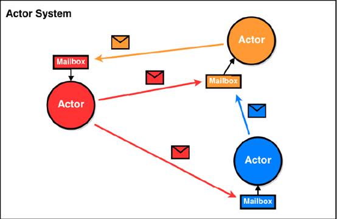

# Basic Flows

## Types

### Unit vs Null vs Nothing

- Unit类型只有一个实例()，该实例没有实际意义;  使用 Nothing 处理异常; 
- Null是所有**引用(Ref)类型**的**子类型** Null类只有一个实例对象null; null可以赋值给任意引用类型，但是不能赋值给**值类型**

## If statement

- if statement has return value

  ```scala
  val name = if (n > 10) "A" else "B";
  ```

- if `if` statement returns different type of value, the return type is the =="super type"== of the return types

  ```scala
  val name:Any = if (n > 10) 1 else "A"; // here name is of Any type
  ```

- if `if` statement is missing `else` block, by default `else` will return `Unit`, `Unit` is equivalent to `void`

  ```scala
  val name = if (n > 10) "A"; // if n <= 10, name is of type Unit
  ```

## For

- `for(i <- expression)`, let `i` iterate the generated sequence by the `expression`; note type of `i`depends on the `expression`

  - e.g., `expression = 1 to 10`, then `i` is of type `int`

- Double loop: `for(i <- 1 to 10; j <- 1 to 3)`

- `yield` can be used to return evaluated loop results

  ```scala
  val res = for (i <- 1 to 5) yield i + 2; // res = [3, 4, 5, 6, 7]
  ```


## Array

```scala
// fixed length array : Array
-- 长度为10的整型数组，初始值为0
val nums = new Array[Int](10)
-- 使用()访问数据元素；下标从0开始
nums(9) = 10
-- 长度为10的字符串数组，初始值为null
val strs = new Array[String](10)
-- 省略new关键字，定义数组，scala进行自动类型推断
val arrays = Array(1, 2, 3)
-- 快速定义数组，用于测试
val numsTest = (1 to 100).toArray


// dynamic array: ArrayBuffer
import scala.collection.mutable.ArrayBuffer
// 定义一个空的可变长Int型数组。注意：后面要有小括号
val nums = ArrayBuffer[Int]()
// 在尾端添加元素
nums += 1
// 在尾端添加多个元素
nums += (2,3,4,5)
// 使用++=在尾端添加任何集合
nums ++= Array(6,7,8)
// 这些操作符，有相应的 -= ，--=可以做数组的删减，用法同+=，++=
// 使用append追加一个或者多个元素
nums.append(1)
nums.append(2,3)
// 在下标2之前插入元素
nums.insert(2,20)
nums.insert(2,30,30)
// 移除最后2元素
nums.trimEnd(2)
// 移除最开始的一个或者多个元素
nums.trimStart(1)
// 从下标2处移除一个或者多个元素
nums.remove(2)
nums.remove(2,2)

//2D array
-- 3*4 matrix
val dim = Array.ofDim[Double](3,4)
dim(1)(1) = 11.11
for (i <- 0 to 2; j <- 0 to 3) {
print(dim(i)(j) + " ")
if (j == 3) println()
}

```

- index using `()` instead of `[]`

## Tuple

```scala
//报错，元组的元素个数上限是22个
val a = Tuple23(1,2,3,4,5,6,7,8,9,0,1,2,3,4,5,6,7,8,9,0,1,2,3)
// 定义元组
val a = (1, 1.2, "ad", 'd')
val b = Tuple4(1, 1.2, "ad", 'd')
println(a==b)
// Tuple的访问形式比较特殊。元组的下标从1开始
a._1
a _2
a._3
a _4
// 从元组接收数据
val (a1, a2, a3, a4), a5 = a
val (b1, _, b2, _), b5 = a
// 遍历元组，第一种方式
for(x <- a.productIterator){
	println(x)
}
// 遍历元组，第二种方式
a.productIterator.foreach(x => println(x))

```

# Class

- no need to declare ==public== in scala, classes are default `public`
- for ==val==, 值不能改变，只提供getter方法，没有setter方法；for ==var==, 值可以改变，对外提供getter, setter方法
- `object.attrName_(val)` is to use the object's `setter()` method to set the attribute to `val`
  - Similarly, `object.attrName` is to use the object's `getter()` method

```scala
class Person {
  // Scala中声明一个字段，必须显示的初始化，然后根据初始化的数据类型自动推断其类型，字段类型可以省略
  var name = "jacky"
    
  // _ 表示一个占位符，编译器会根据变量的数据类型赋予相应的初始值; 使用占位符，变量类型必须指定
  // _ 对应的默认值:整型默认值0；浮点型默认值0.0；String与引用类型，默认值null; Boolean默认值false
  var nickName: String = _
    
  var age=20
  // 如果赋值为null,则一定要加数据类型，因为不加类型, 该字段的数据类型就是Null类型
  // var address = null ## 报错
  var address: String = null

  // val修饰的变量不能使用占位符
  val num = 30

  // 类私有字段,有私有的getter方法和setter方法，
  // 在类的内部可以访问，其伴生(companion)对象也可以访问, companion used for singletons
  private var hobby: String = "旅游"

  // 对象私有字段,访问权限更加严格，只能在当前类中访问
  private[this] val cardInfo = "123456"
  
  //自定义方法
   def hello(message: String): Unit = {
    //只能在当前类中访问cardInfo
    println(s"$message,$cardInfo")
  }
}


object Main {
  def main(args: Array[String]): Unit = {
    //创建对象两种方式，这里都是使用的无参构造器来进行创建对象的
    val person = new Person()
    //创建类的对象时，小括号()可以省略
    val person1 = new Person
    //给类的属性赋值
    person.age = 50
    //注意：如果使用对象的属性加上 _= 给var修饰的属性进行重新赋值，其实就是调用age_=这个setter()方法
    person.age_=(20)
    //直接调用类的属性，其实就是调用getter方法
    println(person.age)
    //调用类中的方法
    person.hello("hello")
    val result = person.addNum(10, 20)
    println(result)
  }
}
```

## Constructor

- inside constructor we can declare `val`, `var` or nothing for the parameter list

  ```scala
  class Person(var firstName: String, var lastName: String)	//scala will auto generate getters and setters where getter is infoked by: object.attr, setter is invoked by: object.attr = val
  class Person(val firstName: String, val lastName: String)	//scala will only generate getters
  class Person(firstName: String, lastName: String) //If a field doesn’t have a var or val modifier, Scala gets conservative, and doesn’t generate a getter or setter method for the field.
  ```

  -  for `var`: scala will auto generate getters and setters where getter is infoked by: `object.attr`, setter is invoked by: `object.attr = val`
  - for `val`: scala will only generate getters, invoke setter will raise error
  - for default(without `val` and `var`): If a field doesn’t have a var or val modifier, Scala gets conservative, and doesn’t generate a getter or setter method for the field. Invoke any of getter or setter will raise errors.

- In addition to these three basic configurations, you can add the `private` keyword to a `val` or `var` field. This keyword prevents getter and setter methods from being generated, so the field can only be accessed from within members of the class:

  ```scala
  scala> class Person(private var name: String) { def getName {println(name)}  }
  defined class Person
  
  scala> val p = new Person("Alvin Alexander")
  p: Person = Person@3cb7cee4
  
  scala> p.name
  <console>:10: error: variable name in class Person cannot be accessed in Person
                p.name
                  ^
  
  scala> p.getName
  Alvin Alexander
  ```

  

## Auxilary Constructor

In Scala, ==every auxiliary constructor must invoke another constructor of the same class as its first action. In other words, the first statement in every auxiliary constructor in every Scala class will have the form “this(. . . )”. The invoked constructor is either the primary constructor (as in the Rational example)==, or another auxiliary constructor that comes textually before the calling constructor. The net effect of this rule is that every constructor invocation in ==Scala will end up eventually calling the primary constructor== of the class. **The primary constructor is thus the single point of entry of a class**.

```scala
// auxiliary constructor, following is example of 2 c'tor & 1 c'tor
class Rational(n: Int, d: Int) {
require(d != 0)
val numer: Int = n
val denom: Int = d
val str: String = null
def this(n: Int) = this(n, 1) // auxiliary constructor

//auxiliary constructor 2
def this(n: Int, s: String) {
    this(n);
    this.str = s;
}
override def toString = numer + "/" + denom
    
def add(that: Rational): Rational =
    new Rational(
        numer * that.denom + that.numer * denom,
        denom * that.denom
    )
}
```

## Getter and Setter

对于 Scala 类中的每一个属性，编译后会有一个私有的字段和相应的getter、setter方法生成。

~~~scala
//getter方法
println(person.age)

//setter方法
person.age= 18

//getter方法
println(person.age)
~~~

可以不使用自动生成的方式，自己定义getter和setter方法

~~~scala
class Dog {
  private var _leg = 0
  //自定义getter方法
  def leg = _leg
  //自定义setter方法
  def leg_=(newLeg: Int) {
    _leg = newLeg
  }
}

// 使用自定义getter和setter方法
val dog = new Dog
dog.leg_=(4)
println(dog.leg)
~~~

自定义变量的getter和setter方法需要遵循以下原则：

- 字段属性名以“_”作为前缀，如： _leg
- getter方法定义为：def leg = _leg
- setter方法定义为：def leg_=(newLeg: Int)

## Bean Property

JavaBean规范把Java属性定义为一堆getter和setter方法。

类似于Java，当将Scala字段标注为 @BeanProperty时，getFoo和setFoo方法会自动生成。

使用`@BeanProperty`并不会影响Scala自己自动生成的getter和setter方法。

在使用时需要导入包scala.beans.BeanProperty

~~~scala
import scala.beans.BeanProperty

class Teacher {
    @BeanProperty var name:String = _	//auto generate getName() and setName()
}

object BeanDemo{
  def main(args: Array[String]): Unit = {
    val tea: Teacher = new Teacher
    tea.name = "zhagnsan"
    tea.setName("lisi")    //BeanProperty生成的setName方法
    println(tea.getName)   //BeanProperty生成的getName方法
  }
}
~~~

上述Teacher类中共生成了四个方法：

~~~scala
1. name: String
2. name_= (newValue: String): Unit
3. getName(): String
4. setName (newValue: String): Unit
~~~

## Singleton

- 创建singleton object不需要==new==
- singleton object只有无参constructor

```scala
object MySingle {  
	println("这是单例对象的代码, 只会被执行一遍！！")  
}
object Main {
    def main(args: Array[String]): Unit = {    
		val object1=MySingle   
		val object2=MySingle
        //print once "这是单例对象的代码, 只会被执行一遍！！"
	}
}
```


### Companion Class and Object

- 当单例对象与某个类具有相同的名称时，它被称为这个类的“伴生(Companion)对象”； 类和它的伴生对象必须存在于同一个文件中，而且可以相互访问私有成员（字段和方法）；

#### Apply

- https://docs.scala-lang.org/overviews/scala-book/companion-objects.html
- **The `apply()` method in the companion object acts as a ==Factory Method==**. A companion ==object’s apply() method== lets you create new instances of a ==class== **without using the new keyword**
- 这个**object**相当于对应**companion class**的 **singleton builder**

- **apply方法通常定义在伴生对象中**，目的是通过伴生类的构造函数功能，来实现伴生对象的构造函数功能；

- 通常我们会在类的伴生对象中定义apply方法，**当遇到类名(参数1,...参数n)时apply方法会被调用**；

- 在创建伴生对象或伴生类的对象时，通常不会使用new class/class() 的方式，而是**直接使用 class()隐式的调用伴生对象的 apply 方法**，这样会让对象创建的更加简洁；

  ```scala
  //class Student为伴生类
  class Student(name: String, age: Int) {
    private var gender: String = _
  
    def sayHi(): Unit ={
      println(s"大家好，我是$name,$gender 生")
    }
  }
  
  //object Student是class class的伴生对象
  object Student {
    //apply方法定义在伴生对象中
    def apply(name: String, age: Int): Student = new Student(name, age)
  
    def main(args: Array[String]): Unit = {
      //直接利用类名进行对象的创建，这种方式实际上是调用伴生对象的apply方法实现的
      val student=Student("jacky",30)
      student.gender="男"
  
      student.sayHi()
    }
  }
  ```

**问题**：在Scala中实现工厂方法，让子类声明哪种对象应该被创建，保持对象创建在同一位置。例如，假设要创建Animal工厂，让其返回Cat和Dog类的实例，基于这个需求，通过实现Animal伴生对象的apply方法，工厂的使用者可以像这样创建新的Cat和Dog实例。

```scala
abstract class Animal {
  def speak
}

class Dog extends Animal {
  override def speak: Unit = {
    println("woof")
  }
}

class Cat extends Animal {
  override def speak: Unit = {
    println("meow")
  }
}

object Animal {
  def apply(str: String): Animal = {
    if (str == "dog")
      new Dog
    else
      new Cat
  }

  def main(args: Array[String]): Unit = {
    val cat = Animal("cat")
    cat.speak

    val dog = Animal("dog")
    dog.speak
  }
}
```

#### Access between companion object and class

- Companion Object can directly access its companion class's method and fields. For Companion Class to access Companion object field and method, it needs to declare explicitly `import CompanionObject._`; https://stackoverflow.com/questions/23704769/companion-class-requires-import-of-companion-object-methods-and-nested-objects

  

  

# Inheritance

### 第1节 继承的概念

Scala中继承类的方式和Java一样，也是使用extends关键字：

```scala
class Employee extends Person{
	var salary=1000
}
```

和Java一样，可在定义中给出子类需要而父类没有的字段和方法，或者重写父类的方法。

```scala
//Person类
class Person(name:String,age:Int)
//Student继承Person类
class Student(name:String,age:Int,var studentNo:String) extends Person(name,age)
object Demo{
  def main(args: Array[String]): Unit = {
     val student=new Student("john",18,"1024")
  }
}
```

上面继承部分的代码等效于下面的Java代码

```scala
//Person类
class Person{
    private String name;
    private int age;
    public Person(String name,int age){
       this.name=name;
       this.age=age;
    }
}
//Student继承Person类
class Student extends Person{
    private String studentNo;
    public Student(string name,int age,String studentNo){
        super(name,age);
        this.sutdentNo=studentNo;
    }
}
```


### 第2节 构造器执行顺序

Scala在继承的时候构造器的执行顺序：首先执行父类的主构造器，其次执行子类自身的主构造器。

类有一个主构造器和任意数量的辅助构造器，而每个辅助构造器都必须以对先前定义的辅助构造器或主构造器的调用开始。

子类的辅助构造器最终都会调用主构造器。只有主构造器可以调用父类的构造器。

```scala
//Person类
class Person(name:String,age:Int){
  println("这是父类Person")
}
//Student继承Person类
class Student(name:String,age:Int,studentNo:String) extends Person(name,age){
  println("这是子类Student")
}

object Demo{
  def main(args: Array[String]): Unit = {
     //下面的语句执行时会打印下列内容:
     //这是父类Person
     //这是子类Student
     //也就是说，构造Student对象之前，首先会调用Person的主构造器
     val student=new Student("john",18,"1024")
  }
}
```

### 第3节 override方法重写

方法重写指的是当子类继承父类的时候，从父类继承过来的方法不能满足子类的需要，子类希望有自己的实现，这时需要对父类的方法进行重写，方法重写是实现多态的关键。 
Scala中的方法重写同Java一样，也是利用override关键字标识重写父类的方法。

```scala
class Programmer(name:String,age:Int){
  def coding():Unit=println("我在写代码...")
}
//ScalaProgrammer继承Programmer类
class ScalaProgrammer(name:String,age:Int,workNo:String) extends Programmer(name,age){
  override def coding():Unit={
    //调用父类的方法
    super.coding()
    //增加了自己的实现
    println("我在写Scala代码...")
  }
}

object ExtendsDemo {
  def main(args: Array[String]): Unit = {
    val scalaProgrammer=new ScalaProgrammer("张三",30,"1001")
    scalaProgrammer.coding()
  }
}
//代码运行输出内容:
我在写代码...
我在写Scala代码...
```

需要强调一点：如果父类是抽象类，则override关键字可以不加。如果继承的父类是抽象类（假设抽象类为AbstractClass，子类为SubClass），在SubClass类中，AbstractClass对应的抽象方法如果没有实现的话，那SubClass也必须定义为抽象类，否则的话必须要有方法的实现。

```scala
//抽象的Person类
abstract class Person(name:String,age:Int){
  def walk():Unit
}
//Student继承抽象Person类
class Student(name:String,age:Int,var studentNo:String) extends Person(name,age){
  //重写抽象类中的walk方法，可以不加override关键字
  def walk():Unit={
    println("walk like a elegant swan")
  }
}
object Demo{
  def main(args: Array[String]): Unit = {
     val stu=new Student("john",18,"1024")
     stu.walk()
  }
}
```


### 第4节 类型检查与转换 

要测试某个对象是否属于某个给定的类，可以用isInstanceOf方法。如果测试成功，可以用asInstanceOf方法进行类型转换。

```scala
if(p.isInstanceOf[Employee]){
	//s的类型转换为Employee
	val s = p.asInstanceOf[Employee]
}
```

如果p指向的是Employee类及其子类的对象，则p.isInstanceOf[Employee]将会成功。

如果p是null，则p.isInstanceOf[Employee]将返回false，且p.asInstanceOf[Employee]将返回null。

如果p不是一个Employee，则p.asInstanceOf[Employee]将抛出异常。

如果想要测试p指向的是一个Employee对象但又不是其子类，可以用：

```scala
if(p.getClass == classOf[Employee])
```

classOf方法定义在scala.Preder对象中，因此会被自动引入。

不过，与类型检查和转换相比，模式匹配通常是更好的选择。

```scala
p match{
	//将s作为Employee处理
	case s: Employee => ...
	//p不是Employee的情况
	case _ => ....
}
```

# Trait

### 第1节 作为接口使用的特质

Scala中的trait特质是一种特殊的概念。

首先可以将trait作为接口来使用，此时的trait就与Java中的接口非常类似。

在trait中可以定义抽象方法，与抽象类中的抽象方法一样，只要不给出方法的具体实现即可。

类可以使用extends关键字继承trait。

注意：在Scala中没有implement的概念，无论继承类还是trait特质，统一都是extends。

类继承trait特质后，必须实现其中的抽象方法，实现时**可以省略override关键字**。

Scala不支持对类进行多继承，但是**支持多重继承trait特质，使用with关键字即可**。

```scala
//定义一个trai特质
trait HelloTrait {
  def sayHello
}
//定义一个trai特质
trait MakeFriendTrait {
  def makeFriend
}
//继承多个trait,第一个trait使用extends关键字，其它trait使用with关键字
class Person(name: String) extends HelloTrait with MakeFriendsTrait with Serializable {
  override def sayHello() = println("Hello, My name is " + name)
  //override关键字也可以省略
  def makeFriend() = println("Hello，" + name)
}
```


### 第2节 带有具体实现的特质

**具体方法**

Scala中的trait特质不仅仅可以定义抽象方法，还可以定义具体实现的方法，这时的trait更像是包含了通用工具方法的类。比如，trait中可以包含一些很多类都通用的功能方法，比如打印日志等等，Spark中就使用了trait来定义通用的日志打印方法。

**具体字段**

Scala trait特质中的字段可以是抽象的，也可以是具体的。

```scala
trait People {
  //定义抽象字段
  val name: String
  //定义了age字段
  val age = 30

  def eat(message: String): Unit = {
    println(message)
  }
}

trait Worker {
  //这个trait也定义了age字段
  val age = 25

  def work: Unit = {
    println("Working......")
  }
}
// Student类继承了Worker、Person这两个特质，需要使用extends、with这两个关键字
class Student extends Worker with People{
  //重写抽象字段，override可以省略
  override val name: String = "张三"
  //继承的两个trait中都有age字段，此时需要重写age字段，override不能省略
  override val age = 20
}

object TraitDemoTwo {
  def main(args: Array[String]): Unit = {
    val stu = new Student
    stu.eat("吃饭")
    stu.work
    println(s"Name is ${stu.name}, Age is ${stu.age}")
  }
}
```

**注意：**特质Person和Worker中都有age字段，当Student继承这两个特质时，需要重写age字段，并且要用override关键字，否则就会报错。

### 第5节 Ordered和Ordering

在Java中对象的比较有两个接口，分别是Comparable和Comparator。它们之间的区别在于：

实现Comparable接口的类，重写compareTo()方法后，其对象自身就具有了可比较性；
实现Comparator接口的类，重写了compare()方法后，则提供一个第三方比较器，用于比较两个对象。

在Scala中也引入了以上两种比较方法(Scala.math包下):

Ordered特质混入Java的Comparable接口，它定义了相同类型间的比较方式，但这种内部比较方式是单一的；

```scala
trait Ordered[A] extends Any with java.lang.Comparable[A]{......}
```

Ordering特质混入Comparator接口，它是提供第三方比较器，可以自定义多种比较方式，在实际开发中也是使用比较多的，灵活解耦合。

```scala
trait Ordering[T] extends Comparator[T] with PartialOrdering[T] with Serializable {......}
```

使用Ordered特质进行排序操作

```scala
case class Project(tag:String, score:Int) extends Ordered[Project] {
  def compare(pro:Project ) = tag.compareTo(pro.tag)
}

object OrderedDemo {
  def main(args: Array[String]): Unit = {
    val list = List(Project("hadoop",60), Project("flink",90), 			                             Project("hive",70),Project("spark",80))
    println(list.sorted)
  }
}
```

使用Ordering特质进行排序操作

```scala
object OrderingDemo {
  def main(args: Array[String]): Unit = {
    val pairs = Array(("a", 7, 2), ("c", 9, 1), ("b", 8, 3))
    // Ordering.by[(Int,Int,Double),Int](_._2)表示从Tuple3转到Int型
    // 并按此Tuple3中第二个元素进行排序
    Sorting.quickSort(pairs)(Ordering.by[(String, Int, Int), Int](_._2))
    println(pairs.toBuffer)
  }
}
```

# Case

## match class type

```scala
def main(args: Array[String]): Unit = {
  val a = 3
  val obj = if(a == 1) 1
  else if(a == 2) "2"
  else if(a == 3) BigInt(3)
  else if(a == 4) Map("aa" -> 1)
  else if(a == 5) Map(1 -> "aa")
  else if(a == 6) Array(1, 2, 3)
  else if(a == 7) Array("aa", 1)
  else if(a == 8) Array("aa")
    
  val r1 = obj match {
    case x: Int => x
    case s: String => s.toInt
    // case BigInt => -1 //不能这么匹配
    case _: BigInt => Int.MaxValue
    case m: Map[String, Int] => "Map[String, Int]类型的Map集合"
    case m: Map[_, _] => "Map集合"
    case a: Array[Int] => "It's an Array[Int]"
    case a: Array[String] => "It's an Array[String]"
    case a: Array[_] => "It's an array of something other than Int"
    case _ => 0
  }
  println(r1 + ", " + r1.getClass.getName)
}
```

## match variable value

## adding garding statement in the case

```scala
// 所谓守卫就是添加if语句
object MatchDemo {
  def main(args: Array[String]): Unit = {
    //守卫式
    val character = '*'
    val num = character match {
      case '+' => 1
      case '-' => 2
      case _ if character.equals('*') => 3
      case _ => 4
    }
    println(character + " " + num)
}
```

## Match Collection

```scala
def main(args: Array[String]): Unit = {
  val arr = Array(0, 3, 5)
  //对Array数组进行模式匹配，分别匹配：
  //带有指定个数元素的数组、带有指定元素的数组、以某元素开头的数组
  arr match {
    case Array(0, x, y) => println(x + " " + y)
    case Array(0) => println("only 0")
    //匹配数组以1开始作为第一个元素
    case Array(1, _*) => println("1 ...")
    case _ => println("something else")
  }

  val list = List(3, -1)
  //对List列表进行模式匹配，与Array类似，但是需要使用List特有的::操作符
  //构造List列表的两个基本单位是Nil和::，Nil表示为一个空列表
  //tail返回一个除了第一元素之外的其他元素的列表
  //分别匹配：带有指定个数元素的列表、带有指定元素的列表、以某元素开头的列表
  list match {
    case x :: y :: Nil => println(s"x: $x y: $y")
    case 0 :: Nil => println("only 0")
    case 1 :: tail => println("1 ...") 
    case _ => println("something else")
  }

  val tuple = (1, 3, 7)
  tuple match {
    case (1, x, y) => println(s"1, $x , $y")
    case (_, z, 5) => println(z)
    case  _ => println("else")
  }
}
```

## Case Class

case class样例类是Scala中特殊的类。当声明样例类时，以下事情会自动发生：

- for a case class, all of the constructor parameters will be automatically public fields.
- 主构造函数接收的参数通常不需要显式使用var或val修饰，Scala会自动使用val修饰
- **自动为样例类定义了伴生对象，并提供apply方法，不用new关键字就能够构造出相应的对象**
- 将生成toString、equals、hashCode和copy方法，除非显示的给出这些方法的定义
- 继承了Product和Serializable这两个特质，也就是说样例类可序列化和可应用Product的方法

case class是多例的，后面要跟构造参数，case object是单例的。

此外，case class样例类中可以添加方法和字段，并且可用于模式匹配。

```scala
class Amount
//定义样例类Dollar，继承Amount父类
case class Dollar(value: Double) extends Amount
//定义样例类Currency，继承Amount父类
case class Currency(value: Double, unit: String) extends Amount
//定义样例对象Nothing，继承Amount父类
case object Nothing extends Amount

object CaseClassDemo {
  def main(args: Array[String]): Unit = {
    judgeIdentity(Dollar(10.0))
    judgeIdentity(Currency(20.2,"100"))
    judgeIdentity(Nothing)
  }
  //自定义方法，模式匹配判断amt类型
  def judgeIdentity(amt: Amount): Unit = {
    amt match {
      case Dollar(value) => println(s"$value")
      case Currency(value, unit) => println(s"Oh noes,I got $unit")
      case Nothing => println("Oh,GOD!")
    }
  }
}
```

### Match Case Class

- https://docs.scala-lang.org/tour/pattern-matching.html

  ```scala
  abstract class Notification
  
  case class Email(sender: String, title: String, body: String) extends Notification
  
  case class SMS(caller: String, message: String) extends Notification
  
  case class VoiceRecording(contactName: String, link: String) extends Notification
  
  def showNotification(notification: Notification): String = {
    notification match {
      case Email(sender, title, _) =>
        s"You got an email from $sender with title: $title"
      case SMS(number, message) =>
        s"You got an SMS from $number! Message: $message"
      case VoiceRecording(name, link) =>
        s"You received a Voice Recording from $name! Click the link to hear it: $link"
    }
  }
  val someSms = SMS("12345", "Are you there?")
  val someVoiceRecording = VoiceRecording("Tom", "voicerecording.org/id/123")
  
  println(showNotification(someSms))  // prints You got an SMS from 12345! Message: Are you there?
  
  println(showNotification(someVoiceRecording))  // prints You received a Voice Recording from Tom! Click the link to hear it: voicerecording.org/id/123
  ```

- Traits and classes can be marked `sealed` which means all subtypes must be declared in the same file. This assures that all subtypes are known. This is useful for pattern matching because we don’t need a “catch all” case.

### Case Class vs Case Object

- A case class can take arguments, so each instance of that case class can be different based on the values of it's arguments. A case object on the other hand does not take args in the constructor, so there can only be one instance of it (a singleton, like a regular scala `object` is).

```scala
//case object
case object DoWork

def receive = {
  case DoWork => 
     //do some work here
}

// case class
case class DoWorkAfter(waitTime:Long)

def receive = {
  case DoWorkAfter(time) =>
    context.system.scheduler.scheduleOnce(time.milliseconds, self, DoWork)

  case DoWork => 
     //do some work here
}
```


- https://stackoverflow.com/questions/32078526/difference-between-case-class-and-case-object

## Option

Scala Option选项类型用来表示一个值是可选的，有值或无值。

**Option[T] 是一个类型为 T 的可选值的容器，可以通过get()函数获取Option的值。如果值存在，Option[T] 就是一个 `Some`。如果不存在，Option[T] 就是对象 `None` **。

Option通常与模式匹配结合使用，用于判断某个变量是有值还是无值。

```scala
object Main {
  val map = Map("jacky" -> 90, "tom" -> 80, "jarry" -> 95)

  def getGrade(name: String): Unit = {
    val grade = map.get(name)	//map.get() returns a Option[T]; map.get(key) -> returns Some(T) if there are value, None if nothing
    val grade2: Option[Int] = map.get(name); 	
    grade match {
      case Some(grade) => println("成绩：" + grade)
      case None => println("没有此人成绩！")
    }
  }

  def main(args: Array[String]): Unit = {
    getGrade("jacky")
    getGrade("张三")
  }
}
```


# Function

- 方法(method)可用`def`来修饰，函数(function)可用`val`. 

  ```scala
  val add1: Int => Int = (x) => x+1
  
  
  def add2: Unit = {
      println("hello");
      print("no");
  }
  def add2 = print("a");
  def add3 = "a"; //a method that returns a string a
  val add4 = () => "a"; //a function that returns a string a, for method we need to include () for no param input
  ```

  

- 函数体中只有1行语句时，大括号可以省略；

  ```scala
  val add3(x: Int, y: Int) => x + y
  ```

- 在Scala中有自动类型推断，所以可以省略变量的类型 `val 变量名 = 值`

  ```scala
  val add1 = (x: Int) => x + 1
  ```

- scala function definition summary

  ```scala
  val 函数名: (参数类型1，参数类型2) => (返回类型) = 函数字面量
  val 函数名 = 函数字面量
  函数字面量:(参数1：类型1，参数2：类型2)  =>  函数体
  val 函数名 = (参数1：类型1，参数2：类型2)  =>  函数体
  
  函数体 = {函数定义}
  函数字面量 = 单行函数定义，不加{}
  ```

## Method vs Function

- Scala 中用 val 语句定义函数，def 语句定义方法
- 方法不能作为单独的表达式而存在，而函数可以；
- 函数(val)必须要有参数列表，而方法(def)可以没有参数列表；
- 方法名是方法调用，而函数名只是代表函数对象本身；
- 在需要函数的地方，如果传递一个方法，会自动把方法转换为函数

~~~scala
// 方法不能作为单独的表达式而存在，而函数可以
scala> def addm(x: Int, y: Int): Int = x + y
addm: (x: Int, y: Int)Int

scala> val addf = (x: Int, y: Int) => x + y
addf: (Int, Int) => Int = <function2>

scala> addm
<console>:13: error: missing argument list for method addm

scala> addf
res8: (Int, Int) => Int = <function2>

// 函数必须要有参数列表，而方法可以没有参数列表
scala> def m1 = "This is lagou edu"
m1: String

// 函数必须有参数列表
scala> val f1 = () => "This is lagou edu"
f1: () => String = <function0>

// 方法名是方法调用
scala> m1
res16: String = This is lagou edu

// 函数名代表函数对象
scala> f1
res17: () => String = <function0>

// 这才代表函数调用
scala> f1()
res18: String = This is lagou edu

// 需要函数的地方，可以传递一个方法
scala> val list = (1 to 10).toList
lst: List[Int] = List(1, 2, 3, 4, 5, 6, 7, 8, 9, 10)

scala> def double(x: Int) = x*x
double: (x: Int)Int

scala> list.map(double(_))
res20: List[Int] = List(1, 4, 9, 16, 25, 36, 49, 64, 81, 100)
~~~


### **将方法转换为函数**

~~~scala
scala> def f1 = double _   //注意：方法名与下划线之间有一个空格
f1: Int => Int

scala> f1
res21: Int => Int = <function1>
~~~

写程序的时候是定义方法、还是定义函数？

**一般情况下**，不对二者做区分，认为都是函数，**更多的时候使用def定义函数。**

### Empty Paren methods vs parameterless methods

instead of 

```scala
def width(): Int
```

the function can be defined without parenthesis

```scala
def width: Int
```

Such `parameterless method`s are quite common in Scala. By contrast, methods defined with empty parentheses, such as def `height()`: Int, are called **empty-paren methods**. The recommended convention is to use a **parameterless method(no parenthesis)** whenever there are no parameters and the method accesses mutable state only by reading fields of the containing object (in particular, it does not change mutable state). 


## Annonymous Function

函数没有名字就是匿名函数；

匿名函数，又被称为 Lambda 表达式。 Lambda表达式的形式如下：

`(参数名1:  类型1, 参数名2:  类型2, ... ...) => 函数体`

~~~scala
// 定义匿名函数
scala> (x: Int) => x + 1
res0: Int => Int = <function1>

// 函数没有名字，在集成开发环境中是无法被调用的
scala> res0(10)
res1: Int = 11

scala> val list = (1 to 10).toList
lst: List[Int] = List(1, 2, 3, 4, 5, 6, 7, 8, 9, 10)

// 将匿名函数作为参数传递给另一个函数
scala> list.map((x: Int) => x + 1)
res2: List[Int] = List(2, 3, 4, 5, 6, 7, 8, 9, 10, 11)

// x一定是Int类型，这里可以省略
scala> list.map((x) => x + 1)
res3: List[Int] = List(2, 3, 4, 5, 6, 7, 8, 9, 10, 11)

// 只有一个参数，小括号可以省略
scala> list.map(x => x + 1)
res4: List[Int] = List(2, 3, 4, 5, 6, 7, 8, 9, 10, 11)

// 使用占位符简化函数字面量
scala> list.map(_ + 1)
res5: List[Int] = List(2, 3, 4, 5, 6, 7, 8, 9, 10, 11)

// 实现将List中的每个元素*2 + 1，但是出错了
scala> list.map(_ + _ + 1)
<console>:13: error: missing parameter type for expanded function ((x$1, x$2) => x$1.$plus(x$2).$plus(1))

// 这样是可行的
scala> list.map(2 * _ + 1)

// 通过reduce这个高阶函数，将list列表中的元素相加求和
scala> list.reduce((x,y) => x + y)
res0: Int = 55

// 使用占位符简化函数字面量
// 第一个下划线代表第一个参数，第二个下划线代表第二个参数
scala> list.reduce(_ + _)
res1: Int = 55
~~~

### **多个下划线(_)指代多个参数，而不是单个参数的重复运用**

- 第一个下划线代表第一个参数
- 第二个下划线代表第二个参数
- 第三个……，如此类推

## Higher Order Functions(高阶函数)

**高阶函数：接收一个或多个函数作为输入 或 输出一个函数。**

函数的参数可以是变量，而函数又可以赋值给变量，由于函数和变量地位一样，所以函数参数也可以是函数；

常用的高阶函数：map、reduce、flatMap、foreach、filter、count … … (接收函数作为参数)

~~~scala
object HighFunction {
  def main(args: Array[String]): Unit = {
    //定义一个函数
    val func = (n) => "*" * n
    //接收函数作为输入
    (1 to 5).map(func(_)).foreach(println)

    //输出一个函数
    val urlBuilder= (ssl: Boolean, domainName: String) => {
      val schema = if (ssl) "https://" else "http://"
      //返回一个匿名函数
      (endPoint: String, query: String) => s"$schema$domainName/$endPoint?$query"
    }
    val domainName = "www.lagou.com"

    def getURL: (String, String) => String = urlBuilder(true, domainName)

    val endPoint: String = "show"
    val query: String = "id=1"
    val url: String = getURL(endPoint, query)
    println(url)
  }
}
~~~

## 闭包

闭包是一种函数，一种比较特殊的函数，它和普通的函数有很大区别：

~~~scala
    // 普通的函数
    val addMore1 = (x: Int) => x + 10
    // 外部变量，也称为自由变量
    var more = 10
    // 闭包
    val addMore2 = (x: Int) => x + more

	// 调用addMore1函数
	println(addMore1(5))
    // 每次addMore2函数被调用时，都会去捕获外部的自由变量
    println(addMore2(10))
    more = 100
    println(addMore2(10))
    more = 1000
    println(addMore2(10))
~~~

**闭包是在其上下文中引用了自由变量的函数；**

闭包引用到函数外面定义的变量，定义这个函数的过程就是将这个自由变量捕获而构成的一个封闭的函数，也可理解为”把函数外部的一个自由变量关闭进来“。

何为闭包？需满足下面三个条件：

1、闭包是一个函数

2、函数必须要有返回值

3、返回值依赖声明在函数外部的一个或多个变量，用Java的话说，就是返回值和定义的全局变量有关

## Currying

函数编程中，**接收多个参数的函数都可以转化为接收单个参数的函数**，这个转化过程就叫柯里化(Currying)。

Scala中，柯里化函数的定义形式和普通函数类似，区别在于柯里化函数拥有多组参数列表，每组参数用小括号括起来。

Scala API中很多函数都是柯里化的形式。

```scala
// 使用普通的方式
def add1(x: Int, y: Int) = x + y

// 使用闭包的方式，将其中一个函数作为返回值
def add2(x: Int) = (y:Int) => x + y

// 使用柯里化的方式
def add(x: Int)(y: Int) = x + y

//调用柯里化函数add
scala> add(1)(2)
res1: Int = 3
//add(1)(2)实际上第一次调用使用参数x，返回一个函数类型的值，第二次使用参数y调用这个函数类型的值。
//实际上最先演变成这样的函数：def add(x: Int) = (y:Int) => x + y
//在这个函数中，接收一个x为参数，返回一个匿名函数，这个匿名函数的定义是：接收一个Int型参数y，函数体是x+y。
//调用过程如下：
scala> val result=add(1)
result: Int => Int = <function1>

scala> val sum=result(2)
sum: Int = 3

scala> sum
res0: Int = 3
```

## Partial Applied Function

部分应用函数（Partial Applied Function）也叫偏应用函数，与偏函数从名称上看非常接近，但二者之间却有天壤之别。

**部分应用函数是指缺少部分（甚至全部）参数的函数。**

如果一个函数有n个参数, 而为其提供少于n个参数, 那就得到了一个部分应用函数。

~~~scala
// 定义一个函数
def add(x:Int, y:Int, z:Int) = x+y+z

// Int不能省略
def addX = add(1, _:Int, _:Int)
addX(2,3)
addX(3,4)

def addXAndY = add(10, 100, _:Int)
addXAndY(1)

def addZ = add(_:Int, _:Int, 10)
addZ(1,2)

// 省略了全部的参数，下面两个等价。第二个更常用
def add1 = add(_: Int, _: Int, _: Int)
def add2 = add _  
~~~

## Partial Function偏函数

偏函数（Partial Function）之所以“偏”，原因在于它们并不处理所有可能的输入，而只处理那些能与至少一个 case 语句匹配的输入；

在偏函数中只能使用 **case 语句**，整个函数必须用**大括号**包围。这与普通的函数字面量不同，普通的函数字面量可以使用大括号，也可以用小括号；

被包裹在**大括号**中的一组case语句是一个偏函数，是一个并非对所有输入值都有定义的函数；

Scala中的Partial Function是一个trait，其类型为PartialFunction[A,B]，表示：接收一个类型为A的参数，返回一个类型为B的结果。

~~~scala
// 1、2、3有对应的输出值，其它输入打印 Other
val pf: PartialFunction[Int, String] = {
  case 1 => "One"
  case 2 => "Two"
  case 3 => "Three"
  case _=> "Other"
}
pf(1) // 返回: One
pf(2) // 返回: Two
pf(5) // 返回: Other
~~~

- 需求：过滤List中的String类型的元素，并将Int类型的元素加1。

通过偏函数实现上述需求。

~~~scala
package cn.lagou.edu.scala.section3

object PartialFunctionDemo1 {
  def main(args: Array[String]): Unit = {
    // PartialFunction[Any, Int]: 偏函数接收的数据类型是Any，返回类型为Int
    val partialFun = new PartialFunction[Any, Int] {
      // 如果返回true，就调用 apply 构建实例对象；如果返回false，过滤String数据
      override def isDefinedAt(x: Any): Boolean = {
        println(s"x = $x")
        x.isInstanceOf[Int]
      }

      // apply构造器，对传入值+1，并返回
      override def apply(v1: Any): Int = {
        println(s"v1 = $v1")
        v1.asInstanceOf[Int] + 1
      }
    }

    val lst = List(10, "hadoop", 20, "hive", 30, "flume", 40, "sqoop")

    // 过滤字符串，对整型+1
    // collect通过执行一个并行计算（偏函数），得到一个新的数组对象
    lst.collect(partialFun).foreach(println)

    // 实际不用上面那么麻烦
    lst.collect{case x: Int => x+1}.foreach(println)
  }
}
~~~

### 偏函数应用

> [程序员网链接](http://www.voidcn.com/article/p-vjfhjhrf-st.html)
>
> [博客园网链接](https://www.cnblogs.com/guazi/p/7054441.html)


- 在调用函数时
  - 如果你要调用的函数有两个或两个以上的参数那么你只能使用小括号
  - 如果你要调用的函数只有单一参数那么通常情况下小括号和花括号是可以互换的
  - 在调用单一参数函数时小括号和花括号虽然等效但还是有差异的
  - 在调用一个单一参数函数时如果参数本身是一个通过case语句实现的 偏函数你只能使用花括号
- 作为表达式expression和语句块code blocks时

#### 在调用函数时

人们会笼统地说在函数调用时，小括号和花括号是通用的，但实际上，情况会复杂的多

#### 如果你要调用的函数有两个或两个以上的参数，那么你只能使用“小括号”

请看下面的示例：

```
scala> var add = (x: Int,y: Int) => x + y
add: (Int, Int) => Int = <function2>

scala> add(1,2)
res0: Int = 3

scala> add{1,2}
<console>:1: error: ';' expected but ',' found.
add{1,2}
     ^
```

#### 如果你要调用的函数只有单一参数，那么“通常”情况下小括号和花括号是可以互换的

请看下面的示例：

```
scala> var increase = (x: Int) => x + 1
increase: Int => Int = <function1>

scala> increase(10)
res0: Int = 11

scala> increase{10}
res1: Int = 11
```

#### 在调用单一参数函数时，小括号和花括号虽然等效，但还是有差异的

如果使用小括号，意味着你告诉编译器：它只接受单一的一行，因此，如果你意外地输入2行或更多，编译器就会报错。但对花括号来说则不然，如果你在花括号里忘记了一个操作符，代码是可以编辑的，但是会得到出乎意料的结果，进而导致难以追踪的Bug. 看如下的例子：

```scala
scala> def method(x: Int) = {
     |     x + 1
     | }
method: (x: Int)Int

scala> method {
     |   1 +
     |   2
     |   3
     | }
<console>:14: warning: a pure expression does nothing in statement position; you may be omitting necessary parentheses
         1 +
           ^
res14: Int = 4

scala> method(
     |   1 +
     |   2
     |   3
<console>:4: error: ')' expected but integer literal found.
  3
  ^
```

花括号的调用虽然有warning，但是可以编译通过，小括号的调用会编译报错，但是花括号版本的返回值4是一个超出预期的结果。注意，16-19行，1+2是一行，它们合在一起才是一个完整的表达式，3是独立的表达式，算第二行。

所以，在调用单一参数函数时，特别是高阶函数， 如果函数参数用一行可以表达，通常我们推荐还是使用小括号，这样我们可以借助编译器获得更好的错误检查。

#### 在调用一个单一参数函数时，如果参数本身是一个通过case语句实现的 “偏函数”，你只能使用“花括号”

究其原因，我觉得scala对小括号和花括号的使用还是有一种“习惯上”的定位的：通常人们还是会认为小括号是面向单行的，花括号面向多行的。在使用case实现偏函数时，通常都会是多个case语句，小括号不能满足这种场合，只是说在只有一个case语句时，会让人产生误解，认为只有一行，为什么不使用case语句。

```scala
scala> val tupleList = List[(String, String)]()
tupleList: List[(String, String)] = List()

scala> val filtered = tupleList.takeWhile( case (s1, s2) => s1 == s2 )
<console>:1: error: illegal start of simple expression
val filtered = tupleList.takeWhile( case (s1, s2) => s1 == s2 )
                                    ^

scala> val filtered = tupleList.takeWhile{ case (s1, s2) => s1 == s2 }
filtered: List[(String, String)] = List()
```

#### 作为表达式（expression）和语句块（code blocks）时

if you need declarations, multiple statements, an import or anything like that, you need curly braces. And because an expression is a statement, parenthesis may appear inside curly braces. But the interesting thing is that blocks of code are also expressions, so you can use them anywhere inside an expression:

在非函数调用时，小括号可以用于界定表达式，花括号可以用于界定代码块。代码块由多条语句(statement)组成，每一条语句可以是一个”import”语句，一个变量或函数的声明，或者是一个表达式（expression），而一个表达式必定也是一条语句（statement），所以小括号可能出现在花括号里面，同时，语句块里可以出现表达式，所以花括号也可能出现在小括号里。看看下面的例子：

```
1       // literal - 字面量
(1)     // expression - 表达式
{1}     // block of code - 代码块
({1})   // expression with a block of code - 表达式里是一个语句块
{(1)}   // block of code with an expression - 语句块里是一个表达式
({(1)}) // you get the drift... - 你懂的。。。。
```

## apply() function in scala

https://blog.matthewrathbone.com/2017/03/06/scala-object-apply-functions.html

- can be used as a object factory
- can be used within a class to make the instance of that class "callable"
- built in within the case class so we don't need `new` keyword to create a case class instance

## call-by-name evaluation

- sotimes we see in code where a function is invoked following a `{}` curley braces, his is called either a ***nullary function*** or a *thunk*, and is an example of ***call-by-name evaluation*** 

- You can use nullaries pretty much anywhere you have a parameter list. They are basically just syntactic sugar around zero-argument functions that make them look like ordinary values, and are invoked whenever they are referenced.

  ```scala
  def doSomething(op: => Unit) {
    op
  }
  doSomething {
    println("Hello!")
  }
  ```

  is the same as 

  ```scala
  def doSomething(op: () => Unit) {
    op()
  }
  doSomething(() => println("Hello!"))
  ```

- https://stackoverflow.com/questions/22670356/passing-function-as-block-of-code-between-curly-braces

# Collections

### 第2节 Seq

Seq代表按照一定顺序排列的元素序列；

该序列是一种特别的可迭代集合，包含可重复的元素；

元素的顺序是确定的，每个元素对应一个索引值；

Seq提供了两个重要的子特质：

- IndexedSeq：提供了快速随机访问元素的功能，它通过索引来查找和定位的
- LinearSeq：提供了访问head、tail的功能，它是线型的，有头部和尾部的概念，通过遍历来查找。


#### 2.1 List

List代表元素顺序固定的不可变的链表，它是Seq的子类，在Scala编程中经常使用。

List是函数式编程语言中典型的数据结构，与数组类似，可索引、存放类型相同的元素。

List一旦被定义，其值就不能改变。


List列表有头部和尾部的概念，可以分别使用head和tail方法来获取：

- head返回的是列表第一个元素的值
- tail返回的是除第一个元素外的其它元素构成的新列表

这体现出列表具有递归的链表结构。


Scala定义了一个空列表对象Nil，定义为List[Nothing]

借助 Nil 可将多个元素用操作符 **::** 添加到列表头部，常用来初始化列表；

操作符 **:::** 用于拼接两个列表；

~~~scala
// 构建List
val lst1 = 1 :: 2:: 3:: 4 :: Nil

// :: 是右结合的
val lst2 = 1 :: (2:: (3:: (4 :: Nil)))

// 使用 ::: 拼接List
val lst3 = lst1 ::: lst2

// 使用 head、tail获取头尾
lst3.head //返回第一个元素
lst3.tail //返回除第一个元素外的其它元素构成的新列表
lst3.init //返回除最后一个元素外的其它元素构成的新列表
lst3.last //返回最后一个元素
~~~


列表递归的结构，便于编写递归的算法：

~~~scala
package cn.lagou.edu.scala.section3

import scala.util.Random

object test1 {
  def main(args: Array[String]): Unit = {
    val random = new Random(100)
    val lst = List.fill(100)(random.nextInt(200))
    println(lst)

    println(s"sum(lst) = ${sum(lst)}; sum(lst) = ${lst.sum}")

    println(quickSort(lst))
  }

  // 快排
  def quickSort(lst: List[Int]): List[Int] = {
    lst match {
      case Nil => Nil
      case head :: tail =>
        val (less, greater) = tail.partition(_ < head)
        quickSort(less) ::: head :: quickSort(greater)
    }
  }
}
~~~


#### 2.2 Queue

队列Queue是一个先进先出的结构。

队列是一个有序列表，在底层可以用数组或链表来实现。

先进先出的原则，就是先存入的数据，要先取出，后存入的数据后取出。

在Scala中，有scala.collection.mutable.Queue和scala.collection.immutable.Queue，一般来说，我们使用的是scala.collection.mutable.Queue

~~~scala
//创建可变的队列
val queue1 = new collection.mutable.Queue[Int]()
println(queue1)

//队列当中添加元素
queue1 += 1
//队列当中添加List
queue1 ++= List(2,3,4)
println(queue1)

// 按照进入队列顺序，删除队列当中的元素（弹出队列）
// 返回队列中的第一个元素，并从队列中删除该元素。
val dequeue = queue1.dequeue()
println(dequeue)
println(queue1)

// 向队列当中加入元素（入队列操作）
// 元素入队列
queue1.enqueue(5,6,7)
println(queue1)

//获取第一个、最后一个元素
println(queue1.head)
println(queue1.last)
~~~


### 第3节 Set

Set(集合)是没有重复元素的对象集合，Set中的元素是唯一的；

Set分为可变的和不可变的集合；

默认情况下，使用的是不可变集合(引用 scala.collection.immutable.Set)；

使用可变集合，需要引用 scala.collection.mutable.Set 包；

~~~scala
object SetDemo {
  def main(args: Array[String]): Unit = {
    // 判断元素是否存在
    val set = Set(1, 2, 3, 4, 5, 6, 7)
    println(set.exists(_ % 2 == 0))
    // 删除元素
    set.drop(1)

    // 引入可变的Set
    import scala.collection.mutable.Set
    val mutableSet = Set(4, 5, 6)

    // 增加元素、删除元素；执行成功返回true，否则返回false
    mutableSet.add(7)
    println(mutableSet)
    mutableSet.remove(7)
    println(mutableSet)

    // 使用 += / -= 增加、删除元素，表达更简洁
    mutableSet += 5
    mutableSet -= 2

    // 集合典型操作交、并、差
    //交集（&、intersect）
    println(Set(1, 2, 3) & Set(2, 3, 4))
    println(Set(1, 2, 3).intersect(Set(2, 3, 4)))
    println(Set(1, 2, 3) intersect (Set(2, 3, 4)))

    //并集(++、|、union)
    println(Set(1, 2, 3) ++ Set(2, 3, 4))
    println(Set(1, 2, 3) | Set(2, 3, 4))
    println(Set(1, 2, 3).union(Set(2, 3, 4)))

    //差集(--、&~、diff)
    //返回:包含本集合中不包含在给定集合中的元素的集合
    println(Set(1, 2, 3) -- Set(2, 3, 4))
    println(Set(1, 2, 3) &~ Set(2, 3, 4))
    println(Set(1, 2, 3).diff(Set(2, 3, 4)))
  }
}
~~~

### 第4节 Map

Map(映射)是一系列键值对的容器；Scala 提供了可变的和不可变的两种版本的Map，

分别定义在包 scala.collection.mutable 和 scala.collection.immutable 里；

默认情况下，Scala中使用不可变的 Map；

如果要使用可变Map，必须导入scala.collection.mutable.Map；

在Map中，键的值是唯一的，可以根据键来对值进行快速的检索。

~~~scala
// 可使用两种方式定义Map 
// Map缺省是不可变的，值不能更改
val a = Map("a" -> 1, "b" -> 2, "c" -> 3) 
val a = Map(("a", 1),("b", 2),("c", 3))
a.keys
a.values

// 获取Map中的值：
a("a")

// 访问不存在的key时，会抛出异常。Java.util.NoSuchElementException: key not found: x
a("x")

// 使用get方法，返回一个Option对象，要么是Some（键对应的值），要么是None
a.get("a")

// 获取键对应的值，如果键不存在返回给定的值（这里是0）
a.getOrElse("a", 0)

// 更新Map中的值(要使用可变的Map)
val b = scala.collection.mutable.Map("a" -> 1, "b" -> 2, "c" -> 3)
b("a") = 2

// 增加了一个新元素
b("d") = 4

// 用 + 添加新的元素；用 – 删除元素
b += ("e" -> 1, "f" -> 2)
b -= "a"

// 增加元素
val b = Map("a" -> 1, "b" -> 2, "c" -> 3)
val c = b + ("a" -> 10, "b" -> 20)

// 通过包含键值对的二元组创建Map集合
val a = Map(("a", 1),("b", 2),("c", 3))

// 逐个访问 value
for(v <- a.values) println(v)

// key 和 value 做了交换
val b = for((k,v) <- a) yield (v,k)

// 下面才是具有scala风格的写法，推荐
a.map(x=>(x._2, x._1))

// 拉链操作创建Map
val a = Array(1,2,3)
val b = Array("a","b","c")
//c: Array[(Int, String)]
val c = a.zip(b)
//c: scala.collection.immutable.Map[Int,String]
val c = a.zip(b).toMap
~~~


### 第5节 集合常用算子

#### 5.1 map、foreach & mapValues

集合对象都有 foreach、map 算子。

两个算子的共同点在于：都是用于遍历集合对象，并对每一项执行指定的方法；

两个算子的差异点在于：

foreach无返回值（准确说返回void），用于遍历集合

map返回集合对象，用于将一个集合转换成另一个集合

~~~scala
// 使用 foreach 打印集合元素
val numlist = (1 to 10).toList
numlist.foreach(elem=>print(elem+" "))
numlist.foreach(print _)
numlist.foreach(print)

// 使用 map 对集合进行转换
numlist.map(_ > 2)
numlist.map(_ * 2)
~~~


操作 Map集合时，mapValues用于遍历value，是map操作的一种简化形式；

~~~scala
// Range(20, 0, -2)用给定的步长值设定一个范围，从开始到结束(不包含)。
//Map(20 -> 0,18 -> 1,16 -> 2,14 -> 3,12 -> 4,10 -> 5,8 -> 6,6 -> 7,4 -> 8,2 -> 9)
val map = Range(20, 0, -2).zipWithIndex.toMap

// 将map集合中的value值+100
map.map(elem => (elem._1, elem._2 + 100))
map.map{case (k,v) => (k, v+100)}
// mapValues的表达最简洁
map.mapValues(_+100)
~~~


#### 5.2 flatten & flatMap

flatten的作用是把嵌套的结构展开，把结果放到一个集合中；

在 flatMap 中传入一个函数，该函数对每个输入都返回一个集合（而不是一个元素），最后把生成的多个集合“拍扁”成为一个集合；

~~~scala
scala> val lst1 = List(List(1,2), List(3,4))
lst1: List[List[Int]] = List(List(1, 2), List(3, 4))

scala> lst1.flatten
res5: List[Int] = List(1, 2, 3, 4)

// flatten 把一个字符串的集合展开为一个字符集合，因为字符串本身就是字符的集合
scala> val lst4 = List("Java", "hadoop")
lst4: List[String] = List(Java, hadoop)

scala> lst4.flatten
res8: List[Char] = List(J, a, v, a, h, a, d, o, o, p)

// flatten 有效的处理 Some 和 None 组成的集合。它可以展开Some元素形成一个新的集合，同时去掉None元素
scala> val x = Array(Some(1), None, Some(3), None)
x: Array[Option[Int]] = Array(Some(1), None, Some(3), None)

// 方法很多，flatten最简单
scala> x.flatten
res9: Array[Int] = Array(1, 3)

scala> x.collect{case Some(i) => i}
res10: Array[Int] = Array(1, 3)

scala> x.filter(!_.isEmpty).map(_.get)
res11: Array[Int] = Array(1, 3)
~~~


~~~scala
// 下面两条语句等价
val lst = List(List(1,2,5,6),List(3,4))

// 将 lst 中每个元素乘2，最后作为一个集合返回
// 此时 flatMap = flatten + map
//List(1,2,5,6,3,4)
lst.flatten.map(_*2)
lst.flatMap((x: List[Int]) => x.map(_*2))
lst.flatMap(_.map(_*2))
//		above ALL returns: (2, 4, 10, 12, 6, 8)

// 将字符串数组按空格切分，转换为单词数组
val lines = Array("Apache Spark has an advanced DAG execution engine",
"Spark offers over 80 high-level operators")
// 下面两条语句效果等价
//map算子产生的结果：Array(Array(Apache, Spark, has, an, advanced, DAG, execution, engine), Array(Spark, offers, over, 80, high-level, operators))
// flatten算子产生的结果：Array(Apache, Spark, has, an, advanced, DAG, execution, engine, Spark, offers, over, 80, high-level, operators)
lines.map(_.split(" ")).flatten
// 此时 flatMap = map + flatten	
lines.flatMap(_.split(" "))
// lines.map(_.split(" ")).flatten and lines.flatMap(_.split(" ")) are equivalent
~~~

**备注：flatMap = flatten + map 或 flatMap = map + flatten**


#### 5.3 collect

collect通过执行一个并行计算（偏函数），得到一个新的数组对象

```scala
object CollectDemo {
  //通过下面的偏函数，把chars数组的小写a转换为大写的A
  val fun: PartialFunction[Char, Char] = {
    case 'a' => 'A'
    case x => x
  }

  def main(args: Array[String]): Unit = {
    val chars = Array('a', 'b', 'c')
    val newchars = chars.collect(fun)
    println("newchars:" + newchars.mkString(","))	
    //returns ('A', 'b', 'c')
  }
}
```


#### 5.4 reduce

reduce可以对集合当中的元素进行归约操作；

还有 reduceLeft 和 reduceRight ，reduceLeft 从左向右归约，reduceRight 从右向左归约；

~~~scala
val lst1 = (1 to 10).toList
lst1.reduce(_+_)	//returns (1 + 2, 3 + 4, 5 + 6, 7 + 8, 9 + 10)

// 为什么这里能出现两个占位符？
lst1.reduce(_+_)

// 我们说过一个占位符代表一个参数，那么两个占位符就代表两个参数。根据这个思路改写等价的语句
// x类似于buffer，缓存每次操作的数据；y每次操作传递新的集合元素
lst1.reduce((x, y) => x + y)


// 利用reduce操作，查找 lst1 中的最大值
lst1.reduce((x,y) => if (x>y) x else y)

// reduceLeft、reduceRight
lst1.reduceLeft((x,y) => if (x>y) x else y)
lst1.reduceRight((x,y) => if (x>y) x else y)
~~~


#### 5.5 sorted sortwith & sortby

Scala中对于集合的排序有三种方法：sorted、sortBy、sortWith

```scala
object SortDemo {
  def main(args: Array[String]): Unit = {
    val list = List(1, 9, 3, 8, 5, 6)
    //sorted方法对一个集合进行自然排序
    //sorted源码：def sorted[B >: A](implicit ord: Ordering[B]): Repr
    //源码中有两点值得注意的地方：
    // 1.sorted方法中有个隐式参数ord: Ordering。
    // 2.sorted方法真正排序的逻辑是调用的java.util.Arrays.sort
    val numSort: List[Int] = list.sorted
    println(numSort)
    //sortBy源码：def sortBy[B](f: A => B)(implicit ord: Ordering[B]): Repr = sorted(ord on f)
    //sortBy最后调用的sorted方法
    println(list.sortBy(x => x).reverse)

    //sortWith源码：def sortWith(lt: (A, A) => Boolean): Repr = sorted(Ordering fromLessThan lt)
    print(list.sortWith(_ > _))
  }
}
```


### 第6节 与Java集合的转换

使用 scala.collection.JavaConverters 与Java集合交互。它有一系列的隐式转换，添加了asJava和asScala的转换方法。

~~~scala
import scala.collection.JavaConverters._
 
val list: Java.util.List[Int] = List(1,2,3,4).asJava
val buffer: scala.collection.mutable.Buffer[Int] = list.asScala
~~~

# 隐式(Implicit)机制

## 第1节 隐式转换

隐式转换和隐式参数是Scala中两个非常强大的功能，利用隐式转换和隐式参数，可以提供类库，对类库的使用者隐匿掉具体的细节。

Scala会根据隐式转换函数的签名，在程序中使用到隐式转换函数接收的参数类型定义的对象时，会自动将其传入隐式转换函数，转换为另外一种类型的对象并返回，这就是“**隐式转换**”。

- 首先得有一个隐式转换函数
- 使用到隐式转换函数接收的参数类型定义的对象
- Scala自动传入隐式转换函数，并完成对象的类型转换

隐式转换需要使用implicit关键字。

使用Scala的隐式转换有一定的限制：

- implicit关键字只能用来修饰方法、变量、参数
- 隐式转换的函数只在当前范围内才有效。如果隐式转换不在当前范围内定义，那么必须通过import语句将其导入

Spark源码中有大量的隐式转换和隐式参数，因此必须掌握隐式机制。

## 第2节 隐式转换函数

Scala的隐式转换最核心的就是定义隐式转换函数，即implicit conversion function。

定义的隐式转换函数，只要在编写的程序内引入，就会被Scala自动使用。

隐式转换函数由Scala自动调用，通常建议将隐式转换函数的名称命名为“one2one”的形式。

- 隐式函数的定义必须定义在使用之前，否则编译报错
- 如果一个object 没有定义method `a()`, 那么通过隐式函数这个object会被先转换对应有`a()`定义的object再去调用`a()`
- 同理，如果一个函数`f(object: C)`的参数需要class type `C`, 但我们只有class type `A`, 那么可以定义一个隐式函数把`A`的object转换为`C`的object这样我们就可以调用这个函数`f(object: C)`

**示例1：下面代码中定义了一个隐式函数**

- `Num` is implicitly converted to `RichNum` through implicit function `num2RichNum(num: Num): RichNum`, and now it has the access to method `rich()` **which `Num` object originally does not have**
- 隐式函数的定义必须定义在使用之前，否则编译报错。

```scala
class Num {}

class RichNum(num: Num) {
  def rich(): Unit = {
    println("Hello Implicit!")
  }
}

object ImplicitDemo {
  // 定义一个名称为num2RichNum的隐式函数
  implicit def num2RichNum(num: Num): RichNum = {
    new RichNum(num)
  }

  def main(args: Array[String]): Unit = {
    val num = new Num
    // num对象并没有rich方法，编译器会查找当前范围内是否有可转换的函数
    // 如果没有则编译失败，如果有则会调用。
    num.rich()	//Num is implicitly converted to RichNum through implicit function num2RichNum, and has the access to method rich()
  }
}
```

**示例2**：**导入隐式函数**

```scala
package test.implicitdemo

object Int2String {
  implicit def int2String(num: Int):String = num.toString
}
```

下面代码中调用了String类型的length方法，Int类型本身没有length方法，但是在可用范围内定义了可以把Int转换为String的隐式函数int2String，因此函数编译通过并运行出正确的结果。

此示例中隐式函数的定义必须定义在使用之前，否则编译报错。

```scala
import test.implicitdemo.Int2String._

object ImplicitTest {
  def main(args: Array[String]): Unit = {
    println(20.length)
  }
}
```

通过import test.implicitdemo.Int2String._，将Int2StringTest内部的成员导入到相应的作用域内，否则无法调用隐式函数。

要实现隐式转换，只要在程序可见的范围内定义隐式转换函数即可，Scala会自动使用隐式转换函数。隐式转换函数与普通函数的语法区别就是，要以implicit开头，而且最好要定义函数返回类型。

隐式转换案例：特殊售票窗口（只接受特殊人群买票，比如学生、老人等），其他人不能在特殊售票窗口买票。

```scala
class SpecialPerson(var name: String)

class Older(var name: String)

class Student(var name: String)

class Worker(var name: String)

object ImplicitDemoTwo {
  def buySpecialTickWindow(person: SpecialPerson): Unit = {
    if (peron != null) {
      println(person.name + "购买了一张特殊票！")
    } else {
      println("你不是特殊人群，不能在此买票！")
    }
  }

  //隐式转换函数
  //注意：any参数的类型是Any
  implicit def any2SpecialPerson(any: Any): SpecialPerson = {
    any match {
      case any: Older => new SpecialPerson(any.asInstanceOf[Older].name)
      case any: Student => new SpecialPerson(any.asInstanceOf[Student].name)
      case _ => null
    }
  }

  def main(args: Array[String]): Unit = {
    val stu = new Student("jacky")		// "jacky购买了一张特殊票！"
    val older = new Older("old man")	// "old man 购买了一张特殊票！"
      //we define in the implicit function so that worker(case = _ type) is mapped/converted to null and null is passed to buySpecialTickWindow(person: SpecialPerson) function
    val worker = new Worker("tom")		//"你不是特殊人群，不能在此买票！"

    ImplicitDemoTwo.buySpecialTickWindow(stu)
    ImplicitDemoTwo.buySpecialTickWindow(older)
    ImplicitDemoTwo.buySpecialTickWindow(worker)
  }
}
```

## 第3节 隐式参数和隐式值

在函数定义的时候，支持在**最后一组参数**中使用  `implicit`，表明这是一组隐式参数。在调用该函数的时候，可以不用传递隐式参数，而编译器会自动寻找一个`implicit`标记过的合适的值作为参数。

Scala编译器会在两个范围内查找：

- 当前作用域内可见的val或var定义隐式变量

- 隐式参数类型的伴生对象内隐式值

  ```scala
  object Doubly {
    //在print函数中定义一个隐式参数fmt
    def print(num: Double)(implicit fmt: String): Unit = {
      println(fmt format (num))
    }
    def main(args: Array[String]): Unit = {
      //此时调用print函数需要为第二个隐式参数赋值
      print(3.12)("%.1f")
  
      //定义一个隐式变量
      implicit val printFmt="%.3f"
      //当调用print函数时没有给第二个隐式参数赋值，
      //那么Scala会在当前作用域内寻找可见的val或var定义的隐式变量，一旦找到就会应用
      print(3.12)
    }
  }
  ```

# 泛型函数

泛型函数，与泛型类类似，可以给某个函数在声明时指定泛型类型，然后在函数体内，多个变量或者返回值之间，就可以使用泛型类型进行声明，从而对某个特殊的变量，或者多个变量，进行强制性的类型限制。

与泛型类一样，你可以通过给使用了泛型类型的变量传递值来让Scala自动推断泛型的实际类型，也可以在调用函数时，手动指定泛型类型。

 

**案例：卡片售卖机，可以指定卡片的内容，内容可以是String类型或Int类型**

```scala
object GenericityFunction {
  def getCard[T](content: T) = {
    content match {
      case content: Int => s"card:$content is Int "
      case content: String => s"card:$content is String"
      case _ => s"card:$content"
    }
  }

  def main(args: Array[String]): Unit = {
    println(getCard[String]("hello"))
    println(getCard(1001))
  }
}
```

## 协变和逆变

Scala的协变和逆变是非常有特色的，完全解决了Java中的泛型的一大缺憾！

举例来说，Java中，如果有Professional是Master的子类，那么Card[Professionnal]是不是Card[Master]的子类？答案是：不是。因此对于开发程序造成了很多的麻烦。

而Scala中，只要灵活使用协变和逆变，就可以解决Java泛型的问题。

**协变定义形式如：trait List[+T] {}** 

当类型S是类型A的子类型时，则List[S]也可以认为是List[A}的子类型，即List[S]可以泛化为List[A]，也就是被参数化，类型的泛化方向与参数类型的方向是一致的，所以称为协变（covariance）。

**逆变定义形式如：trait List[-T] {}** 
 当类型S是类型A的子类型，则Queue[A]反过来可以认为是Queue[S}的子类型，也就是被参数化类型的泛化方向与参数类型的方向是相反的，所以称为逆变（contravariance）。

```
小结：
	如果A是B的子类，那么在协变中，List[A]就是List[B]的子类； 在逆变中，List[A]就是List[B]的父类。
```

**协变案例：只有大师以及大师级别以下的名片都可以进入会场**

```scala
package lagou.cn.part11

//大师
class Master

//专家
class Professor extends Master

//讲师
class Teacher

//这个是协变，Professor是Master的子类，此时Card[Profesor]也是Card[Master]的子类
class Card[+T]

object CovarianceDemo {

  def enterMeet(card: Card[Master]): Unit = {
    //只有Card[Master]及其子类Card[Professor]才能进入会场。
    println("欢迎进入会场！")
  }

  def main(args: Array[String]): Unit = {
    val masterCard = new Card[Master]
    val professorCard = new Card[Professor]
    val teacharCard = new Card[Teacher]

    enterMeet(masterCard)
    enterMeet(professorCard)
    //此处就会报错
    //enterMeet(teacharCard)
  }
}
```

# Akka

- Akka is a  a message passing model, which is an additional concurrency model provided by scala

  - Scala is can still use the thread-locking mechanism using the java API. However, it is a model that is often difficult to reason about(race condition, deadlocks), especially as systems scale up in size and complexity. 

  

- **Actors** are concurrency abstractions that can be implemented on top of threads. They communicate by sending messages to each other. An actor can perform two basic operations, **message send** and **receive**. 

  - The send operation, denoted by an **exclamation point (!)**, sends a message to an actor. Here’s an example in which the caller actor send `msg` to actor A

    ```scala
    var msg = "a message string";
    A ! msg	//send to actor A with `msg`
    ```

  - A send is asynchronous; that is, the sending actor can proceed immediately, without waiting for the message to be received and processed. the sender puts the message in the **recipient’s mailbox** and is free to do other work.

  - You might be wondering what the Actor is doing when it is not processing messages, i.e. doing actual work? It is in a **suspended state in which it does not consume any resources apart from memory**. Again, showing the lightweight, efficient nature of Actors

- Every actor has a mailbox in which incoming messages are queued. An actor handles messages that have arrived in its mailbox by override the `receive()` method under `Actor` class:

  ```scala
  override def receive = {
  case Msg1 => ... // handle Msg1
  case Msg2 => ... // handle Msg2
  // ...
  }
  ```

  - Once the mailbox does not contain any messages, the actor suspends and waits for further incoming messages.

## Akka Concept

### [Actor System](https://doc.akka.io/docs/akka/current/general/actor-systems.html)

- An ActorSystem is a heavyweight structure that will allocate 1…N Threads, so create one per logical application.

### Behavior & Actor State

In simple words, Behavior is what actor will do when they receives a message, so what **Behavior** does is define what code will actor execute upon receiving a message, and since after handling a message the "behavior" of the actor might change. 

> e.g., if actor became "suspend" state after handle the last message, future message it receives it will put them in a queue instead of processing those messages

Akka allows us to update the "Behavior" of an actor by "return a new behavior". 

- `Behaviors.same` means the behavior does not change from the previous(e.g., a logger actor simply writes down whatever it receives, so the state remains the same between messages). `
- `Behaviors.stop` means the actor is shutdown
- we can also return a new `Behavior[MessageType]` to change the behavoirs of the actor after handling this message

Here is how we let the Akka framework knows what the "behavior" of the actor will be upon receiving messages

```scala
import akka.actor.typed.scaladsl.Behaviors
import akka.actor.typed.{ActorSystem, Behavior}

sealed trait Message;	//make sure no subclass outside of the source file, make the case match easier
case class HelloMessage() extends Message;
case class ByeMessage() extends Message;
case class GreetMessage() extends Message;
object MyActor {
  //actor() returns the initial behavior of MyActor
  def apply(): Behavior[Message] = myActor(0);
  //myActor(state: Int) returns an new behavior which uses the state variable
  // we pass a state integer
  def myActor(state: Int): Behavior[Message] = Behaviors.receiveMessage { message =>
    message match {
      case HelloMessage() => {
        println("hello");
        Behaviors.same	//same state
      }
      case ByeMessage() => Behaviors.stopped
      case GreetMessage() => {
        println(s"my state is $state");
        myActor(state + 1);
      }
    }
  }
}

object Main {
  def main(args: Array[String]): Unit = {
    //create a root actor using the MyActor.apply()
    val rootActor: ActorSystem[Message] = ActorSystem(MyActor(), "rootActor");
    rootActor ! HelloMessage()	//print "hello"
    rootActor ! GreetMessage()	//print "my state is 0"
    rootActor ! GreetMessage()	//print "my state is 1"
    rootActor ! ByeMessage()	//shutdown
  }
}
```

What did we accomplish?

- we could define `state` int as private mutable variable, but since we are coding in akka and scala, better off use immutable state and state are passed with messages. Thus being able to "return new behavior" of an actor allows us to manage and transition the actor into different states

#### Behaviors.setup

- this is used to obtain the `ActorContext` instance associated with the actor. 
-  In the object-oriented style it’s retrieved from `Behaviors.setup` and kept as an instance field, while in the functional style it’s passed in alongside the message.
- `Behaviors.setup` is often used in the functional style as well, and then often together with `Behaviors.receiveMessage` that doesn’t pass in the context with the message.

#### Behaviors.withTimers

- this is used to obtain `TimerScheduler` instance where we can do some scheduling tasks
- This can be used with any type of `Behavior`, including `receive`, `receiveMessage`, but also `setup` or any other behavior.

## Typed vs Classic Akka

- [classic Akka doc](https://doc.akka.io/docs/akka/current/actors.html)

"Classic" Actors are untyped. You define an actor that accepts `Any` object, and use pattern matching to define which messages it will actually handle.

```scala
// from https://doc.akka.io/docs/akka/current/actors.html
class MyActor extends Actor {
  val log = Logging(context.system, this)

  def receive = {
    case "test" => log.info("received test")
    case _      => log.info("received unknown message")
  }
}
```

`receive` that you have to define for each actor is `PartialFunction[Any, Unit]`. It doesn't prevent you from sending message to a wrong actor - one that will silently ignore it. It doesn't prevent you from sending the wrong type of message. You can send everything to everyone.

From a certain point of view you have a concurrency model - build on top of a strongly-typed language - which is as strongly typed as JavaScript.

What Akka Typed does, is that it makes you send messages through typed wrappers around untyped actors:

```scala
// from https://doc.akka.io/docs/akka/current/typed/actors.html#akka-actors
object HelloWorld {
  final case class Greet(whom: String, replyTo: ActorRef[Greeted])
  final case class Greeted(whom: String, from: ActorRef[Greet])

  def apply(): Behavior[Greet] = Behaviors.receive { (context, message) =>
    context.log.info("Hello {}!", message.whom)
    message.replyTo ! Greeted(message.whom, context.self)
    Behaviors.same
  }
}

object HelloWorldBot {

  def apply(max: Int): Behavior[HelloWorld.Greeted] = {
    bot(0, max)
  }

  private def bot(greetingCounter: Int, max: Int): Behavior[HelloWorld.Greeted] =
    Behaviors.receive { (context, message) =>
      val n = greetingCounter + 1
      context.log.info2("Greeting {} for {}", n, message.whom)
      if (n == max) {
        Behaviors.stopped
      } else {
        message.from ! HelloWorld.Greet(message.whom, context.self)
        bot(n, max)
      }
    }
}
```

This way you have:

- typed actors (`Behavior`) which tells you what kind of messages they accept
- typed `ActorRef` which will help you send only the right kind of message to an actor
- typed `ActorSystem` which defines what is the kind of messages you can send directly to an actor system.

## Akka Typed Starter Example

- https://doc.akka.io/docs/akka/current/typed/actors.html


## Functional vs Object Oriented Akka

Reference Link: https://doc.akka.io/docs/akka/current/typed/style-guide.html#functional-versus-object-oriented-style

- An example of a counter actor implemented in the functional style:

```scala
import akka.actor.typed.Behavior
import akka.actor.typed.scaladsl.ActorContext
import akka.actor.typed.scaladsl.Behaviors

object Counter {
  sealed trait Command
  case object Increment extends Command
  final case class GetValue(replyTo: ActorRef[Value]) extends Command
  final case class Value(n: Int)

  def apply(): Behavior[Command] =
    counter(0)

  private def counter(n: Int): Behavior[Command] =
    Behaviors.receive { (context, message) =>
      message match {
        case Increment =>
          val newValue = n + 1
          context.log.debug("Incremented counter to [{}]", newValue)
          counter(newValue)
        case GetValue(replyTo) =>
          replyTo ! Value(n)
          Behaviors.same
      }
    }
}
```

- Corresponding actor implemented in the object-oriented style:

```scala
import akka.actor.typed.Behavior
import akka.actor.typed.scaladsl.ActorContext
import akka.actor.typed.scaladsl.Behaviors
import akka.actor.typed.scaladsl.AbstractBehavior

object Counter {
  sealed trait Command
  case object Increment extends Command
  final case class GetValue(replyTo: ActorRef[Value]) extends Command
  final case class Value(n: Int)

  def apply(): Behavior[Command] = {
    Behaviors.setup(context => new Counter(context))
  }
}

class Counter(context: ActorContext[Counter.Command]) extends AbstractBehavior[Counter.Command](context) {
  import Counter._

  private var n = 0

  override def onMessage(msg: Command): Behavior[Counter.Command] = {
    msg match {
      case Increment =>
        n += 1
        context.log.debug("Incremented counter to [{}]", n)
        this
      case GetValue(replyTo) =>
        replyTo ! Value(n)
        this
    }
  }
}
```

Some similarities to note:

- Messages are defined in the same way.
- Both have an `apply` factory method in the companion object to create the initial behavior, i.e. from the outside they are used in the same way.
- Pattern matching and handling of the messages are done in the same way.
- The `ActorContext` API is the same.

A few differences to note:

- There is no class in the functional style, but that is not strictly a requirement and sometimes it’s convenient to use a class also with the functional style to reduce number of parameters in the methods.
- Mutable state, such as the `var n` is typically used in the object-oriented style.
- In the functional style the state is is updated by returning a new behavior that holds the new immutable state, the `n: Int` parameter of the `counter` method.
- The object-oriented style ==must use a new instance of the initial `Behavior` for each spawned actor instance==, since the state in `AbstractBehavior` instance must not be shared between actor instances. This is “hidden” in the functional style since the immutable state is captured by the function.
- In the object-oriented style one can return `this` to stay with the same behavior for next message. In the functional style there is no `this` so `Behaviors.same` is used instead.
- The `ActorContext` is accessed in different ways. In the object-oriented style it’s retrieved from `Behaviors.setup` and kept as an instance field, while in the functional style it’s passed in alongside the message. That said, `Behaviors.setup` is often used in the functional style as well, and then often together with `Behaviors.receiveMessage` that doesn’t pass in the context with the message.

#### Mixing Functional and Object Oriented

- using functional can inccur problems such as having too much parameters needed to be passed, one way to resolve the problem is to use a enclosing class that wraps the needed parameter into a class; We can, also use a enclosing class(companion class) which contains the immutable fields to achieve the same thing

##### **Creating a seperate class to enclose the Parameter**

 following we use `SetUp` class to enclose the parameters, while we still keep the parameter `n` seperated

- Only one thing to carry around and easy to add more things to it without rewriting everything. Note that we also placed the `ActorContext` in the `Setup` class, and therefore switched from `Behaviors.receive` to `Behaviors.receiveMessage` since we already have access to the `context`.

```scala
// this is better than previous example, but even better solution exists
object Counter {
  sealed trait Command
  case object Increment extends Command
  final case class IncrementRepeatedly(interval: FiniteDuration) extends Command
  final case class GetValue(replyTo: ActorRef[Value]) extends Command
  final case class Value(n: Int)

  private case class Setup(name: String, context: ActorContext[Command], timers: TimerScheduler[Command])

  def apply(name: String): Behavior[Command] =
    Behaviors.setup { context =>
      Behaviors.withTimers { timers =>
        counter(Setup(name, context, timers), 0)
      }
    }

  private def counter(setup: Setup, n: Int): Behavior[Command] =
    Behaviors.receiveMessage {
      case IncrementRepeatedly(interval) =>
        setup.context.log.debugN(
          "[{}] Starting repeated increments with interval [{}], current count is [{}]",
          setup.name,
          interval,
          n)
        setup.timers.startTimerWithFixedDelay(Increment, interval)
        Behaviors.same
      case Increment =>
        val newValue = n + 1
        setup.context.log.debug2("[{}] Incremented counter to [{}]", setup.name, newValue)
        counter(setup, newValue)
      case GetValue(replyTo) =>
        replyTo ! Value(n)
        Behaviors.same
    }
}
```

#### Create an enclosing companion class

- We can do better by introducing an enclosing class, even though it’s still using the functional style. The “constructor” parameters can be immutable instance fields and can be accessed from member methods.
- Here Constructor is private so outside cannot create a new `Counter` instance through the class constructor and must create through the factory singleton `Counter` object
- Also note that for companion class to use fields of its companion object, must use `import ClassName._` to import
- One thing to be cautious with here is that it’s important that you create a new instance for each spawned actor, since those parameters must not be shared between different actor instances. That comes natural when creating the instance from `Behaviors.setup` as in the above example. Having a `apply` factory method in the companion object and making the constructor private is recommended.

```scala
// this is better than previous examples
object Counter {
  sealed trait Command
  case object Increment extends Command
  final case class IncrementRepeatedly(interval: FiniteDuration) extends Command
  final case class GetValue(replyTo: ActorRef[Value]) extends Command
  final case class Value(n: Int)

  def apply(name: String): Behavior[Command] =
    Behaviors.setup { context =>
      Behaviors.withTimers { timers =>
        new Counter(name, context, timers).counter(0)
      }
    }
}

class Counter private (
    name: String,
    context: ActorContext[Counter.Command],
    timers: TimerScheduler[Counter.Command]) {
  import Counter._		// for companion class to use fields of companion object, must import

  private def counter(n: Int): Behavior[Command] =
    Behaviors.receiveMessage {
      case IncrementRepeatedly(interval) =>
        context.log.debugN(
          "[{}] Starting repeated increments with interval [{}], current count is [{}]",
          name,
          interval,
          n)
        timers.startTimerWithFixedDelay(Increment, interval)
        Behaviors.same
      case Increment =>
        val newValue = n + 1
        context.log.debug2("[{}] Incremented counter to [{}]", name, newValue)
        counter(newValue)
      case GetValue(replyTo) =>
        replyTo ! Value(n)
        Behaviors.same
    }
}
```


# IO

- for read io `import scala.io.{BufferedSource, Source}`
- for write file `import java.io.PrintWriter`


# Q

- object vs class?

  > object is java singleton, main() method must be in a scala object instead of a class

- Nothing vs Null vs AnyRef vs AnyVal vs Any

  1. Nothing 是所有type的子类，用于抓异常
  2. Null 是AnyRef(list, class, option)的子类，相当于java的`null`
  3. AnyRef是(list, class, option, string)的父类,相当于java的`Object`
  4. AnyVal是primitive type的父类(Int, Double, Float...)
  5. Unit相当于`()`，void返回值类型，用于定义函数
  6. Any是所有的父类


# Spark Scala

## Threads

1. [Spark rdd spllit line string from text source file](https://stackoverflow.com/questions/29820501/splitting-strings-in-apache-spark-using-scala)