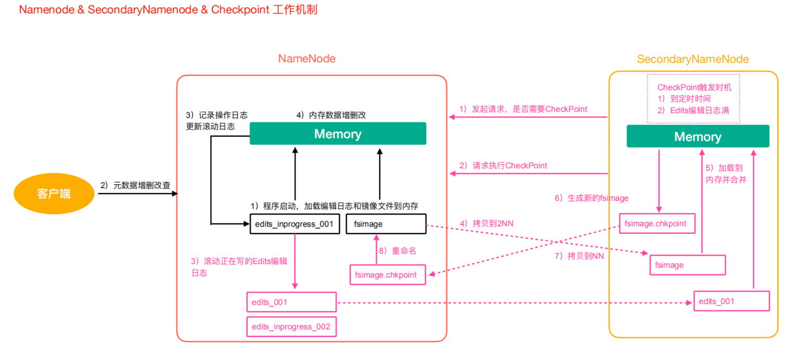

# HDFS

## feature
- for high availibility: **federation**(partitioned namenodes), **high availibility(HA)** mode (secondary namenode)
- block storage (128MB default)
- directory information stored on namenode, metadata of which datanode contains which block stored on namenode
- **written once, read multiple times**: HDFS is suitable for write only once, and read multiple times, does not support random updates(does support appending, `apppendToFile()`)
  - thus hdfs is not suitable for cloud drive(bad support on frequent update, latency, network bandwidth); Hdfs is suitable for storage of big data analytics

## Replication
- replication factor can be greater than # of datanode, but this is pointless since hdfs will only store min(# of datanode, userSetReplicationFactor)

## distcp
- use MapReduce to implement, how? (by having one mapper only, why does it cause unbalancing nodes)

## HDFS CLI
- [hadoop fs vs dfs](https://stackoverflow.com/questions/18142960/whats-the-difference-between-hadoop-fs-shell-commands-and-hdfs-dfs-shell-co)

## HDFS read/write mechanism
### Read
- 1.client request block informations on a specific file to namenode -> 2.client request **parallel** to datanodes to obtain different blocks(each block in **packet** = 64kb) and merge them(e.g., block1 at datanode A, block2 at datanode B)

### Write
- 1.client request datanode information to namenode to write blocks of a file -> 2. client split the file into blocks -> 3. client write for each block(in **packet** = 64kb) to a datanode i, then datanode i **propogate** packets to other datanodes to reach the replication factor -> 4.downstream datanodes will send ack and will eventually send back to client, client maintian a ack queue to ensure data are persisted

## HDFS Namenode work mechanism
- core concetps: **edits file(WAL, Write Ahead Log), fsimage file(Snap Shot), and checkpoint mechanism(periodically truncate the edits file in case its too big)**
- edits file + fsimage ensure the client's update request is preserver and namenode can recover upon failure
  - Secondary Namenode periodically(or if edits file size reach the specified # of threshhold writes) request for **checkpointing** Namenode by copying edits file(after copying edits file in namenode, edit file in Namenode can be rolled to a new file since we dont need it anymore) and fsimage file, **merge two in secondary memory to create new fsimage** and send the new fsimage to Namenode
  - the whole point is to offload the Namenode from having to generate the fsimage(snapshot) itself(while cost memory usage and CPU) so i can actively respond to the client request
- checkpoint ensures that edist file (WAL) is within a managable size and load of generating fsimage(snapshot) is delegated to Secondary Namenode. Usually **Secondary Namenode** performs the **CheckPoint** to offload the namenode
- HDFS Namnenode **utilizes both memory and disks(edits file + fsimage)**, where memory can serves as a cache for frequent/recent requests, disk can ensure the metadata persistance

### seen_txid
- to prevent edits file become too big, namenode periodically roll the edits file (or when reaching some threshold). `seen_txid` track the most recent edit file id prefix
- `seen_txid` is also used upon restart namenode to check if there was a failure and data loss of edits file

### VERSION file
- `VERSION` file stores some metadata about the cluster:
  - `CLUSTERID` identifies the cluster of namenode and datanode, which will be sent to all datanodes upon initial set up

### Fsimage
- Fsimage stores Directory, File information, and block ids for each of the file. But **does NOT store the mapping of which datanodes does each block reside**. This is bc the mapping information is only stored in the namenode memory, and when namenode crash those mapping will be lost, but upon restart, namenode will start first in **safemode** and require all datanodes to report their block information and restore the mapping from those information
  - Doing such save the amount of data needed to be saved in fsimage

### Edits file
- basically a WAL, stores all the write/update/delete information in an AOL
- upon restart (from failure e.g.), only logs after the last fsimage needs to be replayed; **fsimage and edit files share the same monotoniacally increasing prefix id** to identify which writes needs to be reloaded

## HDFS HA Mode (**Secondary NameNode != Standby Namenode**)
- in normal set up with one namenode and one secondary namenode, upon namenode failure, we can only restore from the most recent fsimage taken in secondary namenode, and all edits after that fsimage(snapshot) will subject to loss
- in HA Mode, in addition to Secondary Namenode, we also have a **Standby Namenode**. Through coordination of Zookeeper, both Standby and Secondary namenode have the same data, and upon failure Standby can switch to be the new main namenode

## HDFS Safemode
- safemode only allows for read operation, write/delete will be rejected. Usually hdfs is in safemode upon restart, to sync the block mapping metadata from datanodes
- `hdfs dfsadmin -safemode`
## Archive in HDFS
- problem: too many small files wastes too many spaces for their metadata
- Archive in HDFS works by treating multiple small files as one single file, so a single metadata block stores multiple small files
- `hadoop archive -option`
- Archive operation in HDFS is a mapreduce job to merge those metadata into a `.har` file, and by specifying the URI `har:///harDir/myhar.har` can tell hdfs we are querying the archived file metadata, so we can do normal `copyToLocal`, `ls` operations by specifying such URI