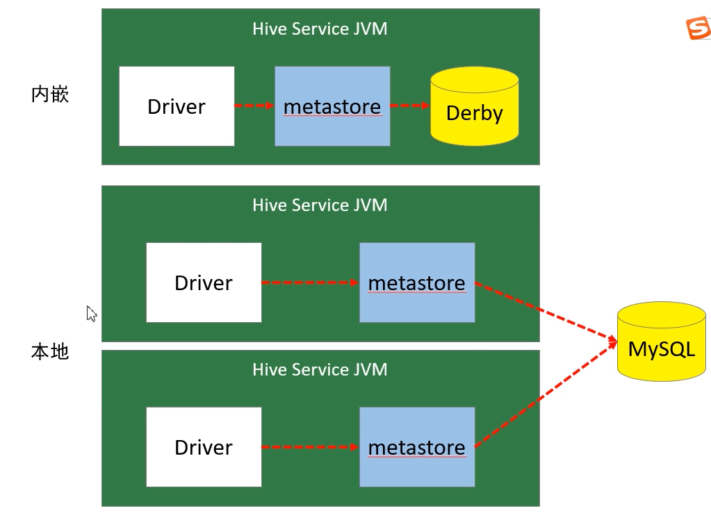
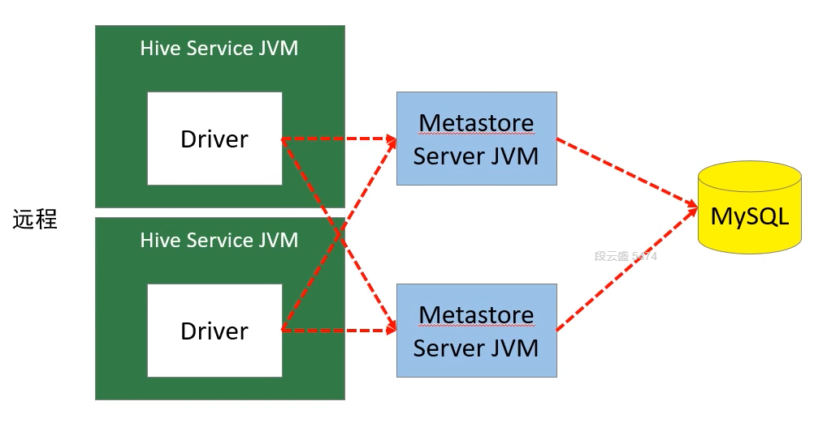

# Hive

## Partition
- "Partitioning" table is different in HIVE in comare to other databases(which partitioning key are usually the part of the primary key that dertermines the physical partition node location), partitioning in hive only means to store data in different subdirectoryes in HDFS
- Hive Partition-By attribute does not have to exist in the table schema, can treat partition attribute as pseudo attribute

## Bucketing
- Bucketing gives finer control whithin each partition in case data in each partition grows too big.
- By picking an attribute(exist in the table, different from partition attribute), and specifying # of desired bucket within each partition, a record `r` will go in the bucket of a particular partition where bucket id is computed by `bucketID = r.bucketAttribute.hashCode() % # of bucket`
  - this is the same in MR to compute the partition, where a key-value pair goes to the partition = `key.hashCode % # of reduceTask`

## Hive 表(table)类型
|type|desc|
|---|---|
|内部表(internal table)|删除表时，同时删除元数据和表数据|
|外部表(external table)|删除表时，仅删除元数据，保留表中数据；生产环境多使用外部表|
|分区表(partitioning)|按照分区字段将表中的数据放置在不同的目录中，提高SQL查询的性能|
|分桶表(bucketing)|按照分桶字段，将表中数据分开。 分桶字段.hashCode % 分桶数据|

## Common DDL cmd
- `desc formatted {tableName}`, show more detailed description of a table(partition, bucketing, hdfs storage location etc.)

## Common HQL and performance
### Basic rule
- Hive有一个默认的数据库default，在操作HQL时，如果不明确的指定要使用哪个库，则使用默认数据库；
- Hive的数据库名、表名均不区分大小写；
- 名字不能使用数字开头；
- 不能使用关键字，尽量不使用特殊符号；

### Sorting
- `ORDER BY`
  -  ORDER BY**执行全局排序，只有一个reduce**; `Order By` is thus ineifficient due to its low parallelism
- `SORT BY`
  - 对于大规模数据而言order by效率低;在很多业务场景，我们并不需要全局有序的数据，此时可以使用sort by;
  -  **sort by为每个reduce产生一个排序文件(we can set the # of MR reducer before running the query `set mapreduce.job.reduces=x`，在reduce内部进行排序，得到局部有序的结果;**
- `DISTRIBUTE BY`
  - `distribute by` 将特定的行发送到特定的reducer中，便于后继的聚合(aggregation) 与 排序(sorting) 操作;
  - **`distribute by` 类似于MR中的分区操作，可以结合`sort by`操作，使分区数据有序;**
  - **`distribute by` 要写在`sort by之前`**
  ```SQL
    -- 将数据分到3个区中，每个分区都有数据
    set mapreduce.job.reduces=3;  -- necessary, default 1 reducer = 1 partition
    insert overwrite local directory '/home/hadoop/output/distBy1'
    select empno, ename, job, deptno, sal + nvl(comm, 0) salcomm
    from emp
    distribute by deptno
    sort by salcomm desc;
  ```
- `CLUSTER BY`
  - 当`distribute by` 与 `sort by`是**同一个字段(attribute)**时，可使用`cluster by`简化语法, so its equivalent
  - `Cluster By` can **only be asending order**, not descending
  ```SQL
    -- 语法上是等价的
    select * from emp distribute by deptno sort by deptno;
    select * from emp cluster by deptno;
  ```

### explode

### window function
- `over(...)`
- `rows between ... and ... `
  - unbounded preceding
  - n preceding
  - current row
  - n following
  - unbounded following
### rank function

### partition by, order by

### 序列函数
- `lag`
- `lead`
- `first_value`
- `last_value`
- `ntile`

### casting
- `cast(from as to)`
### 行转列，列转行
- `collect_set(attribute)`, `collect_list()`
- `case attribute when val then x else y`
### given date(yy-mm-dd), find month
- `floor(month(dt) / 3.1)` => {0 : month1-3, 1 : month4-6, 2 : month7-9, 3 : month10-12}
### temp table
- `with myTempTable as (select  .... from ... where ....)`

## SQL Question set
- Consecutive 7-day user
> given (user_id, date, login_statue{0, 1}), find user that logged in for at least consecutive 7 days
- 持续30分钟登录用户
> https://blog.csdn.net/depa2018/article/details/107899575
## Hive Metastore
- three modes:
  - embeded: single user, with a derby db 
  - local: multiple user, local metastore process, with a remote RDMS database, will expose connection password etc (in `hive-site.xml`)
  - remote: multiple user, with remote metastore server(s), remote RDMS databases, more secure and fault tolerant
  
  

## HiveServer2
HiveServer2是一个服务端接口，使远程客户端可以执行对Hive的查询并返回结果。 目前基于Thrift RPC的实现是HiveServer的改进版本，并支持多客户端并发和身份验证，启动hiveServer2服务后，就可以使用`jdbc`、`odbc`、`thrift` 的方式连接。
> Thrift是一种接口描述语言和二进制通讯协议，它被用来定义和创建跨语言的服务。 它被当作一个远程过程调用（RPC）框架来使用，是由Facebook为“大规模跨语言服务开发”而开发的。

## HCatalog
**HCatalog** 提供了一个统一的元数据服务，允许不同的工具如 Pig、MapReduce 等通过 HCatalog 直接访问存储在 HDFS 上的底层文件。
- HCatalog是用来访问Metastore的Hive子项目，它的存在给了整个Hadoop生态环境一个统一的定义。HCatalog 使用了 Hive 的元数据存储，这样就使得像 MapReduce 这样的第三方应用可以直接从 Hive 的数据仓库中读写数据。同时，HCatalog 还支持用户在
MapReduce 程序中只读取需要的表分区和字段，而不需要读取整个表，即提供一种逻辑上的视图来读取数据，而不仅仅是从物理文件的维度。
- HCatalog 提供了一个称为 hcat 的命令行工具。这个工具和 Hive 的命令行工具类似，两者最大的不同就是 hcat 只接受不会产生 MapReduce 任务的命令。

## Hive supportted storage types
- row level: textfile, SequenceFile
- column level, binary data format: ORC File, Parquet

## Hive 架构优化
- 执行引擎（MR, Tez, Spark, Flink...)
- 优化器 (query optimizer)
- 分区，分桶
- 文件格式 (text files, sequenceFiles, Binary format files)
- 数据压缩(compression algorithms)

## Hive 参数调优
- 本地模式
- 严格模式
- JVM重用
- 并行执行
- 推测执行
- 合并小文件
- Fetch 模式

## HQL Query 优化
- 列裁剪和分区裁剪
  > 列裁剪是在查询时只读取需要的列；分区裁剪就是只读取需要的分区
- use `sort by` to replace `order by`
  > HiveQL中的`order by`与其他关系数据库SQL中的功能一样，是将结果按某字段全局排序，这会导致所有map端数据都进入**一个reducer**中，在数据量大时可能会长时间计算不完。
  >
  > 如果使用`sort by`，那么还是会视情况启动**多个reducer进行排序**，并且保证每个reducer内局部有序。为了控制map端数据分配到reducer的key，往往还要配合 `distribute by` 一同使用。如果不加distribute by 的话，map端数据就会随机分配到reducer。
- use `group by` to replace `count(distinct)`
  > 当要统计某一列的去重数时，如果数据量很大，count(distinct) 会非常慢。原因与order by类似，count(distinct)逻辑只会有很少的reducer来处理。此时可以用group by 来改写
  ```SQL
    -- 原始SQL
    select count(distinct uid)
    from tab;
    -- 优化后的SQL
    select count(1)
    from (select uid
    from tab
    group by uid) tmp;
  ```
- `group by`配置调优
  -  group by时，如果先起一个combiner在map端做部分预聚合，可以有效减少shuffle数据量。`set hive.map.aggr = true`
  - Map端进行聚合操作的条目数 `set hive.groupby.mapaggr.checkinterval = 100000`

## Joins in Hive
- common join
  - most common join type in Hive, basically a big mapreduce job, mapper maps all records of same key to same partition, and in that partition perform joins. since **shuffling** is envolved, very inefficient
- map join
  - standard map sided join, where small table(build relation) is broadcast into all nodes, **no shuffling** comparing to common join, but only suitable for a build relation that fits in memory
- bucket map join
  - this can only apply to relations that are partitioned and bucketed already. since data are **already parittioned, no furthur shuffling** is required, simply do the join between building and probing relation
  - it's required to have the sizes of building and probing matches, (imagine 7 bucket shcema joining with 8 bucket schema, we cant tell if records with the same key belong at which bucket)

## Optimization Summery
深入理解 Hadoop 的核心能力，对Hive优化很有帮助。Hadoop/Hive 处理数据过程，有几个显著特征：
- 不怕数据多，就怕数据倾斜
- 对 job 数比较多的作业运行效率相对比较低，比如即使有几百行的表，多次关联多次汇总，产生十几个jobs，执行也需要较长的时间。MapReduce 作业初始化的时间是比较长的
- 对sum、count等聚合操作而言，不存在数据倾斜问题
count(distinct) 效率较低，数据量大容易出问题

从大的方面来说，优化可以从几个方面着手：

- 好的模型设计(shcema design, partition key, bucketing design)，事半功倍
- 解决数据倾斜问题。仅仅依靠参数(hive dataskew param)解决数据倾斜，是通用的优化手段，收获有限。开发人员应**该熟悉业务，了解数据规律**，通过业务逻辑解决数据倾斜往往
更可靠
- 减少 job 数
- 设置合理的map、reduce task数
- 对小文件进行合并，是行之有效的提高Hive效率的方法
优化把握整体，单一作业的优化不如整体最优
