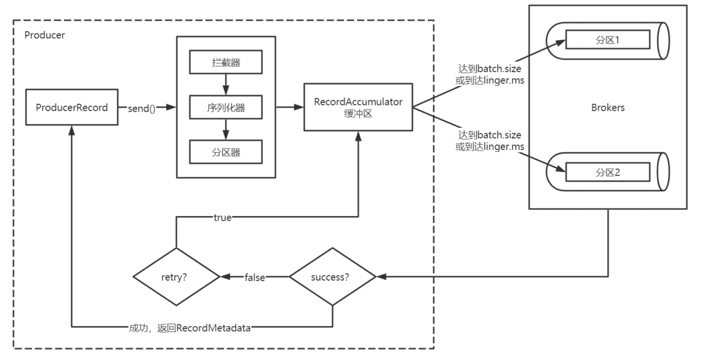
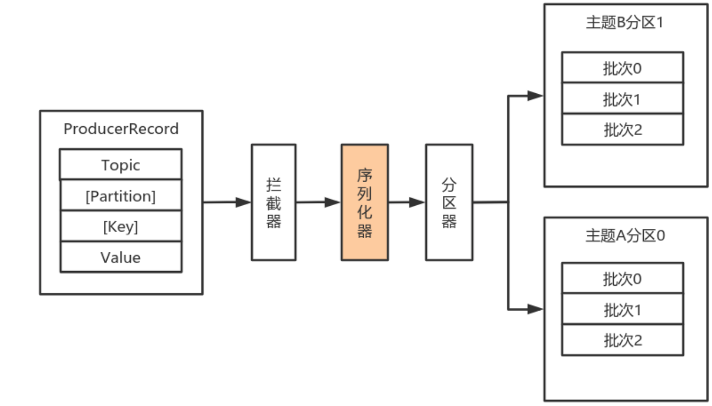
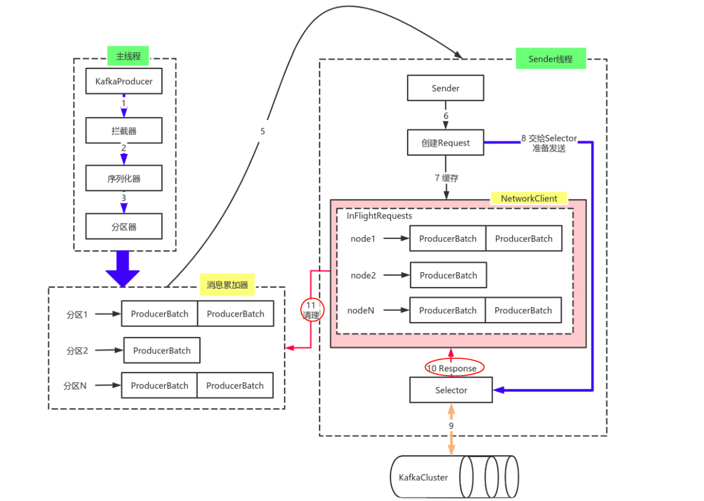

# Intro to Kafka
- Only poll based message passing, not push
- support publish/subscribe & point to point communication
- Kafka manages messages in `topics`, a topic may have multiple partition, each partition may be replicated, each partition under a topic has its own log file(kafka is essentially a log-structured based message broker)

# Achitecture
- Kafka的数据单元称为消息。
可以把消息看成是数据库里的一个“数据行”或一条“记录”。消息由字节 数组组成。消息有键(key)，键也是一个字节数组。当消息以一种可控的方式写入不同的分区时，会用到键。 为了提高效率，消息被分批写入Kafka。**批次(batch)** 就是一组消息，这些消息属于同一个主题和分区。 把消息分成批次可以减少网络开销。批次越大，单位时间内处理的消息就越多，单个消息的传输时 间就越长。批次数据会被压缩，这样可以提升数据的传输和存储能力，但是需要更多的计算处理。
## Components
### Kafka Cluster
- a kafka cluster contains multiple broker
### Connector
- a designated broker work as a connector coordinating the kafka cluster
### Topic
### Partitions
- a topic may be partitioned and furthured replicated
- within a single partition messages are ordered with monotonic increasing id, orders will not be able to be guaranteed accross different partition for the same topic
- ways for publisher to publish messages；
  1. directly specify which partition
  2. based on the hash of keys (recommanded if care order, messages with same key goes in same partition and order is preserved)
  3. round robin (careful about the order may not be preserverd)
- within the partition each message is assigned with an increasing id. both consumer and publisher track their current offset.
  > if a consumer crashed at partition p with its offset i, consumers in the same `consumer group` will come to continue consume the message with offset i. other consumer learned this offset by 
  refering to the shared **zookeeper** file system
### Controller
- a designated broker will be a controller of the kafka cluster, upon node failures controller will elect the ISR to be the new leader(if the failed node contains leader replication)
- **Controller failure**: controller configuration is tracked using `ephemeral node` and `watcher` in **zookeeper** (in `kafkaDir/controller`);Also controllers uses monotonic increasing `epoch` id(in `kafkaDir/controllerEpoch`) to prevent split brain upon controller failure
- How does Controller know the failure of brokers in the cluster? using zookeeper for cluster configuration
  > all nodes write their `broker id` in `kafkaDir/brokers/ids` as `ephemeral nodes`, and controller put a `watcher` on `kafkaDir/brokers/ids` and will be notified for any incoming/disconnected broker, and uppon new configuration, `controller` can get the new/leaving broker's info at `kafkaDir/brokers/topics`
### Replciation
replication mode includes ISR(In-Sync Replica) and OSR(Out-Sync Replica)
- Leader and Follow uses HW and LEO as mechanisms to track which messages are guaranteed to be replicated accross all replications(on those ISR, not including OSR) [this is tracked using `HW`], and which messages are only replicated in leader and some but not all ISR replications [tracked using `LEO`]; Those messages that are marked by `HW` will be visible to consumers, and those between `HW` and `LEO` will not since they are not yet replicated
  - **LEO(log end offset)**: 即日志末端位移(log end offset)，记录了该副本日志中下一条消息的位移值。如果LEO=10，那么表示该副本保存了10条消息，位移值范围是[0, 9]。另外，Leader LEOFollower LEO的更新是有区别的。
  - **HW(high watermark)**: 即上面提到的水位值。对于同一个副本对象而言，其HW值不会大于LEO值。小于等于HW值的所有消息都被认为是“已备份”的（replicated）。Leader副本和Follower副本的HW更新不同。
    > there are still some consistency problem may occur using LEO/HW upon node failures, so it was introduced `leader epoch` in newer version of kafka to handle consistency in case of node failure
### Broker
- a broker is an abstraction of a single kafka server(a physical server); 
- a broker contains multiple partition under different topics(and it has no point to store same partition(replication) on same broker); if a broker b contains the primary replica of partition p1 under topic t1, then b i.s.t.b the t1's partition p1 **leader**; a broker main contain both leader and follower partitions
- 一个独立的Kafka服务器称为broker。broker接收来自生产者的消息，为消息设置偏移量，并提交消息到磁盘保存。broker为消费者提供服务，对读取分区的请求做出响应，返回已经提交到磁盘上的消 息。单个broker可以轻松处理数千个分区以及每秒百万级的消息量。
### subscriber
### publisher
- `bootstrap.server`: a parameter required when a publisher wants to send a message. the publisher node will try to bootstrap a broker server, and then from that server it will discover the address of other broker in the same cluster
  > it is recommanded to have multiple bootstrap servers, in case one that fails the publisher is able to bootstrap other running servers
- typically use `Avro`(binary encoding) as serializer/desirializer for schema evolution, storage optimzation. 

# Feature
## Publishing messages

- messages are sent in **batches** (sent upon meeting the thresh hold on buffer size or record lingering time). **Each partition under a topic will have its own buffer**, thus messages to the same partiiton can be sent in batches; Batch sending improves the throughput of the system and reduce network cost(and **compression** can be used for furthur optimization)
- upon publishing messages, three stages will be gone through: interceptor(拦截器), serializer(序列化器), partitioner(分区器)
### Interceptor
- serve as a middleware between publisher and broker, messages in interceptors can be modified(modify header, correct some error e.g.)
- Interceptor can intercept the message in two ways: **on message send**, and **on message acknowledgement** (e.g, on ack, we can persist the ack info into db)
- allow multiple Interceptors
### Partitioner
- based on the hash value of key, assign a parititon to the record
- type of partitioner
  1. user specified partitioner id
  2. based on hash of key
  3. round robin partitioner (default if no key provided)
- can customize the partitioner
### Serializer
- usually use Avro, can customize a serializer for custome object type.

## Consuming(Poll) messages
- consumer is the abstraction that poll the message from the broker, consumer can be grouped in **consumer groups**, a consumer group evenly distribute messages to its consumers, **for each partition, only one consumer in the consumer group will consume that message**
- consumers track their consume offset, so in case of failure, other consumers in the same group can continue consume messages from that offset
  - **zookeeper** as offset sotrage: consumers update their consume offset in zk file system, not recommanded, since zookeeper is not fit for high concurrent write
  - **kafka topic `_consumer_offsets`** as offset storage: recommanded
- **consumer group** allows the flow of consuming messsage to be horizontally scalable by adding more consumers in a consumer group;
  > **Partition** allows for publishing message to be horizontally scalable
- messaging consumption in kafka is poll based; Even though message queue like RabbitMQ provided push based (low latency, real time), kafka is poll based which reduced the load of broker, and makes the process of consuming message horizontally scalable
  > - **pros of poll-based messaging**: scalability(since add consumer scale the system)
  > - **cons of poll-based messaging**: latency(bounded by the poll interval)
### Consume a message multiple times
- recall that each consumer will track its consumer offset towards each of the partition under a subscribed topic; consumer offset will be tracked and updated each time it finishes consuming a message. Consumer does the update by commiting the consumer id (commit to zk or kafka topic depends on the choice). It is possible for a consumer that after consuming a message and before commiting the consumer offset, a failure or rebalance takes place, and when consumer comes back **it will reconsume that message due to the consumer offset for that message is not yet commited**

#### there are three ways for committing the consumer offset:
1. **auto commit**: commit in for each preset time interval t. this approach amplifies the possibility for reconsuming messages
2. **sync commit(同步提交)**: block the process until successfully commit an offset: reduced performance for consumer, but more guarantee on updating the consumer offset and thus minimize chances to repeatedly consume same messages
3. **async commit(异步提交)**: high performance, but cannot guarantee retry on failure of commit
    > can combine sync & async commit: keep async commit until exceptions are raised, and when exception is raised, switch to sync commit

### Rebalancing(再平衡)
重平衡可以说是kafka为人诟病最多的一个点了。 重平衡其实就是一个协议，它规定了如何让消费者组下的所有消费者来分配topic中的每一个分区。 比如一个topic有100个分区，一个消费者组内有20个消费者，在协调者的控制下让组内每一个消费者分配到5个分区，这个分配的过程就是重平衡。 重平衡的触发条件主要有三个： 
1. 消费者组内成员发生变更，这个变更包括了增加和减少消费者，比如消费者宕机退出消费组。 
2. 主题的分区数发生变更，kafka目前只支持增加分区，当增加的时候就会触发重平衡 
3. 订阅的主题发生变化，当消费者组使用正则表达式订阅主题，而恰好又新建了对应的主题，就 会触发重平衡
> 为什么说重平衡为人诟病呢？**因为重平衡过程中，消费者无法从kafka消费消息，这对kafka的 TPS影响极大，而如果kafka集内节点较多，比如数百个，那重平衡可能会耗时极多。数分钟到数小时 都有可能，而这段时间kafka基本处于不可用状态。所以在实际环境中，应该尽量避免重平衡发生**。

**解决方案**: 将判断宕机(consumer)的timeout以及心跳timeout尽量设大，减小判断宕机的几率

### ConsumerInterceptor(消费者拦截器)
消费者在拉取了分区消息之后，要首先经过反序列化器对key和value进行反序列化处理。

处理完之后，如果消费端设置了拦截器，则需要经过拦截器的处理之后，才能返回给消费者应用程序进行处理。

- works similarly to producer Interceptor, where we can add processing logic before consumer consuming message and acknowledging consuming message 

## Handling Failure
### Replication failure
- when leader fails, one of the ISR(in-sync replication) will be elected; heartbeats of replication broker are tracked within **zookeeper**; No leader election happened upon failure to increase the system performance(ISR will just became the leader)
  > 总结： Kafka中Leader分区选举，通过维护一个动态变化的ISR集合来实现，一旦Leader分区丢掉，则从ISR中随机挑选一个副本做新的Leader分区。

## [Transactions](https://www.confluent.io/blog/transactions-apache-kafka/)

# Q
1. for replication: does replica handle any read request on behalf of master?
  > no, all read/write goes into the same primary replica, backup replicas are only responsible for copying messages from primary, and when primary is down, backup will be the new primary; 简单来说，kafka不提供读写分离，全由primary 负责，follower仅负责备份
2. Why is that when producer is producing a message to a topic it needs to specify **a broker list**

