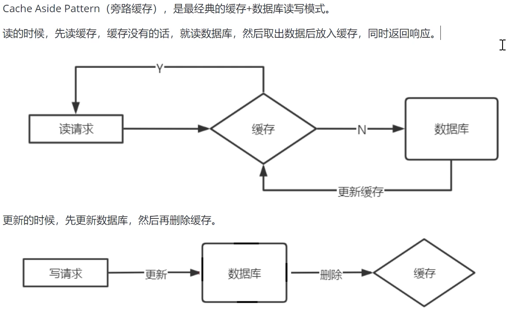
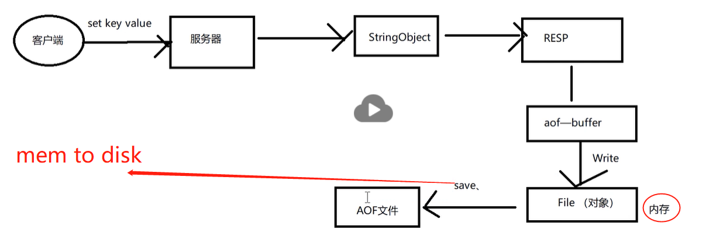
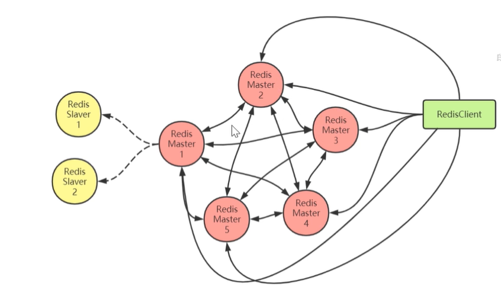
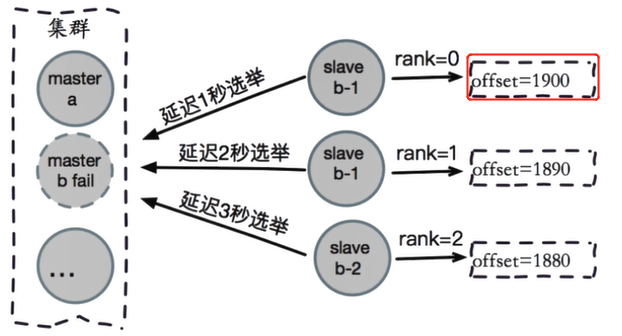
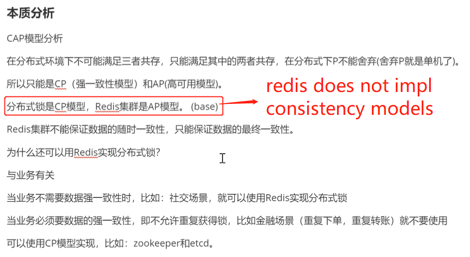
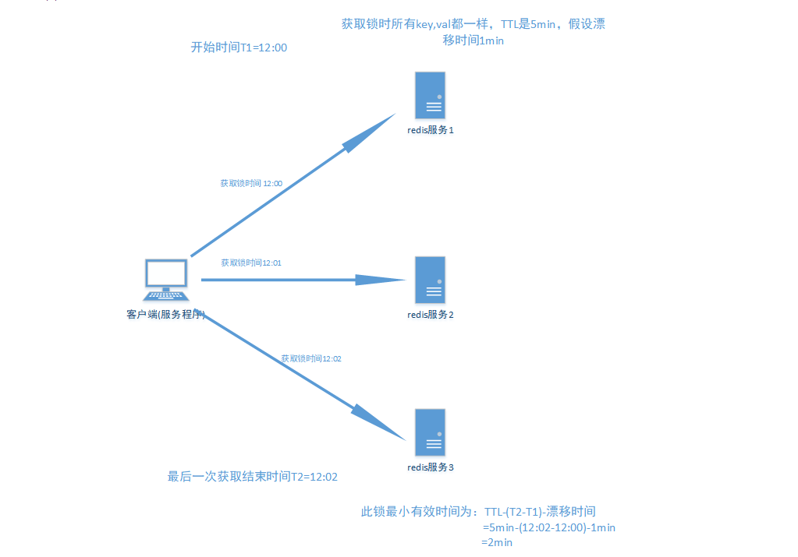
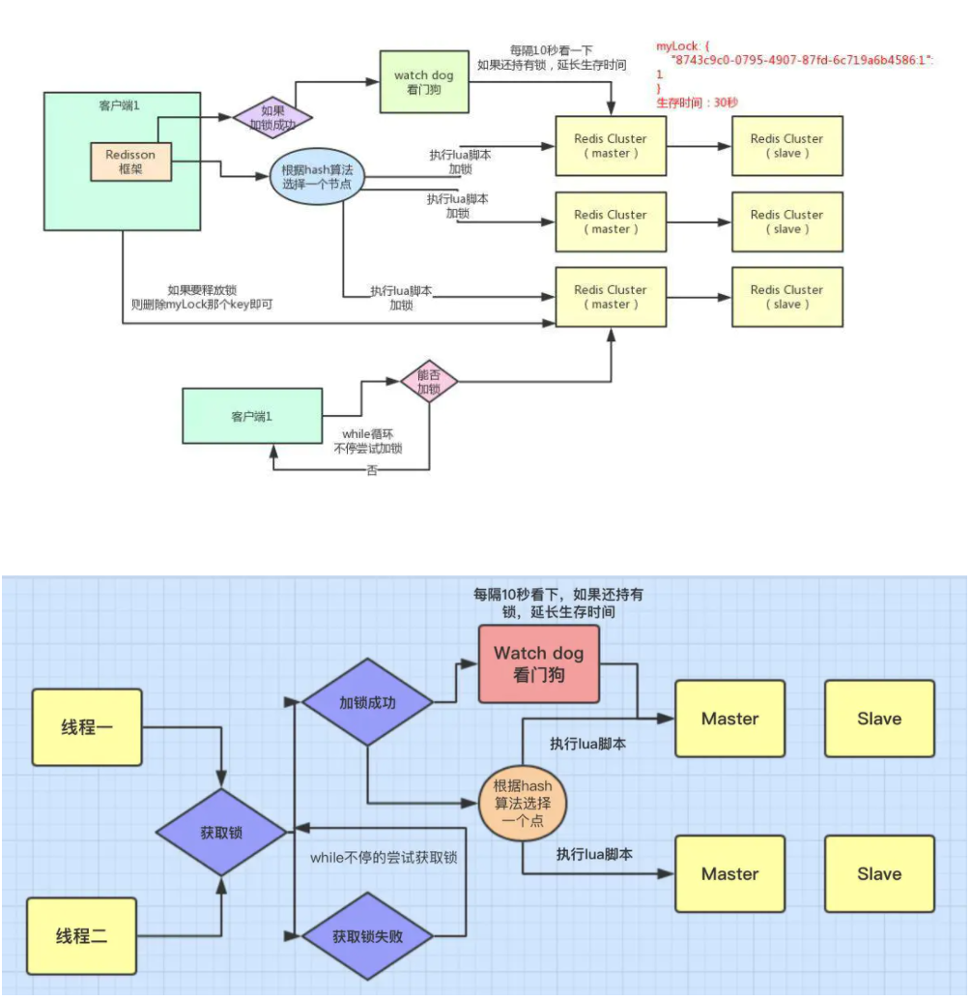

# Intro
## Usage
- distributed cache
  - issues need to consider when using distributed cache service: 缓存雪崩，缓存击穿，缓存穿透
  - cache coherence: (use cache invalidation in look-aside cache FaceBook)
  - cache concurrency
- distributed lock service
- optimistic lock (object/row/db level compare and set)
- session seperation (session in server, so redis can serve as a session for the application server)
- message queue

## General Distribute cache read/write mode(缓存读写模式)
### Cache aside pattern (Look aside cache)

#### pros

#### cons
- **possible dirty writes** (consider a read request after updating DB but not data in cache has not been deleted, read will resolve into a stale value)

### Read/Write through pattern
- read-through cache: when client performs read on the cache and cache does not have data, cache will first fetch the data from database then update its own copy
- write-through: updates are performed directly on the cache, afterwards cache will write to the database
  - this pattern causes the cache to be coupled with the application logic, harder for software evolution
### Write Behind Cache Pattern
- client update the cache on write, and cache will **asynchronously** (and perhaps in batch) update the database
- problem with this pattern is that possible data loss and data consistency, but highly performant


# Data Types
- key can only be strings
- value can be various types supported by Redis
## List
- can be used as a deque
- can also be used to implement message queue, since it allows to be blocked until elements in the list are availible
## Set
## SortedSet
- 有序集合： 元素本身是无序不重复的, 每个元素关联一个分数(score), 可按分数排序，分数可重复
## HashMap
## BitMap (HashSet)
- more memory efficient

# Data Persistence
## RDB
- periodically main redis process will fork a background process to copy the current data in a snapshot fashion

## AOF
- append only the **instruction**, not the data, for performance and fast recovery


- Following picture shows the state of the main redis process when performing aof flow:
  - `Write` always block the main process to write the update instruction to memory
  - `Save` is when persisting to disk. when mode is in `AOF_FSYNC_EVERYSEC`, main process will fork a child process to do the save work (note the `fork()` is blocking but really short amount of time needed)
  

- there will be a daemon process forked by main process to periodically compact the aof file

## AOF vs RDB
1. RDB采用二进制压缩储存，AOF存操作命令，采用文本储存。(如果用混合模式(RDB+AOF)则事文本+二进制压缩，也就是RDB已经做好的部分为二进制，而RDB后的新update instruction为文本)
2. RDB has good performance but potential data loss(from last snapshot); AOF is more real time but costly
  > but when data amount is too large, fork a process to do snapshot will be extremely expensive(recall forking is duplicating the parent process); thus when data amount(in a short period of time) is too large, it is recommanded to use AOF
3. it's sometimes to avoid using both AOF and RDB, reason is that it optimizes the performance of the Redis server; This approach should only be used if the original source the data are preserved somewhere else; using AOF and RDB will have some performance cost due to the restart/replay data/forking&blocking. 


# Transaction in Redis
- weak guarantee: if transaction fails, then partial write will occur if some update operations are successful (so does not provide Atomocity guarantee)
# Lua
- Redis uses the same Lua interpreter to run all the commands. Also **Redis guarantees that a script is executed in an atomic way: no other script or Redis command will be executed while a script is being executed. This semantic is similar to the one of MULTI / EXEC**. From the point of view of all the other clients the effects of a script are either still not visible or already completed.
- However this also means that executing slow scripts is not a good idea. It is not hard to create fast scripts, as the script overhead is very low, but if you are going to use slow scripts you should be aware that while the script is running no other client can execute commands.
  
  > note if using `MULTI/EXEC` transactions in Redis, other clients can still be runnning commands while one server is `EXEC` transactions
## Comparing other ways to send commands in bulk
[Blog](https://engineering.linecorp.com/en/blog/redis-lua-scripting-atomic-processing-cache/)

- **pipeline**: the purpose of using pipeline is solely to optimize network bandwidth usage. Using pipeline **does not guarantee atomic operation**. To process commands atomically, you either have to use transactions or Lua script.
- **Redis Transaction**: atomicity is not strongly guaranteed, concurrent running transactions might affect one and another. **Note both Lua and Multi/Exec does not provide failure rollback, so partial results still occur**
  > 原文：“同 redis 的事务一样，那些通过 redis.call 函数已经执行过的指令对服务器状态产生影响是无法撤销的”
  >
  > 详细看rsrc/redisLua_原理.pdf
- **Lua**

# High Availibility
## Master-Slave replication(not cluster)
- master-slave architecture(and slaves can be master of other slaves); master accepts write/read, slave accept reads only
- synchronization
  - upon new slave starts, 先全量同步(copy snapshot)后增量同步(master sends all new writes to slave)
- slave sends heart beat to master periodically

## [Sentinel](https://redis.io/topics/sentinel)
- a cluster of sentinel nodes will elect new leader upon leader failure. Sentinel cluster will track the health of the cluster
- [CNBlog](https://www.cnblogs.com/williamjie/p/9505782.html)
### Mechanism
- communication between sentinel nodes: using `publish-subscribe` in Redis, each sentinel publish to channel `sentinel:hello` every 2s informing its port,ip,...etc metadata. 
- failure detection: sentinel sends pings to redis nodes periodically, and if no reply the node will be considered 'down', and if quorom # of sentinel nodes aggree on the same node is down, redis cluster will perform leader/node failover
  
  > Leader Election: if no sentinel cluster used, Raft is used as Leader Election; if sentinel cluster is used, sentinel cluster will using quorom to decide the new leader

## Consistent Hashing
- hash partitioning is efficient and allowing balanced distribution, however when it comes to rebalancing it became costly to recompute all the hashes. `Consistent Hashing` is used to reduce the amount of data that needs to be recomputing hash code
- 虚拟槽分区: 虚拟槽分区是Redis Cluster采用的分区方式, 预设虚拟槽，每个槽就相当于一个数字，有一定范围。每个槽映射一个数据子集，一般比节点数大
  
  > 虚拟槽是基于consistnet hashing的分区方式，解决了consistent hashing选区必须选均匀的分区点的问题，因为虚拟槽可以map到任意一个物理的分区点，所以不用担心如何均匀分布物理分区

## Redis Cluster

- Redis Cluster refers to a cluster of cluster of master-slave nodes. Within this cluster data is partitioned accross different master nodes, within the small cluster (individual single master-slaves cluster), master is responsible for write/read, slaves are read only.
- RedisCluster是由多个Redis节点组构成，是一个P2P无中心节点的集群架构，通过Gossip协议传播信息; 通过Gossip协议，cluster金额图提供集群时间状态同步更新，选举自助failover等功能
- 为什么需要Redis Cluster(Comparing to single master-slave replication):
  1. 主从复制不能实现高可用
  2. 随着公司发展，用户数量增多，并发越来越多，业务需要更高的QPS，而主从复制中**单机**的QPS可能无法满足业务需求
  3. 数据量的考虑，现有服务器内存不能满足业务数据的需要时，单纯向服务器添加内存不能达到要求，此时需要考虑分布式需求，把数据分布到不同服务器上
  4. 网络流量需求：业务的流量已经超过服务器的网卡的上限值，可以考虑使用分布式来进行分流
- 客户端访问任意节点时，对数据的key按照CRC16规则进行hash运算取余，**如果余数在当前访问的节点管理的槽范围内，则直接返回对应的数据如果不在当前节点负责管理的槽范围内，则会告诉客户端去哪个节点获取数据，由客户端去正确的节点获取数据**(这个过程叫做`move redirection`)
  
  > (槽(slots)平均分配给节点进行管理，每个节点只能对自己负责的槽进行读写操作由于每个节点之间都彼此通信，每个节点都知道另外节点负责管理的槽范围。在集群刚启动时，槽会平均并连续地分布到每个master节点)
- [CNBlog](https://www.cnblogs.com/williamjie/p/11132211.html)

### Failure Detection
`Redis Cluster`通过`ping/pong`消息实现故障发现：不需要`sentinel`

`ping/pong`不仅能传递节点与槽的对应消息，也能传递其他状态，比如：节点主从状态，节点故障等

故障发现就是通过这种模式来实现，分为`主观下线`和`客观下线`
- 主观下线：某个节点认为另一个节点不可用，'偏见'，只代表一个节点对另一个节点的判断，不代表所有节点的认知
- 客观下线：当半数以上持有槽的主节点都标记某节点主观下线时，可以保证判断的公平性
### Failover
对从节点的资格进行检查，只有难过检查的从节点才可以开始进行故障恢复, 使偏移量最大的从节点具备优先级成为主节点的条件


### Advantage
- 高性能
  - 多个主节点，负载均衡，读写分离
- 高可用
  - faliover
- 易扩展
  - 向redis cluster添加/溢出节点很容易，不需要停机
  - 数据分区，海量存储
### Disadvantages
- 当节点数量很多时，性能不会很高
  
  > 解决方式：使用**智能客户端**。智能客户端知道由哪个节点负责管理哪个槽，而且当节点与槽的映射关系发生改变时，客户端也会知道这个改变，这是一种非常高效的方式

## Smart智能客户端
- Smart智能客户端用途在于客户端自己保留slots->node的mapping，(这样也就不会在查某个key时询问连接的redis node当前查询的key的数据在哪个槽)
- `JedisCluster`是Jedis根据RedisCluster的特性提供的集群只能客户端; `JedisCluster`为每个节点创建连接池，并和各个节点建立映射关系缓存(cluster slots)，`JedisCluster`为每个主节点负责的槽位一一与主节点连接池建立映射缓存；`JedisCluster`启动时，已经知道keys,slots和node之间的关系，可以直接找到目标节点
# Lock
## Optimistic Lock using Redis
乐观锁基于CAS（Compare And Swap）思想（比较并替换），是不具有互斥性，不会产生锁等待而消
耗资源，但是需要反复的重试，但也是因为重试的机制，能比较快的响应。因此我们可以利用redis来
实现乐观锁。具体思路如下：
1. 利用redis的watch功能，监控这个redisKey的状态值 
2. 获取redisKey的值 
3. 创建redis事务 
4. 给这个key的值+1 
5. 然后去执行这个事务，如果key的值被修改过则回滚，key不加1

## Distributed Lock
- method 1:
  ```java
  /**
  * 使用redis的set命令实现获取分布式锁
  * @param lockKey 可以就是锁
  * @param requestId 请求ID，保证同一性 uuid+threadID
  * @param expireTime 过期时间，避免死锁
  * @return
  */
  public boolean getLock(String lockKey,String requestId,int expireTime) {
    //NX:保证互斥性
    // hset 原子性操作 只要lockKey有效 则说明有进程在使用分布式锁
    String result = jedis.set(lockKey, requestId, "NX", "EX", expireTime);
    if("OK".equals(result)) {
    return true;
    }
  }
  ```

- method 2: (bad, since uses two operation set key + set expire, if after set key the process crash, no one will ever obtain the lock again)
  ```java
    public boolean getLock(String lockKey,String requestId,int expireTime) {
      Long result = jedis.setnx(lockKey, requestId);
      if(result == 1) {
        //成功设置 进程down 永久有效 别的进程就无法获得锁
        jedis.expire(lockKey, expireTime);
        return true;
      }
      return false;
    }
  ```
  - 不推荐原因：
    1. 根据流程图可看出其流程较为繁琐
    2. 使用较为老式的 setnx方法获取锁及expire方法（无法保证原子操作）
    3. redis单点，无法做到错误兼容性
### Implementing release lock
- method 1: same problem since get & delete are two operations, concurrency problem may occur
  ```java
  /**
  * 释放分布式锁
  * @param lockKey
  * @param requestId
  */
  public static void releaseLock(String lockKey,String requestId) {
    if (requestId.equals(jedis.get(lockKey))) {
      jedis.del(lockKey);
    }
  }
  ```
  > 问题在于如果调用jedis.del()方法的时候，这把锁已经不属于当前客户端的时候会解除他人加的锁。
那么是否真的有这种场景？答案是肯定的，比如客户端A加锁，一段时间之后客户端A解锁，在执行jedis.del()之前，锁突然过期了，此时客户端B尝试加锁成功，然后客户端A再执行del()方法，则将客户端B的锁给解除了。

- method 2: using atomic operation to do get & delete in one step
  ```java
  public static boolean releaseLock(String lockKey, String requestId) {
    String script = "if redis.call('get', KEYS[1]) == ARGV[1] then return
    redis.call('del', KEYS[1]) else return 0 end";
    Object result = jedis.eval(script, Collections.singletonList(lockKey),
    Collections.singletonList(requestId));
    if (result.equals(1L)) {
      return true;
    }
    return false;
  }
  ```

### problem with this distributed locking Impl scheme
- all read/write request must go through a **single node**, since if using master-slave replication, stale data may be read from slave nodes; thus **the single node restriction is the performance and failure bottle neck**;


## RedLock(多节点redis实现的分布式锁算法: 有效防止单点故障)

### [Algorithm](https://www.cnblogs.com/rgcLOVEyaya/p/RGC_LOVE_YAYA_1003days.html)
假设有5个完全独立的redis主服务器
1. 获取当前时间戳

2. client尝试按照顺序使用相同的key,value获取所有redis服务的锁，在获取锁的过程中的获取时间比锁过期时间短很多，这是为了不要过长时间等待已经关闭的redis服务。并且试着获取下一个redis实例。
  > 比如：TTL为5s,设置获取锁最多用1s，所以如果一秒内无法获取锁，就放弃获取这个锁，从而尝试获取下个锁

3. client通过获取所有能获取的锁后的时间减去第一步的时间，这个时间差要小于TTL时间并且**至少有3个redis实例**(quorum)成功获取锁，才算真正的获取锁成功

4. 如果成功获取锁，则锁的真正有效时间是 TTL减去第三步的时间差 的时间；比如：TTL 是5s ,获取所有锁用了2s,则真正锁有效时间为3s(其实应该再减去时钟漂移);

5. 如果客户端由于某些原因获取锁失败，便会开始解锁所有redis实例；因为可能已经获取了小于3个锁，必须释放，否则影响其他client获取锁



#### RedLock算法是否是异步算法？？
可以看成是同步算法；因为 即使进程间（多个电脑间）没有同步时钟，但是每个进程时间流速大致相同；并且时钟漂移相对于TTL叫小，可以忽略，所以可以看成同步算法；（不够严谨，算法上要算上时钟漂移，因为如果两个电脑在地球两端，则时钟漂移非常大）

#### How is RedLock different from Redisson?
- RedLock只是一种基于redis的多节点分布式锁算法，Redisson则是基于redis的实现多种分布式算法(包括RedLock)的一个java lib, 使得java开发人员有一个interface去使用基于redis的锁; Redisson也实现了单节点的分布式算法，还有其他算法。

#### RedLock注意点（Safety arguments）:

1. 先假设client获取所有实例，所有实例包含相同的key和过期时间(TTL) ,但每个实例set命令时间不同导致不能同时过期，第一个set命令之前是T1,最后一个set命令后为T2,则此client有效获取锁的最小时间为TTL-(T2-T1)-时钟漂移;

2. 对于以N/2+ 1(也就是一半以 上)的方式判断获取锁成功，是因为如果小于一半判断为成功的话，有可能出现多个client都成功获取锁的情况， 从而使锁失效

3. 一个client锁定大多数事例耗费的时间大于或接近锁的过期时间，就认为锁无效，并且解锁这个redis实例(不执行业务) ;只要在TTL时间内成功获取一半以上的锁便是有效锁;否则无效

#### RedLock性能及崩溃恢复的相关解决方法

1. 如果redis没有持久化功能，在clientA获取锁成功后，所有redis重启，clientB能够再次获取到锁，这样违法了锁的排他互斥性;

2. 如果启动AOF永久化存储，事情会好些， 举例:当我们重启redis后，由于redis过期机制是按照unix时间戳走的，所以在重启后，然后会按照规定的时间过期，不影响业务;但是由于AOF同步到磁盘的方式默认是每秒-次，如果在一秒内断电，会导致数据丢失，立即重启会造成锁互斥性失效;但如果同步磁盘方式使用Always(每一个写命令都同步到硬盘)造成性能急剧下降;所以在锁完全有效性和性能方面要有所取舍; 

3. 有效解决既保证锁完全有效性及性能高效及即使断电情况的方法是redis同步到磁盘方式保持默认的每秒，在redis无论因为什么原因停掉后要等待TTL时间后再重启(学名:**延迟重启**) ;缺点是 在TTL时间内服务相当于暂停状态;
## Redisson Lock
Redis 是最流行的 NoSQL 数据库解决方案之一，但 Redis 并没有对 Java 提供原生支持。相反，若想在 Java 程序中集成 Redis，必须使用 Redis 的第三方库。而 Redisson 就是用于在 Java 程序中操作 Redis 的库，开发者利用它可以在程序中轻松地使用 Redis。Redisson 在 java.util 中常用接口的基础上，提供了一系列具有分布式特性的工具类。Redis 分布式锁，一般就用 Redisson 框架，非常的简便易用。

### Distribute(single node) lock implementation of Redisson

#### [流程](https://www.jianshu.com/p/59e44da05c00)
现在某个客户端要加锁。如果该客户端面对的是一个redis cluster集群，它首先会根据hash节点选择一台机器。这里注意，**仅仅只是选择一台机器！这点很关键！**紧接着，就会发送一段lua脚本到redis上。为啥要用lua脚本呢？因为一大坨复杂的业务逻辑，可以通过封装在lua脚本中发送给redis，保证这段复杂业务逻辑执行的**原子性**。

- 注意这里通过hash选出的redis 服务器是single point failure，也就是如果这个节点宕机，当前这个节点分配的锁会出现丢失也会导致一致性的问题（一个新的客户端申请这个节点上正在跑的锁）

### 重入锁(Java ReentrantLock)
- 重用锁指的是同一个线程可以多次acquire the same lock, and to release a lock, it must release n times if it has acquired n times
  
> Why do we need ReentrantLock? mostly for application convinience; 重入进一步提升了加锁行为的封装性，因而简化了面向对象并发代码的开发。在以下程序中，子类改写了父类的 synchronized 方法，然后调用父类中的方法，此时如果内置锁不是可重入的，那么这段代码将产生死锁。由于 Widget 和 LoggingWidget 中 doSomething 方法都是 synchronized 方法，因此每个每个 doSomething 方法在执行前都会获取 Widget 上的锁。然而如果内置锁不是可重入的，那么调用 super.doSomething( )时无法获得 Widget 上的锁，因为这个锁已经被持有，从而线程将永远停顿下去，等待一个永远也无法获得的锁。**重入则避免了这种死锁情况的发生**。
  
- https://www.cnblogs.com/AnXinliang/p/10019389.html
# Tips

## Reaching maxmemory
- upon reaching memory, redis will have to request for more virtual memory pages, which will cause page swaps and potential threshing while performance dramatically fall
- solution to this is to set timeout for records, and set threshold for `maxmemory` allowed for each redis node (e.g., 3/4 physical memory if a node is fully dedicated as a redis server)
  - upon reaching `maxmemory`, records will be cleaned based on LRU

## 缓存穿透
缓存穿透是指在高并发下查询不存在的key，会穿过缓存查询数据库。导致数据库压力过大而宕机

缓存穿透是指缓存和数据库中都没有的数据，而用户不断发起请求，我们数据库的 id 都是`1`开始自增上去的，如发起为id值为 `-1` 的数据或 id 为特别大不存在的数据。这时的用户很可能是攻击者，攻击会导致数据库压力过大，严重会击垮数据库。
> 像这种你如果不对参数做校验，数据库id都是大于0的，我一直用小于0的参数去请求你，每次都能绕开Redis直接打到数据库，数据库也查不到，每次都这样，并发高点就容易崩掉了。
- 解决方案1：在接口层增加校验，比如用户鉴权校验，参数做校验，不合法的参数直接代码Return，比如：id 做基础校验，id <=0的直接拦截等。从缓存取不到的数据，在数据库中也没有取到，**这时也可以将对应Key的Value对写为null、位置错误、稍后重试这样的值具体取啥问产品，或者看具体的场景，缓存有效时间可以设置短点，如30秒（设置太长会导致正常情况也没法使用）。** 这样可以防止攻击用户反复用同一个id暴力攻击，但是我们要知道正常用户是不会在单秒内发起这么多次请求的，那网关层Nginx本渣我也记得有配置项，可以让运维大大对单个IP每秒访问次数超出阈值的IP都拉黑。
- 解决方案2(Bloom Filter)：利用高效的数据结构和算法快速判断出你这个**Key是否在数据库中存在**，不存在你return就好了，存在你就去查了DB刷新KV再return
  > Bloom Filter: Suppose we have a set HashFunc = {f1, f2, f3 ...}, for each incoming key = x, we compute and set d1 = f1(x) % n, d2 = f1(x) % n, ...
   where n = # of slots we have. we set d1-th, d2-th, d3-th ... positions to 1 in a bit string of length n. this bit string will be used as our bloom filter.
  > 
  > Properties of Bloom Filter: given a incoming query key y and a set of hash functions {f1, f2, f3 ...}, we compute di = fi(y) % n and check if all di-th bits in the `bloom filter` bit string are set to 1
  > - if all are set to 1, it is possible for y to be hashed before; 
  > - if not all bits are set to 1, it is guaranteed that y has not been hashed before; (and thus does not exist)
  > - more hash functions we have, higher the accuracy of bloom filter, but it may be computationally more expensive; in the same time, # of space used by bloom filter is extremely efficient
  
  - **Integrating Bloom Filter**: we have a bloom filter bit string at cache layer, and when qeury comes in, and the cache does not have the corresponding data. We first check the blook filter before querying the database, if bloom filter is positive about data is not in the database, we simply return to the client
## 缓存雪崩
缓存雪崩是指在我们设置缓存时采用了相同的过期时间，导致缓存在某一时刻同时失效，请求全部转发到DB，DB瞬时压力过重雪崩。


> 举个简单的例子：如果所有首页的Key失效时间都是12小时，中午12点刷新的，我零点有个秒杀活动大量用户涌入，假设当时每秒 6000 个请求，本来缓存在可以扛住每秒 5000 个请求，但是缓存当时所有的Key都失效了。此时 1 秒 6000 个请求全部落数据库，数据库必然扛不住，它会报一下警，真实情况可能DBA都没反应过来就直接挂了。此时，如果没用什么特别的方案来处理这个故障，DBA 很着急，重启数据库，但是数据库立马又被新的流量给打死了。这就是我理解的缓存雪崩。
>
> **同一时间大面积失效，那一瞬间Redis跟没有一样，那这个数量级别的请求直接打到数据库几乎是灾难性的，你想想如果打挂的是一个用户服务的库，那其他依赖他的库所有的接口几乎都会报错，如果没做熔断等策略基本上就是瞬间挂一片的节奏，你怎么重启用户都会把你打挂，等你能重启的时候，用户早就睡觉去了，并且对你的产品失去了信心，什么垃圾产品。**

- 解决方案: 处理缓存雪崩简单，在批量往Redis存数据的时候，把每个Key的失效时间都加个随机值就好了，这样可以保证数据不会在同一时间大面积失效，我相信，Redis这点流量还是顶得住的。
```
setRedis(Key，value，time + Math.random() * 10000);
```

## 缓存击穿
缓存雪崩是因为大面积的缓存失效，打崩了DB，而缓存击穿不同的是缓存击穿是指一个**Key非常热点**，在不停的扛着大并发，大并发集中对这一个点进行访问，当这个Key在失效的瞬间，持续的大并发就穿破缓存，直接请求数据库，就像在一个完好无损的桶上凿开了一个洞

- 解决方案1： 分布式锁- 所有客户端进来的读请求都需获取锁，这样在热点时效的时候只有第一个客户端进来会cache miss并且从数据库读到并更新到缓存新的数据，这样后来的客户端的读请求就不会出现cache miss也就不会出现缓存穿透；由于使用了锁，应用程序的性能会下降很多
  
  > a variation of this scheme will be: when there is a cache miss, the first client on the cache miss will obtain the lock, and use the lock to query the database (**FaceBook Memcache**), once the data is read the cache will be updated, the subsequent read request will not resolve cache miss
- 解决方案2： 热点key不设失效时间， 但是会造成写一致性问题

## cache coherence
- [分布式之数据库和缓存双写一致性方案解析（双删延时+异步消息）](rsrc/分布式之数据库和缓存双写一致性方案解析（双删延时+异步消息）.pdf)

解决方案：
1. set timeout in cache, so records will eventually stay consistent with whats in database; However, this causes dirty read a lot with stale data
2. 先删数据库->再删缓存/先删缓存->再删数据库：仍然有脏读问题，具体看pdf
3. 延时双删： 避免了大多数情况下的脏读，但是如果删除失败，还是会造成脏读
4. 异步消息：使用MQ来确保删除操作一定成功，但由于是异步，效率会很慢

## 数据并发问题
- 多个client同时对同一个key进行写；解决方案：分布式锁+时间戳；分布式锁来确保mutual exclusion，也就是同时只有一个人能写，时间戳确保业务逻辑，也就是如果当前时间戳的client拿到锁确发现自己时间戳比上一个写的时间戳小，说明当前client过期了，那么当前的client写失败。因此时间戳确保了程序的业务逻辑
  
  > 这里时间戳也就必须由一个central服务器来发放，否则会出现clock synchronization的情况；因此一般是由数据库服务器或是一个middleware(发锁的middleware e.g.)来添加时间戳

## Handling Hot Key
- Hot key detection: counter, rate limiter
1. 变分布式缓存为前端server本地缓存
  > 发现hot key后，把缓存数据取出后，加载到前端服务器本地缓存中，这样系统在访问热key数据时就可以直接访问自己的缓存了（数据会有一致性问题，so setting a good ttl will minimize the cost of inconsistenct)
2. 在每个Redis主节点上备份hot key (add salt and distribute accross multiple redis server)这样在读取时可以采用随机读取的方式，将访问压力负载到每个Redis上(in the same time, one must keep the mapping of salted hot key)
3. 利用对热点数据访问的限流熔断保护措施(basically set a rate limiting, and kill requests if pass the threshold)
  > e.g., 每个cache server最多每秒处理读写缓存请求400次，已超过就可以熔断，不让请求进入缓存集群，直接返回一个空白信息，然后用户稍后会自行再次重新刷新页面之类的。（系统友好性差）

## Handling Big Key
- big key指的是储存的值(value)非常大，如（大V的粉丝列表，序列化后的图片，热门话题下的讨论...）
- Problem with big key:
  - big key takes huge amount of memory, making it slow for master-slave replication
  - a node with hot key usually cause imbalance in the performance of the cluster
  - when deleting a big key, it will potentially block the process too long for deleting large amount of data
- Big key detection:
  - use `redis-cli --bigkey`, but if there are too many keys, it takes very long for the execution
  - obtain redis rdb file, using `rdbtools` to parse the rdb file and do aggregation to find big keys
- Handling big key:
  - distribute a big key into several parts (e.g., distribute key A into A1, A2, A3)
  - use lazy delete(`unlink` in redis) for big key
  - cache big key into a seperated designated cluster of cache (since node containing big key are slow with IO, and if with other small keys, request to small keys will be blocked waiting for the previous big key request)


# Q
- so Lua scripts cannot guarantee atomicity? meaning partial results can still occur upon failure/error that interrupt the execution
  
> Yes, https://www.secpulse.com/archives/78350.html; Both Lua and Redis Transaction cannot guarantee to rollback the partial writes upon failure
  
- How does Redis guarantee only one server executes the Lua while others will not(refering `no other script or Redis command will be executed while a script is being executed`)? is there a synchonization mechanism deployed?
