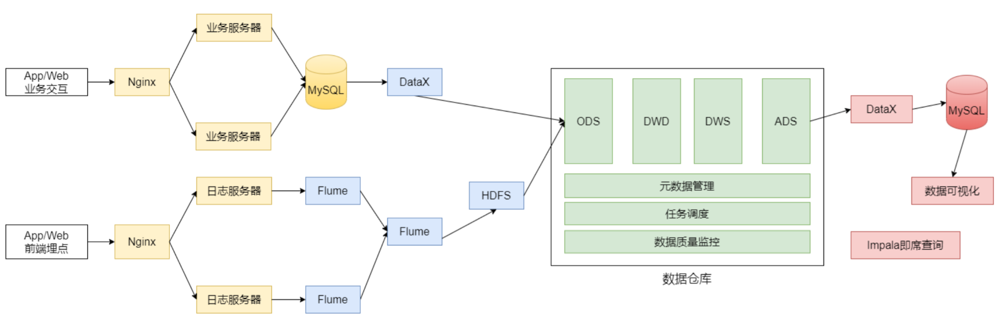
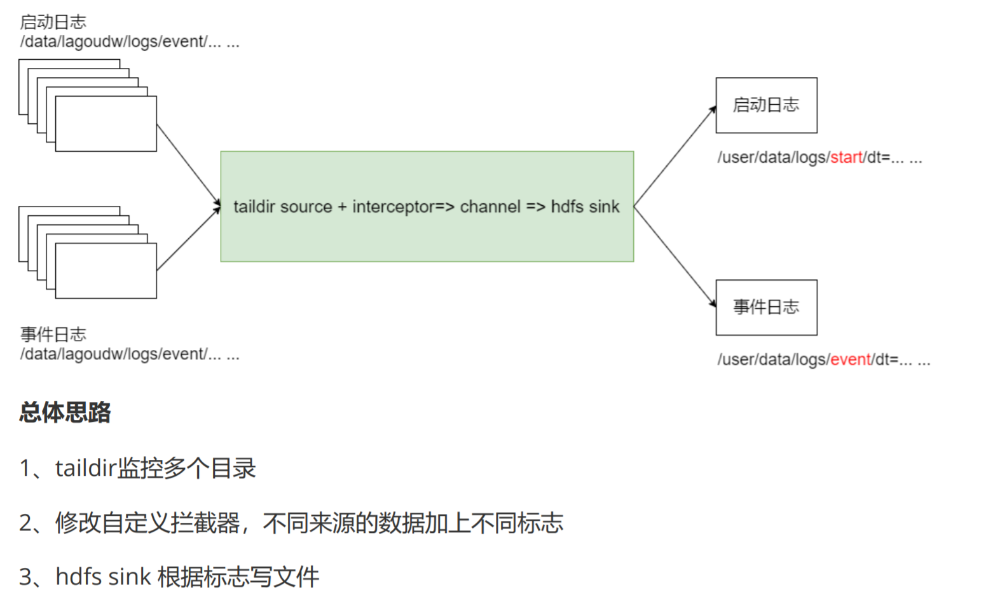
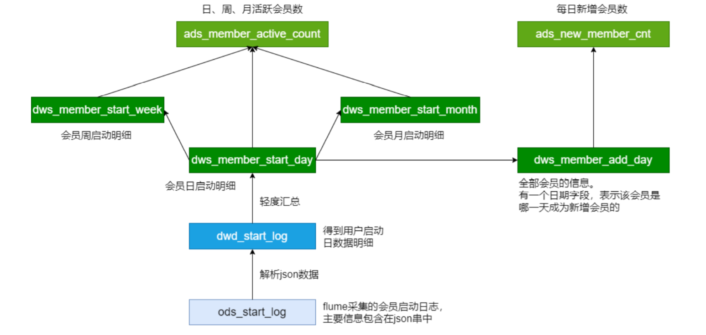
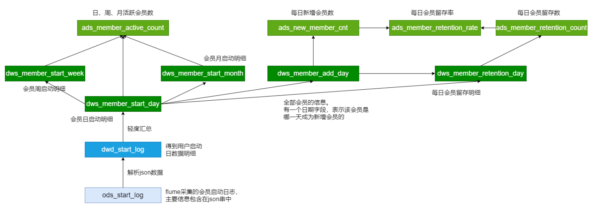

# Data Warehouse knowledges
## data modeling
- fact table
  - 事务事实表: highest granuality
  - 周期快照表
  - 累计快照表
- dimension table
- combining fact & dimension table
  - star schema 
  - snowflake schema
  - 事实星座
### Meta data
- 技术元数据：库表结构、数据模型、ETL程序、SQL程序等
- 业务元数据：业务指标、业务代码、业务术语等
- 管理元数据：数据所有者、数据质量、数据安全等

# E-Commerce Data Warehouse Design
### 数据仓库项目主要分析以下数据：
- 日志数据：启动日志、点击日志（广告点击日志）
- 业务数据库的交易数据：用户下单、提交订单、支付、退款等核心交易数据的分析
### 数据仓库项目分析任务：
- 会员活跃度分析主题
  - 每日新增会员数；每日、周、月活跃会员数；留存会员数、留存会员率
- 广告业务分析主题
  - 广告点击次数、广告点击购买率、广告曝光次数
- 核心交易分析主题
订单数、成交商品数、支付金额
### 数据埋点(Event Tracking)
> 数据埋点: 将用户的浏览、点击事件采集上报的一套数据采集的方法。

#### 埋点为数据分析提供基础数据，埋点工作流程可分为：
1. 根据埋点需求完成开发（前端开发工程师 js）
2. App或网页采用用户数据
3. 数据上报服务器
4. 数据的清洗、加工、存储（大数据工程师）
5. 进行数据分析等到相应的指标（大数据工程师）

#### 在以上过程中，涉及的相关人员可分以下几类：
- 埋点需求：数据产品经理，负责撰写需求文档，规定哪些区域、用户操作需要埋点
- 埋点采集：前端工程师，负责通过一套前端 js 代码对用户的请求事件上送至服务器
- 数据清洗、加工及存储：对埋点中数据缺失、误报等情况需要进行清洗，并通过一定的计算加工，输出业务分析所需要的结构化数据，最后将数据存储在数据仓库中
- 数据分析：在数据仓库中对数据进行整理，成业务关注的指标
- 前端展示：Java 开发

## Cluster Scale choice(集群规模规划)
如何确认集群规模（假设：每台服务器20T硬盘，128G内存）
可以从计算能力(CPU、 内存)、存储量等方面着手考虑集群规模。

假设：
1. 每天的日活用户500万，平均每人每天有100条日志信息
2. 每条日志大小1K左右
3. 不考虑历史数据，半年集群不扩容
4. 数据3个副本
5. 离线数据仓库应用

需要多大集群规模？

要分析的数据有两部分：日志数据+业务数据

- 每天日志数据量：500W * 100 * 1K / 1024 / 1024 = 500G
- 半年需要的存储量：500G * 3 * 180 / 1024 = 260T
- 通常要给磁盘预留20-30%的空间（这里取25%）： 260 * 1.25 = 325T
- 数据仓库应用有1-2倍的数据膨胀（这里取1.5）：500T
- **需要大约25个节点**

## Logical Design



# 指标：会员活跃度分析
## Flume Config
### Application start-log collecting flume agent
- **multiple source using** `taildir` to track the application start logs & event logs in dir `/data/lagoudw/logs/start/.*log`, and in `/data/lagoudw/logs/event/.*log`
  - For each source (current event or application start log directories), we add a header to specify the source for custom interceptor(discussed below) to differentiate the log
- **multiple sink to hdfs** `hdfs:/usr/data/logs/start/dt={logtime}` for start logs and `hdfs:/usr/data/logs/event/dt={logtime}` for event log with a predefined rollfile size/time interval; `logtime` is generated to event header using a custom interceptor
- **Custome Intercertor** to fetch the log records time and add it to the header, so log record goes to the correct time associated hdfs dir;
  - Interceptor differentiates `start-log` and `event-log` by the **event header** which for start logs the header is `start` and for event logs the header is `event`; The header is specified in the source config
  

## Data Warehouse Pipeline: 活跃会员指标
- **ODS**: store the raw log as lines(each line is a string of app start/event log) of strings partitioned by date
- **DWD**: data contains the same information as the ODS layer(strings of log lines) but complies with the standard schema definitions for data warehouses and databases.
  1. **cleanse** the data from ODS
  2. parse the JSON in the lines from ODS into records and store them with the standard schema
  - \* data are stored using `parquet` for more optimized storage and columnar query pattern
- **DWS**: light weight aggregation on DWD - compute the daily/weekly/monthly active user partitioned by current date (so daily/weekly/monthly active member is computed relative to current date)
  - dws.dws_member_start_day: daily active members partitioned by date
  - dws.dws_member_start_week: weekly active members partitioned by date; (if today is Tuesday, then its relative weekly member includes daily active member of Tuesday + Monday)
  - dws.dws_member_start_month: monthly active member partitioned by date
- **ADS**: aggreagtion on active member's day/week/month count relative to each date
  ```sql
  ads.ads_member_active_count(
    `day_count` int COMMENT 'daily active member',
    `week_count` int COMMENT 'weekly active member',
    `month_count` int COMMENT 'montly active member'
  ) COMMENT 'active member count'
  partitioned by(dt string)
  ```
- Summery
  - advantage of dw
    1. 清晰的数据结构：每一个数据分层有它的作用域
    2. 将复杂的问题简单化：one layer based on its lower layer, the ads layer contains the most complecated logic, but simplified over the layer of ods->dwd->dws
    3. 减少重复开发: change of application logic incurr minimal amount of change in dw(only associated layer needs change)
  


## Data Warehouse Pipeline: 新增会员
### 步骤
  1. 计算新增会员
  2. 更新所有会员信息

### flow
1. create **dws** table `dws.dws_member_add_day` in track of the current member list and their **initial subscribed date**
  ```sql
    create table dws.dws_member_add_day
    (
      `device_id` string,
      `uid` string,
      `app_v` string,
      `os_type` string,
      `language` string,
      `channel` string,
      `area` string,
      `brand` string,
      `dt` string
    ) COMMENT '每日新增会员明细'
    stored as parquet;
  ```
2. create **ads** table `ads.ads_new_member_cnt` in track of the newly joined member count for each date

  ```sql
    create table ads.ads_new_member_cnt
    (
      `cnt` string
    )
    partitioned by(dt string)
  ```



## Data Warehouse Pipeline: 留存会员&留存率
1. create **dws** table `dws.dws_member_retention_day` to track the 1,2,3 day retended users
  ```sql
    create table dws.dws_member_retention_day
    (
      `device_id` string,
      `uid` string,
      `app_v` string,
      `os_type` string,
      `language` string,
      `channel` string,
      `area` string,
      `brand` string,
      `add_date` string comment '会员新增时间',
      `retention_date` int comment '留存天数'
    )COMMENT '每日会员留存明细'
    PARTITIONED BY (`dt` string)
    stored as parquet;
  ```
2. create **ads** table `ads.ads_member_retention_count` in track of the # retended users
  ```sql
    create table ads.ads_member_retention_count
    (
      `add_date` string comment '新增日期',
      `retention_day` int comment '截止当前日期留存天数',
      `retention_count` bigint comment '留存数'
    ) COMMENT '会员留存数'
    partitioned by(dt string)
  ```
3. create **ads** table `ads.ads_member_retention_rate` in track of the rate of retention(in terms of today's new user)
  ```sql
    create table ads.ads_member_retention_rate
    (
      `add_date` string comment '新增日期',
      `retention_day` int comment '截止当前日期留存天数',
      `retention_count` bigint comment '留存数',
      `new_mid_count` bigint comment '当日会员新增数',
      `retention_ratio` decimal(10,2) comment '留存率'
    ) COMMENT '会员留存率'
    partitioned by(dt string)
  ```

# Q
- read: https://medium.com/@Alibaba_Cloud/flink-is-attempting-to-build-a-data-warehouse-simply-by-using-a-set-of-sql-statements-57757badbb3f

# Log
- 参数调优 - MapReduce: max mapper memory, # of mapper, # of reducer
  - Hive on Tez: improved average task execution speed 2 times fast
