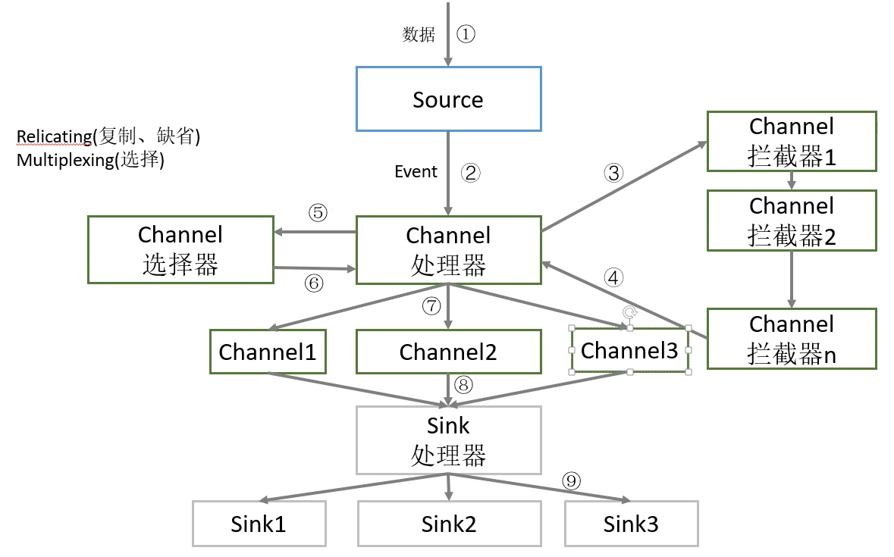
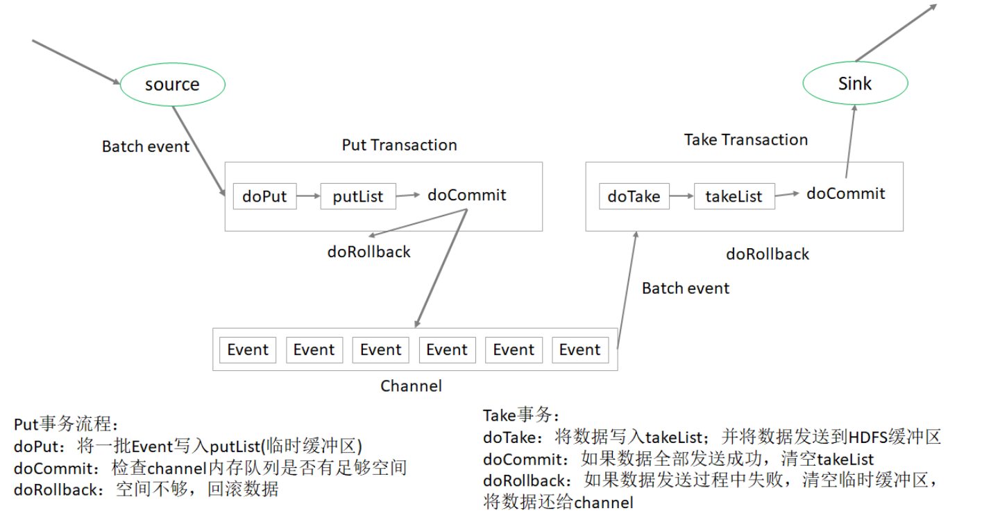

# Flume
- [DataFlare](https://data-flair.training/blogs/apache-flume-tutorial/)
- [Flume中文手册](https://flume.liyifeng.org/)

## Common distributed softwares for log collcecting, aggregating, moving
- Flume, dataX, Sqoop, Kettle, LogStash, Scribe
- Flume is specifically designed for handling of large amount of data in real time
## Features & Limitations
### Features
> In short, we can say that Apache Flume is an open-source distributed system for ingesting online stream data from different sources to Hadoop HDFS or HBase. It is a highly available, reliable, and easy to use the system. Apache Flume provides support for different sources and sinks. Apache Flume caters to high throughput with lower latency. 
- Scalibility: horizontal scalable
- Low Latency: caters to high throughput with lower latency.
- Reliability: In apache flume, the sources transfer events through the channel. The flume source puts events in the channel which are then consumed by the sink. The sink transfers the event to the next agent or to the terminal repository (like HDFS). The events in the flume channel are removed only when they are stored in the next agent channel or in the terminal repository. In this way, the single-hop message delivery semantics in Apache Flume caters to end-to-end reliability of the flow. Flume uses a transactional approach for guaranteeing reliable delivery of the flume events.
- Steady flow: Apache Flume offers steady data flow between reading and writes operations. When the rate at which data is coming exceeds the rate of writing data to the destination, then Apache Flume acts as a mediator between the data producers and the centralized stores. Thus offers a steady flow of data between them.
### Limitations
- **Duplicacy**: Apache Flume does not guarantee that the messages reaching are 100% unique. In many scenarios, the duplicate messages might pop in.
- **Weak ordering guarantee**: Apache Flume offers weaker guarantees than the other systems such as message queues in the event of moving data more quickly and for enabling cheaper fault tolerance. In Apache Flume’s end-to-end reliability mode, the flume events are delivered at least once, but with zero ordering guarantees.

## Agent
- a unit of flume datapipeline(running on one JVM), containing **source**, **channel**, **sink**
### source: 
- component to collect data from upstream data pipeline/application
### Channel
- buffer between source and since, allowing source and sink to operate at different rate(recall reader/writer problem in a single machine)
- thread safe, can concurrently handle multiple source and sink
- common channel: memory channel, file channel, Kafka channel
  |channel|pros|cons|
  |---|---|---|
  |memory channel|fast|limited storage, data loss|
  |file channel|slow|high capacity, data persistence|
  |kafka channel|||
### Sink
- continuously read data from channel, and send(write) to the down stream data pipeline/applications

### Event
- an event is the smallest unit of transmission in Flume

## Modes
- 串行模式
- 复制模式 (single source, multiple channels and sinks)
- 负载均衡模式(single source, single channel, multiple sinks)
- 聚合模式(multiple agents corresponds to multiple webserver, aggregates to a single agent)

## Internals of Flume
### Dataflow
- a event is the smallest unit of transmission inside of a Flume agent
  
  - there are two types of selector: one is to **replicating** the event from source to all downstream channels; one is to **multiplex** the event to a specified/designated channel

## Flume Transaction
