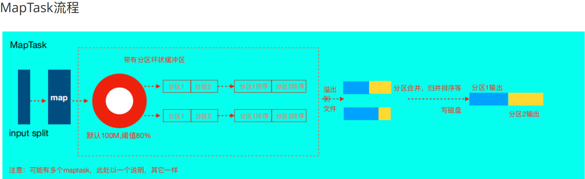
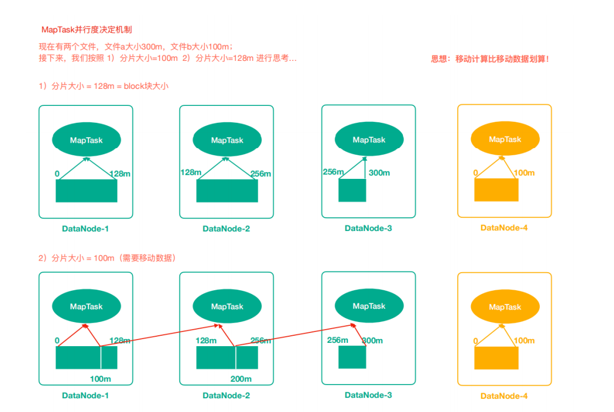
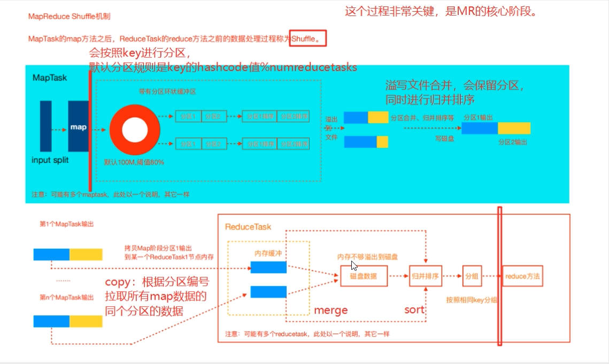
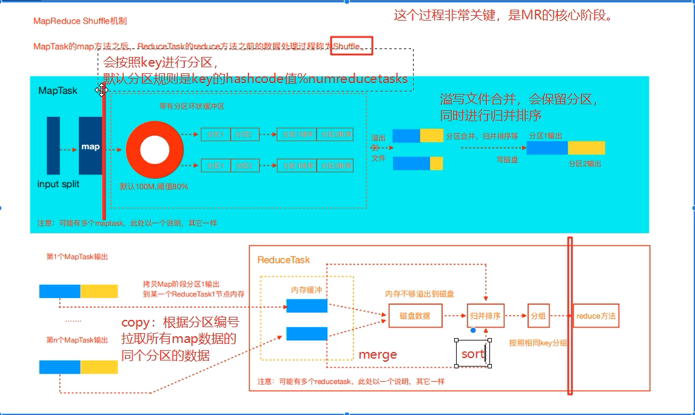

# MapReduace

## Custom Writable Object
- need to implements `Writable` interface
```java
class MySerializableBean implements Writable {
  //empty constructor is mandatory
  public MySerializableBean() {
  }
  public void write(DataOutput out);
  public void readFields(DataInput in);
  //it might be necessary to implement the Comparable
}
```
## Mapper
### Mapper Flow:

### InputSplit
- For a MapReduce Job, ⾸先，读取数据组件InputFormat（默认TextInputFormat）会通过getSplits⽅法对输⼊⽬录中⽂件进⾏逻辑切⽚规划得到splits，有多少个split就对应启动多少个MapTask。split与block的对应关系**默认**是⼀对⼀
  - **Why?** because # of splits direcly determines # of mapper tasks (one split per mapper), and if a split size is less than 128MB = default size of a block: some mapper will have to read through network inorder to do the mapper task. and if split size is too big, we essentailly reduce the parallalism of our mapper tasks which yield reduced job efficiency
  
  > note: HDFS Block is physical spliting the file into blocks = 128MB by defualts; InputSplit is logical spliting the file into splits, no actual disk spliting happened
> Question: MapTask并行度是不是越多越好呢？
> 答案不是，如果一个文件仅仅比128MB大一点点也会被当成split来对待(source code the if data to be split is less than 128*1.1, will be treated as the same split.), 而不是多个split. MR框架在并行运算同时也会消耗更多资源(having to request&create containers if managed by yarn, job report .. etc)，并行度越高消耗的资源也越高。**假设129文件分为两个splits, 一个是128MB，一个是1M；对于1M的Split的Maptask来说，太浪费资源**

### Partitioning & Partitioner

- shuffle开始时会根据key的hashcode来进行分区(partition)，但是结合我们自己的业务需求(e.g., we know our range of keys are only within {apple, banana, strawberry}, in this case we prefer each of those keys handled by a seperate/dedicated reducer(s), meaning to have each key in one partition), 我们需要custome partitioner when **默认hash分区方式不能满足需求(maybe due to the hash, "apple" and "banana" were went to the same partition)**
- It's best practice to have # of custome partitioner = # of reduce tasks(can be set in the MR Driver). each reducer will generate a output file, so n reducers will generate n output files 
  > in the {apple, banana, strawberry}, say # of partitioner is represented by p, # of reduce task by r;
  >
  > - if p = 3, r = 3, there will be three outputs, each containing apple, banana, strawberry
  > - if p = 3, r > 3, there will be multiple outputs potentially causing records of apple be outputed to multiple files
  > - if p = 3, r = 1, there will be only one output file; and we should always not have `r < p && r != 1`, due to records can be partitioned and mapped to a parititon where there is no corresponding reducer for that partition, MR framework will throw error

## Reducer
- **By default, there will be only one reducer**, so one final output file will be generated
- Reduce Task是拉取所有map输出结果文件***固定某个分区(Partitioner)*** 的数据

1. **Copy 阶段**，简单地拉取数据。Reduce进程启动⼀些数据copy线程(Fetcher)，通过HTTP⽅式请求. 如果其大小超过一定阈值(threshhold)，则写到disk上，否则直接放在内存中
maptask获取属于⾃⼰的⽂件。
2. **Merge 阶段**。这⾥的merge如map端的merge动作，只是数组中存放的是不同map端copy来的数值。Copy过来的数据会先放⼊内存缓冲区中，这⾥的缓冲区⼤⼩要⽐map端的更为灵活。***merge有三种形式：内存到内存；内存到磁盘；磁盘到磁盘***。默认情况下第⼀种形式不启⽤。当内存中的数据量到达⼀定阈值，就启动内存到磁盘的merge。与map 端类似，这也是溢写的过程，这个过程中如果你设置有`Combiner`，也是会启⽤的，然后在磁盘中⽣成了众多的溢写⽂件。第⼆种merge⽅式⼀直在运⾏，直到没有map端的数据时才结束，然后启动第三种磁盘到磁盘的merge⽅式⽣成最终的⽂件
3. **Sort 阶段(by key group)**: 按照MapReduce语义，用户编写reduce() function's input is grouped by key. In order to group the same key, MapReduce Framework will do a mergeSort from the **sorted result** from the mapper ealier
4. **Reduce 阶段**： call user reduce() method and write to HDFS

### Parallelism in Reducer
- 一个ReduceTask对应一个输出文件，因为在shuffle机制中每个reduceTask拉取的都是某一个分区(Partition)的数据，**一个分区对应一个输出文件**

## Shuffle
the data processing after the map() in MapTask and before the reduce() in Reduce Task is the shuffle process(环形缓冲数据分区->溢出合并->copy to reducer memory -> memory/disk merge -> sort by keygroup) 
- we can implement `WritableComparable` interface to change how the keys will be sorted
- 全局排序(global ordering) require to have exactly one reducer, so the final merge sort will sort all records into one file. This also causes reduced parallelism due to we have only one reduce task

## Combiner
The goal for `Combiner` if to reduce the network IO during the shuffle, so it does a local aggregation on the map output before records are send to the reduce tasks. ***Combiner的意义就是对每一个map task的输出进行局部汇总，以减少网络传输量***
- **Combiner must not affect the result output** (so e.g., wordcount we can add a combiner to do local aggreagtes on (wordi, 1), to output (wordi, localCounti). but for mean value or median value, the output will be changed if we add combiner)

## Sort in MapReduce
- quick sort in mapper task, and final merge sort during the reduce task


#### homework
链接:https://pan.baidu.com/s/1yhTzZUxeCcsl9LA6LnyWsg  密码:7zpl