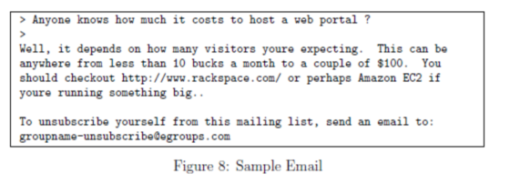
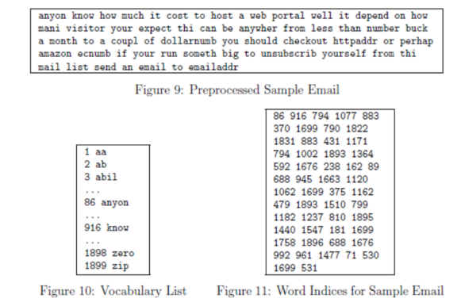
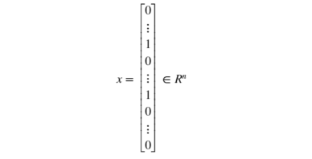

# regularization param C (= 1/lambda)
- the C parameter is a positive value that controls the penalty for misclassiffed training examples. A large  parameter tells the SVM to try to classify all the examples correctly. 
- C plays a role similar to , where C is the regularization parameter that we were using previously for logistic regression

# Gaussian Kernels
- for SVM to do non-linear classification (on datasets that are not linearly separable)
- The Gaussian kernel is also parameterized by a bandwidth parameter, `sigma`, which determines how fast the similarity metric decreases (to 0) as the examples are further apart.

# spam filter
- developped a spam email filter using SVM with Gaussian Kernel
- feature with email header and body
  - email that contains a URL, an email address (at the end), numbers, and dollar amounts. While many emails would contain similar types of entities (e.g., numbers, other URLs, or other email addresses), the specific entities (e.g., the specic URL or specific dollar amount) will be different in almost every email.
  - one method often employed in processing emails is to **'normalize'/tokenize** these values, so that all URLs are treated the same, all numbers are treated the same, etc. For example, we could replace each URL in the email with the unique string "httpaddr" to indicate that a URL was present. This has the effect of letting the spam classifier make a classification decision based on whether any URL was present, rather than whether a specific URL was present. This typically improves the performance of a spam classifier, since spammers often randomize the URLs, and thus the odds of seeing any particular URL again in a new piece of spam is very small.
  - we following email preprocessing and normalization steps:
    > **Lower-casing**: The entire email is converted into lower case, so that captialization is ignored (e.g., IndIcaTE is treated the same as indicate).
    > 
    > **Stripping HTML**: All HTML tags are removed from the emails. Many emails often come with HTML formatting; we remove all the HTML tags, so that only the content remains.
    > 
    > **Normalizing URLs**: All URLs are replaced with the text "httpaddr".
    > 
    > **Normalizing Email Addresses**: All email addresses are replaced with the text "emailaddr".
    > 
    > **Normalizing Numbers**: All numbers are replaced with the text 'number'.
    > 
    > **Normalizing Dollars**: All dollar signs ($) are replaced with the text 'dollar'.
    > 
    > **Word Stemming**: Words are reduced to their stemmed form. For example, 'discount', 'discounts', 'discounted' and 'discounting' are all replaced with 'discount'. Sometimes, the Stemmer actually strips off additional characters from the end, so 'include', 'includes', 'included', and 'including' are all replaced with 'includ'.
    > 
    > **Removal of non-words**: Non-words and punctuation have been removed. All white spaces (tabs, newlines, spaces) have all been trimmed to a single space character.
  - **Spam Vocabulary list**: we need to first preprocess a list of spam words: word count on spam emails
    > After preprocessing the emails `from Figure8 to Figure 9`, we have a list of words for each email. The next step is to choose which words we would like to use in our classifier and which we would want to leave out. For this exercise, we have chosen only the **most frequently occuring words as our set of words considered (the vocabulary list)**. Since words that occur rarely in the training set are only in a few emails, they might cause the model to overfit our training set. The complete vocabulary list is in the file vocab.txt and also shown in `Figure 10`. **Our vocabulary list was selected by choosing all words which occur at least a 100 times in the spam corpus, resulting in a list of 1899 words**(do a wordcount on spam emails). In practice, a vocabulary list with about 10,000 to 50,000 words is often used.
    
    
    >
    >  Given the vocabulary list, we can now map each word in the preprocessed emails (e.g., `Figure 9`) into a list of word indices that contains the index of the word in the vocabulary list. Figure 11 shows the mapping for the sample email. Specically, in the sample email, the word 'anyone' was first normalized to 'anyon' and then mapped onto the index 86 in the vocabulary list.
  - **Build feature vector**
    - We will now implement the feature extraction that converts each email into a vector in . For this exercise, you will be using words in vocabulary list.
    - Specically, the feature xi is in {0, 1} for an email corresponds to whether the i-th word in the dictionary occurs in the email. That is,  if the i-th word is in the email and  if the i-th word is not present in the email.
    

## Training Accuracy
- 99.8% accuracy on training set and 98.5% accuracy on test set 