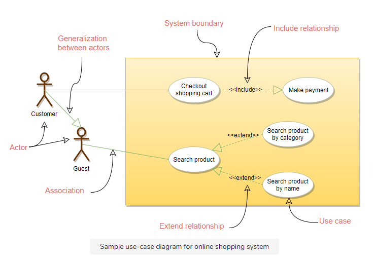
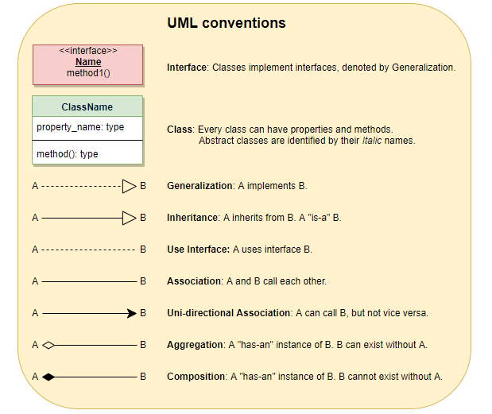
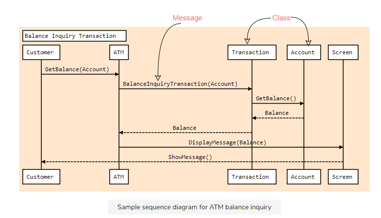
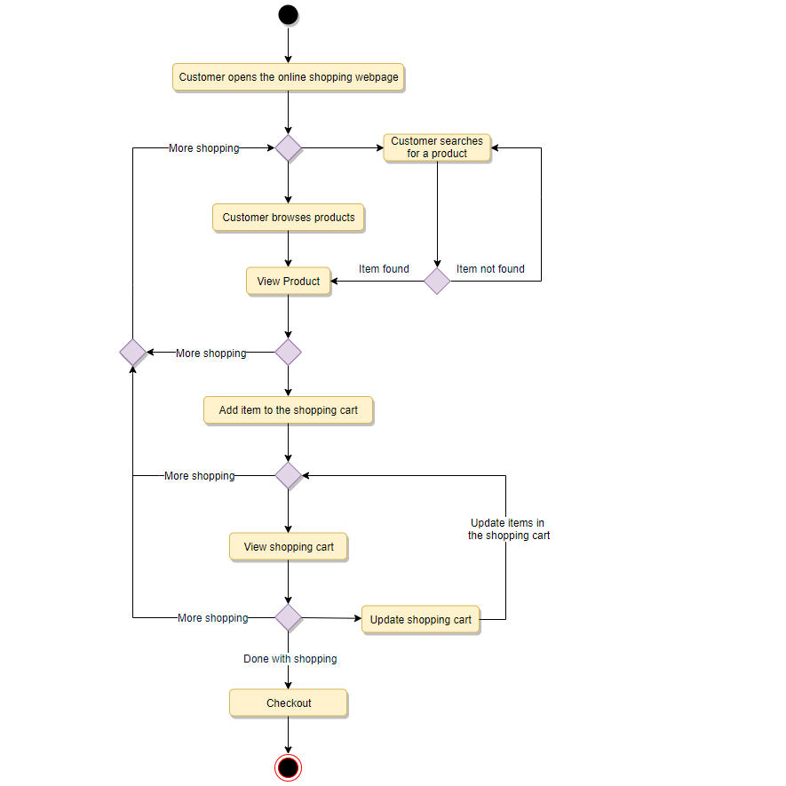
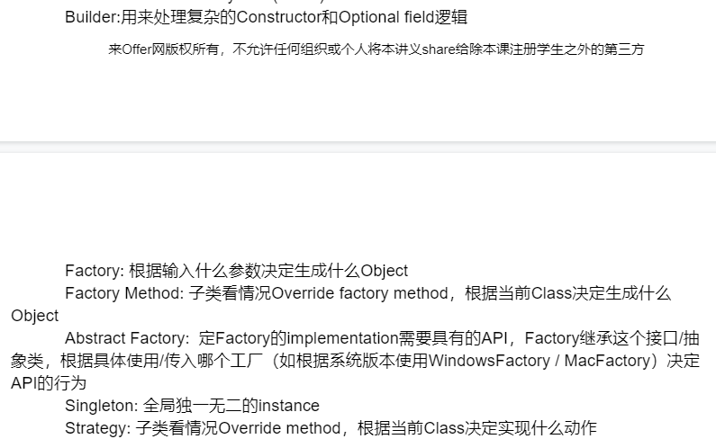

# Use Case Diagram

>  
>
> - **Include:** Include relationship represents an invocation of one use case by another use case. From a coding perspective, it is like one function being called by another function.
>
> - **Extend:** This relationship signifies that the extended use case will work exactly like the base use case, except that some new steps will be inserted in the extended use case.
>
>   


# Class Diagram

> 
>
> 

# Sequence Diagram

> 
>
> - Sequence diagrams show a detailed flow for **a specific use case** or even just part of a particular use case. Sequence diagrams **describe interactions among classes in terms of an exchange of messages over time** and are used to explore the logic of complex operations, functions or procedures.
> - The vertical dimension shows the **sequence of messages** in the chronological order that they occur; the horizontal dimension shows the object instances to which the messages are sent.
> -  If a class instance sends a message to another class instance, draw a line with an open arrowhead pointing to the receiving class instance and place the name of the message above the line
> - Optionally, for important messages, you can draw a **dotted line** with an arrowhead pointing back to the originating class instance; label the returned value above the dotted line.

# Activity Diagram

> 
>
> - Activity diagrams illustrate the dynamic nature of a system by modeling the flow of control from activity to activity
> - Notice how in the activity diagram, we don't really have the classes defined, but a sequence of system states and activities. Thus it is good to have activity diagrams drawn if we don't yet have an idea for the sequence diagram


# OOD in Java

## Inheritance, Implements, polymorphism

- Is-a relationship is modeled using inheritance
  - If base class should not be instantiated, and subclasses have common methods, declare a abstract class.
- has-a functionality if modeled using implementing interfaces
- polymorphism allows different functionalities under a common prototype

## Enum

[oracle doc](https://docs.oracle.com/javase/tutorial/java/javaOO/enum.html)

## Design Pattern

- builder pattern: build object by calling its member construction in any order, in any way and then build.

  ```java
  public class User {
      private String firstName;
      //...
      private User(UserBuilder builder) {
          this.firstName = builder.firstName;
          //...
      }
      
      
      public static class UserBuilder {
          private String firstName;
          //...
          public UserBuilder firstName(String firstName) {
              this.firstName = firstName;
              return this;
          }
          public UserBuilder lastName(String lastName) {
              this.lastName = lastName;
              return this;
          }
          //...
  
          public User build() {
              if (firstName == null || lastName == null) {
                  throw new Exception("required fields not set");
              }
  			return new User(this);
          }
      }
  }
  
  public static void main(String[] args) {
      User user = new User.UserBuilder().firstName("A").lastName("B").build();
  }
  
  ```

- factory pattern: deal with the problem of creating objects without specifying the exact class of object that will be created

  ````java
  public class ShapeFactory {
     	public class Shape {
          private Shape();
      }
      private class Cicle extends Shape {
          private Circle();
      }
      //...
      
      public Shape getShape(String shapeType) {
          if (shapeType == null) {
              return null;
          }
          if (shapeType.equalsIgnoreCase("CIRCLE")) {
              return new Circle();
          } else if (shapeType.equalsIgnoreCase("RECTANGLE")) {
              return new Rectangle();
          } else if {
              //...
          }
          return null;
      }
  }
  
  public static void main(String[] args) {
      private final ShapeFactory shapeFactory = new ShapeFactory();
      Shape s1 = shapeFactory.getShape("CIRCLE");
      Shape s2 = shapeFactory.getShape("RECTANGLE");
  }
  ````

  

- more patterns:

  

- Factory Method pattern: [link](https://en.wikipedia.org/wiki/Factory_method_pattern)

- Abstract Factory pattern: [link](https://en.wikipedia.org/wiki/Abstract_factory_pattern)

## Design Principle

procedures:

> 1. list requirements
> 2. analyze the functionality and use case (diagram if needed)
> 3. develop API
> 4. design classes
>    - Single class single responsibility principle
> 5. 

- SOLID principle: https://www.freecodecamp.org/news/solid-principles-explained-in-plain-english/
