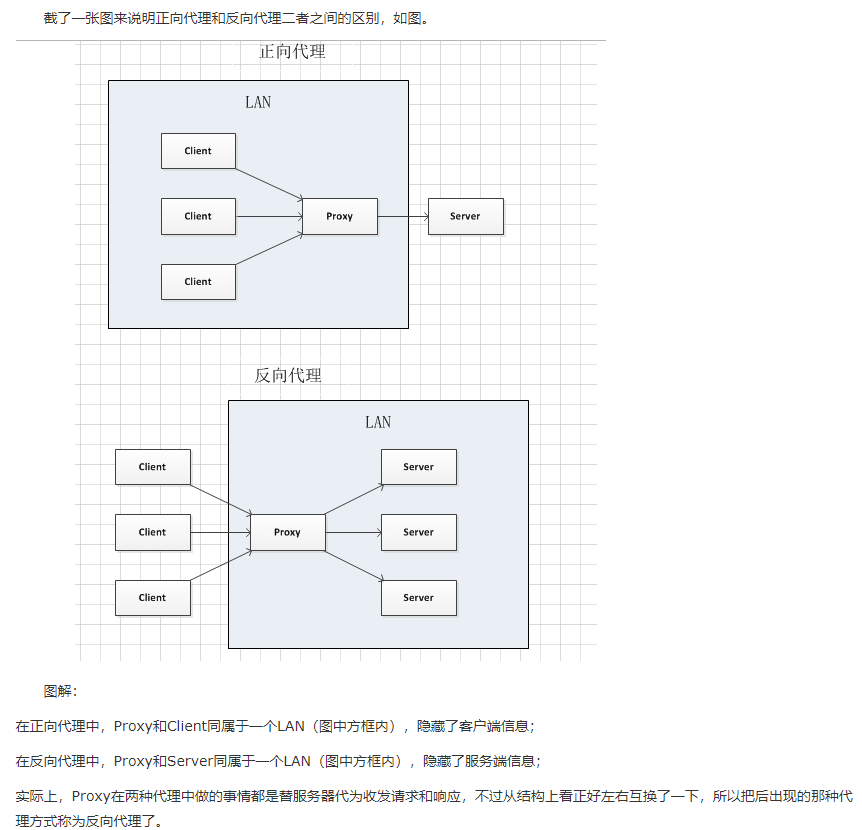

# Nginx

## [Nginx as a Reverse proxy](https://www.cnblogs.com/wcwnina/p/8728391.html)
- Direct proxy(正向代理)： 为客户端代理，访问一个指定的服务器, 服务器并不知道原本的客户端信息(因为现在对于服务器来说客户端就是这个正向代理); Reverse proxy: 为一个服务器集群做代理(load balancing), 客户端们首先访问代理，代理再将request route to one of the servers
  > 客户端是无感知代理的存在的，反向代理对外都是透明的，访问者并不知道自己访问的是一个代理。因为客户端不需要任何配置就可以访问。反向代理，"它代理的是服务端，代服务端接收请求"，主要用于服务器集群分布式部署的情况下，反向代理隐藏了服务器的信息。
  >
- Advantage of reverse proxy:
  1. 保证内网的安全，通常将反向代理作为公网访问地址，Web服务器是内网
  2. 负载均衡，通过反向代理服务器来优化网站的负载
  
- **Integrating Nginx and SpringBoot**: we usually use Nginx as a reverse proxy backed by multiple Tomcat servers(default servers used by SpringBoot)