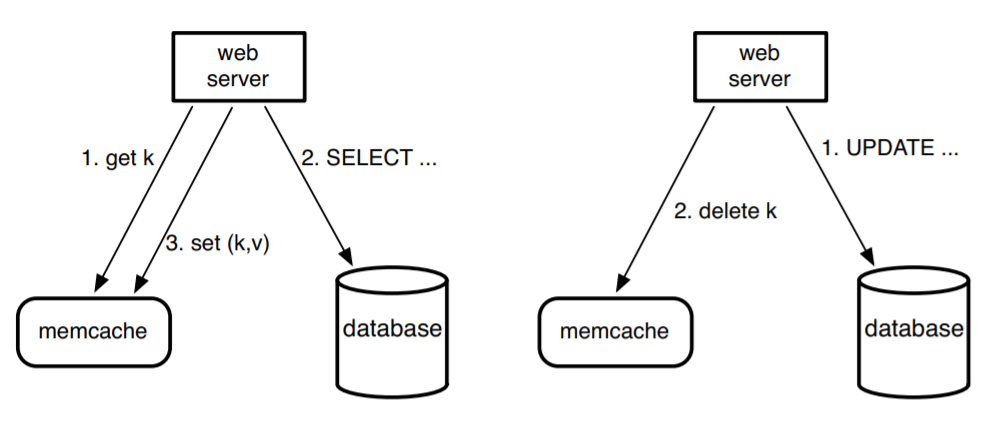

# Memcache at Facebook
## Regions
Facebook split the regions into primary and secondary regions.
- primary stores the true copy of the data where each write require client to directly write to the primary
- secondary stores the copy of the data. where after each write to primary, primary will trigger to update to secondary

## Dataflow

note on read path on cache miss(left) memcache is not responsible for do the query on behalf of webserver, and webserver is responsible for set the new key to the cache.
- this has the advantage of mitigate the cache layer's logic and allows rapid iteration of software and simplifies the development process. where memcache only provides the simple interface as cache, and scale very easily on provision
- this is the difference between **look-aside cache** vs **look-through cache**
  > look-aside is when client web server does set to the cache and query the database directly; look-through the cache will query the database on behalf of the webserver
  >
  > in look-aside cache, the cache is completely neutral about what's in the database, the scheme of database, communication channel .. etc

### get request
- on each frontend server, there's a memcached client to communicate to memcache server. Upon `get(v)` reqeust, the client computes the consistent hash of key v and decides the correct memcache server to talk to;
  > for a `get` request, client talks to memcache server directly through UDP for low latency. for a update(`put`/`delete`), through TCP for data durability

## Partition and Replication Scheme
- Replication are used where there are two regions primary and secondary region
  > under each region, **region is splitted into individual clusters**, so whithin each cluster memcache servers are partitioned and there are multiple frontend server, where same frontend server will only interact with the memcache servers locally; the goal is to keep the cluster size relatively small, due to TCP communications between frontend server and memcache server in each cluster are expensive (costs O(N^2)), so relative small size will contribute to better performance per cluster; And an overloaded cluster will not impact other concurrently running cluster
- Partitions are used within each region
- This scheme allows frontend server fetch data only from the memcache servers within the same region for better performance
- **Regional Pool**: there are memcache servers that are shared by all clusters, called **Regional Pools**. 

This is to handle failed memcache server in a cluster or if a cluster is experiencing heavy load. Regional Pool will provision temporary memcache servers in case of those events, to prevent direct traffic into the databases

## Cache Consistency
> recall: 在一个处理器系统中，主设备(CPU或者外部设备)进行存储器访问时，将试图从存储器系统(主存储器或者其他CPU的Cache)中获得最新的数据拷贝。如果该主设备访问的数据没有在本地命中时，将从其他CPU的Cache中获取数据，**如果这些数据仍然没有在其他CPU的Cache中命中**，主存储器将提供数据。外设设备进行存储器访问时，也需要进行Cache共享一致性。

In FaceBook, the idea of cache consistency is extended from single machine:
- each cluster in a region has its exclusive memcache servers. Upon cache misses, frontend server will first consult with other clusters' cache, and if still misses, it will query the database to fetch the data

# Q
- region pools?
- Lease
- Yahoo Pinuts